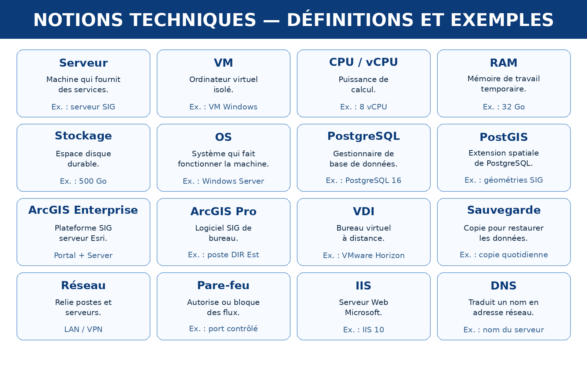

# 02 --- Définitions techniques

## Serveur physique

Un **serveur physique** est un ordinateur conçu pour fournir des
services à plusieurs utilisateurs ou applications. Il possède notamment
un processeur, de la RAM, du stockage et une connexion réseau.

**Exemple professionnel :** un serveur physique peut héberger plusieurs
machines virtuelles utilisées pour ArcGIS Enterprise ou PostgreSQL.

## Machine virtuelle --- VM

Une **VM** est un ordinateur virtuel créé à l'intérieur d'une
infrastructure physique. Elle possède ses propres vCPU, RAM, stockage et
système d'exploitation.

``` text
Serveur physique
├── VM 1 → ArcGIS Enterprise
└── VM 2 → PostgreSQL
```

## CPU / vCPU

Le **CPU** réalise les calculs. Dans une VM, on parle généralement de
**vCPU**, c'est-à-dire de ressources processeur attribuées à la machine
virtuelle.

**Exemple :** une VM avec 8 vCPU dispose de huit unités de calcul
virtuelles pour faire fonctionner son système et ses applications.

## RAM

La **RAM** est la mémoire de travail rapide utilisée pendant le
fonctionnement des applications.

**Exemple :** PostgreSQL utilise de la RAM pour traiter les requêtes ;
ArcGIS Server en utilise pour faire fonctionner les services.

## Stockage

Le **stockage** est l'espace disque qui conserve durablement les bases,
fichiers, logiciels, journaux et autres données.

**Exemple :** un disque de 500 Go peut contenir Windows, ArcGIS
Enterprise, PostgreSQL et des données. Il faut donc connaître la
capacité totale mais aussi l'espace encore disponible.

## RAM et stockage : différence

``` text
RAM       = mémoire de travail, rapide et temporaire
Stockage  = espace disque, durable
```

## PostgreSQL

**PostgreSQL** est un système de gestion de base de données. Il gère les
tables, utilisateurs, rôles, droits, connexions et requêtes.

## PostGIS

**PostGIS** est une extension de PostgreSQL qui ajoute les fonctions
géographiques : points, lignes, polygones et traitements spatiaux.

## ArcGIS Enterprise

**ArcGIS Enterprise** est la plateforme serveur SIG d'Esri permettant de
publier et partager des données, cartes, services et applications.

## VDI

Un **VDI** est un poste de travail virtuel accessible à distance.

``` text
PC utilisateur → VDI → ArcGIS Pro
```

Une des réflexions de la mission consiste à étudier ArcGIS Pro
directement sur les postes.


## Schéma récapitulatif


