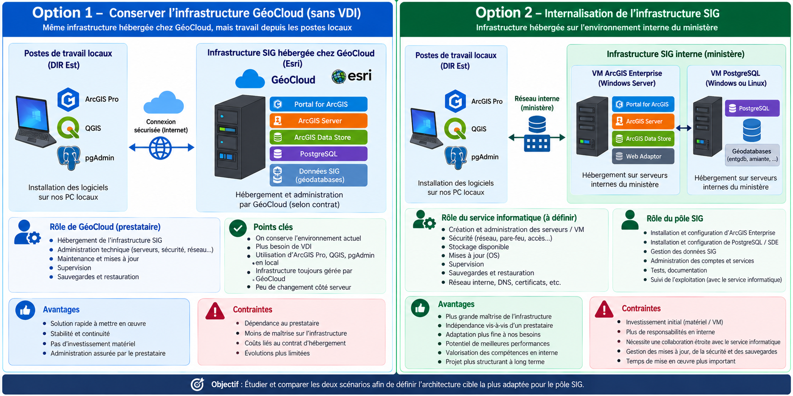

# 04 --- Deux options d'évolution proposées

## Pourquoi deux options ?

Après avoir commencé à comprendre l'existant, j'ai proposé deux pistes.
À ce stade, aucune solution n'est choisie.

## Option 1 --- Garder GéoCloud et installer les outils localement

ArcGIS Enterprise, PostgreSQL et les données restent hébergés dans
GéoCloud Esri. En revanche, on étudie **ArcGIS Pro directement sur les
postes DIR Est** et éventuellement **pgAdmin sur les postes**.

``` text
POSTE DIR EST
├── ArcGIS Pro
└── pgAdmin
      │ connexion sécurisée à vérifier
      ▼
GÉOCLOUD ESRI
├── ArcGIS Enterprise
├── PostgreSQL
└── données
```

### À vérifier

-   installation d'ArcGIS Pro ;
-   licences et authentification ;
-   accès à Portal ;
-   accès distant à PostgreSQL ;
-   règles réseau et sécurité ;
-   performances.

## Option 2 --- Internaliser l'infrastructure

Cette option consiste à étudier une infrastructure SIG gérée en interne.

``` text
POSTES DIR EST
├── ArcGIS Pro
└── pgAdmin
      │
      ▼
INFRASTRUCTURE INTERNE
├── ArcGIS Enterprise
├── PostgreSQL / SDE
└── données
```

### À étudier

-   une ou plusieurs VM ;
-   CPU/vCPU ;
-   RAM ;
-   stockage ;
-   réseau ;
-   sauvegardes ;
-   sécurité ;
-   supervision ;
-   maintenance ;
-   migration.

## Différence simple

  -----------------------------------------------------------------------
  Sujet                   Option 1                Option 2
  ----------------------- ----------------------- -----------------------
  ArcGIS Pro              Poste DIR Est           Poste DIR Est

  ArcGIS Enterprise       GéoCloud                Interne

  PostgreSQL              GéoCloud                Interne

  Données                 GéoCloud                Interne

  Administration serveur  Externalisée en partie  À organiser en interne
  -----------------------------------------------------------------------

Les deux options doivent être étudiées avant toute décision.


## Schéma récapitulatif


