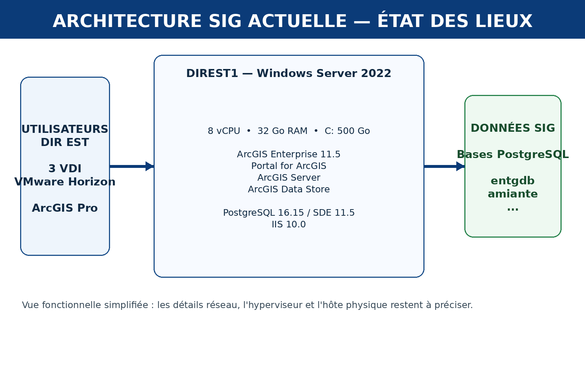
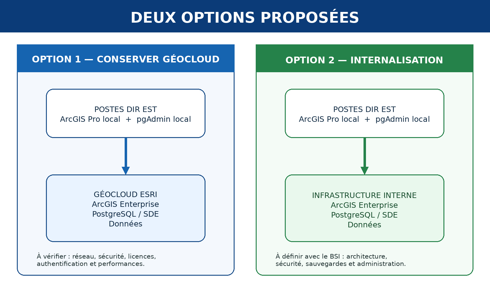

# Cahier des charges --- Mise en œuvre d'un serveur SIG interne

## Pôle SIG --- DIR Est

Ce dossier rassemble progressivement les informations nécessaires pour
étudier l'évolution de l'infrastructure SIG de la DIR Est.

L'objectif n'est pas de choisir immédiatement une solution, mais de
partir du besoin, comprendre l'existant, comparer les deux pistes
envisagées et préparer les futurs échanges avec le BSI.


## Parcours du dossier

  Page     Contenu
  -------- -----------------------------------------------------------
  **01**   Contexte et préparation de la réunion
  **02**   Définitions techniques simples et exemples professionnels
  **03**   Première collecte d'informations
  **04**   Deux options d'évolution proposées
  **05**   Informations communiquées par Esri
  **06**   Retour du tuteur et évolution de la réflexion

## Trois schémas de référence

### Notions techniques


### Architecture actuelle



### Deux options proposées



## Logique de la mission

``` text
Besoin initial
    ↓
Comprendre les notions
    ↓
Collecter l'existant
    ↓
Proposer deux options
    ↓
Compléter avec les informations Esri
    ↓
Intégrer le retour du tuteur
    ↓
Préparer les échanges avec le BSI
```

> **Important :** à ce stade, aucune architecture cible n'est considérée
> comme définitivement choisie.
