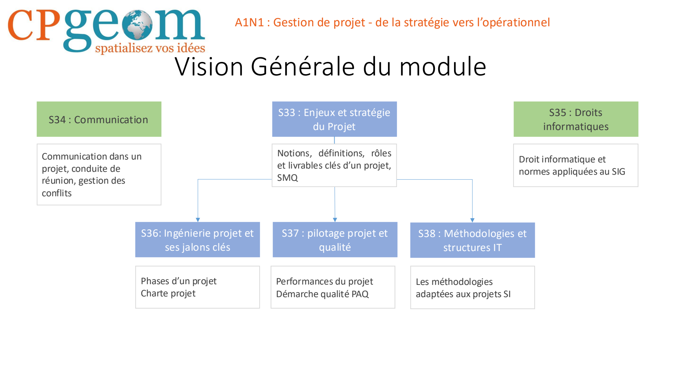

# A1 — Gestion de projet : de la stratégie vers l’opérationnel

> Source du contenu pédagogique de cette page : `A1N1Preambule2025.pdf`, page 1. La navigation et l’inventaire ci-dessous sont des repères éditoriaux.

## Vision générale du module

| Séquence | Intitulé du préambule | Contenu indiqué dans le préambule |
| --- | --- | --- |
| S33 | Enjeux et stratégie du projet | Notions, définitions, rôles et livrables clés d’un projet ; SMQ |
| S34 | Communication | Communication dans un projet, conduite de réunion, gestion des conflits |
| S35 | Droits informatiques | Droit informatique et normes appliquées au SIG |
| S36 | Ingénierie projet et ses jalons clés | Phases d’un projet ; charte projet |
| S37 | Pilotage projet et qualité | Performances du projet ; démarche qualité PAQ |
| S38 | Méthodologies et structures IT | Les méthodologies adaptées aux projets SI |

<!-- FIGURE SOURCE : A1N1Preambule2025.pdf, page 1. Placer ici le schéma « Vision Générale du module », après le tableau des séquences. -->

## Parcours de lecture

1. [S33 — Les enjeux et stratégies du projet](s33-enjeux-strategies-projet.md)
2. [S34 — La communication d’un projet](s34-communication-projet.md)
3. S35 — Support absent : le fichier `s35-droits-informatiques.md` est vide.
4. [S36 — L’ingénierie de projet et ses jalons clés](s36-ingenierie-projet-jalons.md)
5. [S37 — Pilotage et performance de projet](s37-pilotage-performance-projet.md)
6. [S38 — Méthodologies projets SI](s38-methodologies-projets-si.md)

## Supports complémentaires — pages séparées

- [S36 — Fichier Partie 1](s36-ingenierie-projet-part1.md) : son texte correspond aux 46 premières pages du support complet ; les deux fichiers sont transcrits séparément.
- [TP — Charte projet : SIG pour la ville de Montauban](tp-charte-projet.md)
- [Trame de charte projet](trame-charte-projet.md)
- [PAQ — Données géographiques — Digitanie](paq-donnees-geographiques-digitanie.md)
- [PAQ — Exemple pour une application webSIG](paq-exemple-websig.md)
- [PMAQ — Modèle Agenium IT & Systems](pmaq-type-ais.md)

## Repères de transcription

Chaque page Markdown repose sur un seul PDF ou DOCX. Les définitions, exercices, exemples, chiffres et consignes sont ceux des supports, sans actualisation ni ajout extérieur. Les liens externes déjà présents dans les sources sont conservés sans avoir été consultés.

Les schémas complexes sont reproduits à partir des pages originales et repérés par le nom du PDF et son numéro de page. Ces reproductions conservent leurs légendes ; elles ne sont pas des images recréées. Les tableaux textuels sont transcrits en tableaux Markdown. Les tableaux intégrés dans une image sont conservés dans le visuel source.

Les modèles PAQ/PMAQ comportent des blancs, des exemples et des consignes à compléter : ils restent tels quels. Les numéros de page des sommaires Word désignent les documents sources.

## Correspondance des sources et des fichiers

| Document source | Titre de la page | Fichier Markdown | Étendue |
| --- | --- | --- | --- |
| A1N1Preambule2025.pdf | A1 — Gestion de projet : vision générale du module | index.md | 1 page |
| A1N1S33_Nov-2025.pdf | S33 — Les enjeux et stratégies du projet | s33-enjeux-strategies-projet.md | 55 pages |
| A1N1S34_Nov-2025.pdf | S34 — La communication d’un projet | s34-communication-projet.md | 50 pages |
| A1N1S36_Nov25.pdf | S36 — L’ingénierie de projet et ses jalons clés | s36-ingenierie-projet-jalons.md | 80 pages |
| A1N1S37_Nov-2025.pdf | S37 — Pilotage et performance de projet | s37-pilotage-performance-projet.md | 102 pages |
| A1N1S38_Nov-2025.pdf | S38 — Méthodologies projets SI | s38-methodologies-projets-si.md | 75 pages |
| TP Charte projet.pdf | TP — Charte projet : SIG pour la ville de Montauban | tp-charte-projet.md | 7 pages |
| A1N1S36_Nov25-part1.pdf | S36 — L’ingénierie de projet et ses jalons clés — Partie 1 | s36-ingenierie-projet-part1.md | 46 pages |
| 20220504_PAQ_geomatique_draft_digitanie.docx | PAQ — Données géographiques — Digitanie | paq-donnees-geographiques-digitanie.md | 2 tableaux ; 2 images de corps |
| EXEMPLE_PAQ-RL_appli_webSIG.docx | PAQ — Exemple pour une application webSIG | paq-exemple-websig.md | 11 tableaux ; 0 images de corps |
| PMAQ-Type-AIS.docx | PMAQ — Modèle Agenium IT & Systems | pmaq-type-ais.md | 11 tableaux ; 4 images de corps |
| Trame Charte Projet.docx | Trame de charte projet | trame-charte-projet.md | 3 tableaux ; 0 images de corps |

## Fichiers Excel repérés, non transcrits dans ces pages PDF/DOCX

- `DISC vierge.xls`
- `Matrice de faisabilité projet.xlsx`
- `RACI Processus Affaire.xlsx`
