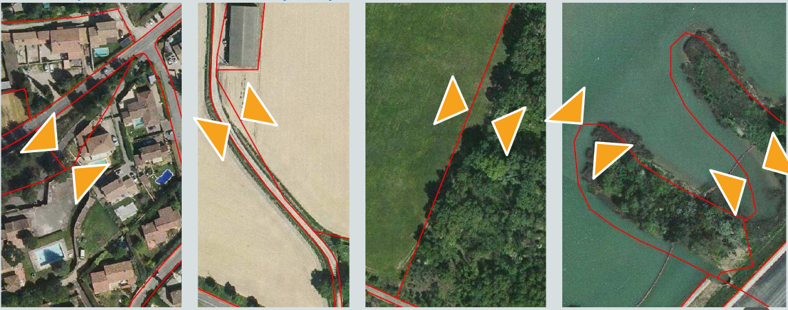

# PAQ — Données géographiques — Digitanie

> Source unique : `20220504_PAQ_geomatique_draft_digitanie.docx`. Les sections, exemples, consignes de modèle et champs non renseignés sont conservés dans leur ordre. Les blancs du document ne sont pas complétés.

Plan d’assurance qualité

Données géographiques

Saverdun, le 4 mai 2022

- Table des matières
- Table des matières — 2
- 1 — Présentation — 3
- 2 — Normes ISO relatives à la qualité de l’information géographique — 6
- 3 — Documents applicables [spécifier en fonction du client] — 8
- 4 — Terminologie — 8
- 4.1 — Index — 8
- 5 — Présentation et organisation du contrat [spécifier en fonction du client] — 8
- 5.1 — Objet du contrat (séquencement général/description des prestations) — 8
- 5.2 — Organisation de Digitanie (organigramme/contacts) — 8
- 6 — Méthodologie de réalisation des prestations — 8
- 7 — Gestion de la qualité — 9
- 8 — Sources — 12

## Présentation

Ce document pourra être revu et complété.

### Objet

Le Plan d’Assurance Qualité est l’engagement du prestataire quant à la politique d’assurance qualité applicable aux prestations. Il s’applique depuis le démarrage du contrat jusqu’à sa clôture et est consultable par chaque membre de l’équipe du prestataire.

Il est également utilisé pour apporter la visibilité au client sur l’organisation mise en œuvre pour réaliser les prestations et sur les méthodes appliquées pour obtenir le niveau de qualité répondant aux exigences contractuelles.

Le PAQ décrit :

- La présentation générale et le processus d’élaboration et de maintien à jour du PAQ,
- Les documents applicables dans le cadre du contrat,
- Les prestations objet du contrat et l’organisation associée,
- La méthodologie applicable pour la réalisation des prestations,
- Le processus de gestion de la qualité,
- Le processus de gestion de la sécurité et de la confidentialité.

Que qualifie-t-on ?

La qualité de la donnée géographique est mesurée au travers des critères de précision géométrique, de précision temporelle, d’exhaustivité, de précision sémantique, de cohérence logique, de cohérence sémantique et de lignage, définis dans la norme ISO 19113 à l’aide de méthodes explicitées dans la normes ISO 19114 et de mesures spécifiques dans la norme ISO 19138.

Critères quantitatifs :

- Précision géométrique (décrit la précision de positionnement planimétrique et altimétrique des données).
- Exhaustivité (décrit la présence ou l'absence d'objets, de leurs attributs ou de leurs relations dans le jeu de données).
- Précision sémantique (décrit la justesse des valeurs des éléments du jeu de données au niveau des objets, des attributs ou des relations).
- Cohérence logique (décrit le degré de compatibilité avec les règles logiques de structure de données, d'attributs et de relations (la structure peut être conceptuelle, logique ou physique).

Critères qualitatifs :

- Exhaustivité.
- Précision sémantique.
- Cohérence logique.
- Actualité (introduit une référence temporelle permettant de savoir si les données sont à jour).
- Généalogie (décrit l’historique d’un jeu de données et, s’il est connu, son cycle de vie depuis l’acquisition et la saisie de l’information jusqu’à sa compilation avec d’autres jeux et les variantes de sa forme actuelle. Ce critère n’est plus présent dans la nouvelle norme ISO 19157. En revanche, il reste bien présent dans la norme ISO 19115 au niveau des métadonnées).

Critère spécifique :

- Qualité spécifique : la qualité spécifique permet à l’utilisateur de définir ses propres critères de qualité si les critères officiels définis par la norme ne répondent pas à ses attentes. C'est en quelque sorte un « critère personnalisé ». Ce critère devrait ne plus être présent dans la nouvelle norme ISO 19157.

Définir le lot ou la base de données que l’on souhaite qualifier en précisant si l’on se place du point de vue utilisateur, du contrôleur ou du diffuseur, si on est dans le cadre d’un standard, si le lot de données concerné fait l’objet de spécifications, s’il fait l’objet localement de compléments dans sa conception, et toutes les règles encadrant la production du lot de données.

Pourquoi ?

La qualification des données peut avoir différents objectifs. Par exemple :
- connaître la qualité de données pour les corriger ;
- réaliser la recette de données récemment acquises ;
- documenter des données avant leur diffusion ;
- comparer plusieurs données ayant le même usage (par exemple des modes d’occupation du sol) ;
- documenter le niveau de qualité de données pour en faire une base de référence.
Déterminer le ou les objectifs avant d’effectuer les mesures qualité est important, à la fois pour étudier les bons usages, et pour préparer la restitution.

### Hiérarchiser les critères qualité

Le CNIG a conçu et testé un « synopsis pratique pour la qualification » : il s’agit, face à un type de données, de déterminer une méthode et un ordre des critères à mesurer.
Le « synopsis » prend la forme d’un tableau avec :
- en colonne les mesures qualité retenues dans les fiches méthodologiques du Cerema ;
- en ligne différents champs de description permettant d’aider à la réalisation de la mesure concernée (voir le descriptif des lignes ci-dessous).

<!-- Tableau 1 du document source, bloc 63. -->

| Importance intrinsèque du critère | Note de 1 à 5 permettant de montrer si la connaissance du résultat de la mesure qualité est indispensable à l’utilisation de la base (note de 5) ou si elle est anecdotique (note de 1). |
| --- | --- |
| Cas d’usage pour lesquels le critère est important | Avant de remplir cette ligne, il est nécessaire de définir des cas d’usages du lot de données (dans un document à part). On indique ensuite, pour chaque mesure, si elle est particulièrement importante pour un ou plusieurs usages. |
| Points de vigilance | Conseils pour la mesure de la qualité. |
| Pistes d’évolution des spécifications | Ligne facultative : elle permet d’indiquer les limites des spécifications. |
| Dépendance à des données externes | Ligne facultative : liste des données de référence ou nécessaires pour la bonne réalisation de la mesure. |
| Besoin d’outils complémentaires | Ligne facultative : permet de liste des idées pour des outils d’aide à la qualification |

Usages pour lesquels cette qualification doit être réalisée :

Thèmes
- Administratif et réglementation
- Défense et secours
- Gestion technique
- Planification et prévention
- Loisirs / tourisme
- Santé
- Environnement

Usages
- Recensement/dénombrement
- Localisation
- Cartographie (grand public, réglementaire, souveraine)
- Acheminement – navigation
- Analyse (statistique, spatiale)
- M2M, IoT

### Représenter les résultats

Il s’agit d’aller encore plus loin dans la simplification de l’information sur la qualité d’un jeu de données en réduisant l’ensemble des mesures à une seule information. Les représentations possibles sont multiples :

- note (sur 5, sur 20...) ;
- smiley ;
- feu (vert, orange, rouge) ;
- étoiles (1 à 5 étoiles en fonction de la qualité du lot). Concernant les méthodes graphiques, on veillera à ne pas dépasser 5 niveaux pour que l’exercice conserve son intérêt simplificateur.

La représentation des résultats de la qualification est fondamentale pour aider les utilisateurs à comprendre quels usages ils peuvent faire des données.
Il s’agira de représenter de façon claire :
- les principaux résultats de la qualification ;
- les usages utiles et ceux déconseillés.
Il est également recommandé d’autoriser la contribution des utilisateurs

<!-- FIGURE SOURCE : 20220504_PAQ_geomatique_draft_digitanie.docx, bloc 75, section « Représenter les résultats ». Ancrage conservé après le contenu du bloc source. -->

La représentation de la qualité peut alors prendre les 3 formes :

- la forme complexe qui consiste à lister l’ensemble des résultats des contrôles sous forme chiffrée avec la mise en perspective des résultats de mesures avec les exigences qualité ;
- la forme simplifiée avec la double représentation des exigences et des mesures, ou une forme comparative ;
- la forme synthétique avec deux résultats possibles (point de vue commanditaire) : lot conforme =&gt; meilleure note (feu vert par exemple), lot non conforme =&gt; moins bonne note (feu rouge par exemple).

La forme complexe est à privilégier dans une relation contractuelle (commanditaire-prestataire) ainsi que la forme synthétique car celle-ci donne efficacement l’information de conformité ou non. La forme simplifiée (avec double représentation) est utile comme outil d’information aux utilisateurs (utilisations prévues ou autres usages) qui ne sont pas nécessairement intéressés par le détail du contrôle ni par le bilan contractuel mais pour qui la présentation des niveaux d’exigence qualité attendus et obtenus par critère a du sens.

## Normes ISO relatives à la qualité de l’information géographique

ISO 19113 :2002 : Principes de qualité. Cette norme établit les principes pour décrire la qualité des données géographiques et définit les éléments pour documenter l'information de qualité. Elle est applicable aux producteurs de données qui fournissent des informations de qualité pour décrire et vérifier dans quelle mesure les données correspondent à la réalité telle que définie dans les spécifications du produit, formelle ou implicite. La règle vaut également pour les utilisateurs afin de déterminer si la qualité de certaines données géographiques est suffisante pour l'application requise. La règle doit être suivie par les organisations responsables de l'acquisition et de la vente afin de rendre possible l'ajustement aux spécifications du produit. La norme peut également être utilisée pour définir les schémas d'application et les exigences de qualité. En plus d'être appliqués aux données géographiques codées numériquement, les principes de la règle peuvent être étendus à identifier, recueillir et documenter des informations relatives à la qualité des ensembles de données ou de petits groupes d'ensembles de données. Bien que la règle s'applique aux données géographiques représentées numériquement, les principes définis peuvent être étendus à de nombreuses formes de données géographiques telles que des cartes, des graphiques et des documents texte. La norme n'a pas l'intention de définir un niveau minimum de qualité pour les données géographiques.

La norme ISO 19114 :2003 fournit un cadre de procédures, de méthodes, de déterminations et d'évaluations de la qualité compatibles avec les principes et critères définis dans la norme ISO 19113. Elle établit également un cadre pour évaluer et rendre compte des résultats, soit par l'intermédiaire de métadonnées seulement, soit dans un rapport spécifique d'évaluation de la qualité.

La norme ISO 19138 :2006 décrit un ensemble de mesures de la qualité des données. Elles peuvent être utilisées pour l'estimation des critères identifiés dans la norme ISO 19113. De nombreuses mesures sont définies pour chaque critère de la qualité des données. Le choix de les utiliser ou non dépend du type de la donnée à évaluer et de son usage.

ISO 19115:2003 Information géographique -- Métadonnées et ISO 19115:2006 Rectificatif technique 1 : Fournit une structure permettant de décrire et de découvrir des données géospatiales, y compris le moment et l'endroit de leur localisation, une vue d'ensemble de leur contenu, de leurs propriétés, de leur qualité, de leur utilisation adéquate, du mécanisme de distribution, des points de contact pour les demandes d'informations, etc. Elle permet de décrire tous les types de ressources géospatiales, y compris les documents textuels et les informations non géographiques. Cette norme comprend le contenu défini dans les normes de qualité des données ISO 19113:2002, ISO 19114:2003 et ISO 19138:2006. Cette norme peut uniquement référencer un document ISO 19110:2005 externe qui décrit des attributs d'entités. Cette norme est remplacée par la norme ISO 19115-1:2014 : elle définit le schéma pour décrire des informations géographiques au moyen de métadonnées. Elle fournit des informations concernant l’identification, l’étendue, la qualité, le contenu, la référence spatiale, la représentation des données, la distribution et d’autres propriétés des données géographiques numériques et des services.

ISO 19157 :2013 – Qualité des données : critère de précision de position / critère de précision thématique. Regroupe les normes 19113/19114 et 19138.

Définit les procédures générales permettant d'évaluer la qualité des données géospatiales et de communiquer le résultat. Par exemple, une des méthodes d'évaluation de la qualité repose sur la spécification d'un produit de données. Cette norme révisée remplace l'ensemble de normes de qualité des données précédent ayant contribué à la norme ISO 19115:2003, lesquelles sont répertoriées ci-dessous :

- Cohérence logique : regroupe tous les éléments de qualité qui vont attester qu’un lot de données est exploitable. L’accent est mis sur les aspects techniques contrairement aux quatre autres critères qui traitent préférentiellement du contenu. Ce critère est généralement évalué en premier pour s’assurer que les données sont conformes aux attendus techniques avant d’évaluer les autres critères. Il regroupe la cohérence conceptuelle, la cohérence des domaines de valeurs, la cohérence du format, la cohérence topologique.
- Exhaustivité : critère considéré comme le plus important en termes de qualité de contenu et que l’on retrouve le plus fréquemment dans les règlements techniques de la directive Inspire quand des exigences de qualité sont précisées. Il qualifie la présence ou l’absence de données qui sont traduites par deux sous-critères : excédent ou omission.
- Précision thématique : suite logique du critère d’exhaustivité. Après s’être assuré que les objets attendus sont effectivement présents dans le jeu de données, on s’attache à vérifier si les informations qu’ils portent sont exactes. On retrouve alors trois sous-critères qui tiennent compte des différentes formes possibles de confusion entre objets et de la typologie des informations portées : justesse du classement, justesse des attributs non quantitatifs, précision des attributs quantitatifs.
- Précision de position : évalue la justesse de localisation. Critère qui peut s’avérer fondamental pour certains types de données ou d’usage. Il est décomposé en trois sous-critères : précision absolue ou externe, précision relative ou interne, précision de position de données matricielles. Les deux premiers sous-critères concernent les données sous forme vectorielle. Le troisième sous-critère est identique, dans sa finalité, au sous-critère de précision absolue mais concerne plus spécifiquement les données sous forme matricielle (grille, image, modèle numérique, etc.).
- Qualité temporelle : ne concerne que les jeux de données comportant des informations de datation. A ne pas confondre avec l’actualité des données qui relève des métadonnées générales. Elle est composée de trois sous-critères : exactitude de la mesure temporelle, cohérence temporelle, validité temporelle.
- Usabilité : critère non traduit sous la forme de mesure ou d’indicateur car dépendant de l’usage fait des données géographiques. Il est en fonction des exigences de chaque utilisateur qui ne peuvent être décrites en utilisant les éléments de qualité ci-dessus.

Ces normes sont le fruit d'un travail commun mené par les organismes nationaux de cartographie au sein des institutions de normalisation. Si elles répondent en grande partie aux besoins de ces organismes qui produisent les données de référence, elles semblent plutôt mal adaptées aux besoins des utilisateurs et encore moins à l'évolution « grand public » que prend la géomatique aujourd'hui autour de l'Internet et des productions collaboratives.

## Documents applicables [spécifier en fonction du client]

<!-- Tableau 2 du document source, bloc 101. -->

| Référence | Statut | Date | Titre |
| --- | --- | --- | --- |
|  | Validé |  |  |

## Terminologie

### Index

- Cerema : Centre d’Etudes et d’expertise sur les Risques, l’Environnement, la Mobilité et l’Aménagement. EPCA apportant un appui aux collectivités territoriales et aux services déconcentrés de l’Etat dans la mise en œuvre des thématiques dont il est responsable.
- CNIG : Conseil National de l’Information Géographique. Appui le Gouvernement dans le domaine de l’information géographique au niveau de la coordination des contributions des acteurs concernés et de l’amélioration des interfaces entre ces derniers.
- Donnée de référence : est produite par une structure publique reconnue, ce qui lui confère un niveau de confiance élevé des utilisateurs. Sa couverture est exhaustive sur le territoire. Son contenu doit être limité afin de minimiser les interprétations possibles, mais doit pouvoir offrir la géométrie et le géoréférencement accompagnés d'une sémantique épurée et plutôt minimaliste qui correspond plus à l'intersection des besoins qu'à leur union. La qualité de ces référentiels doit être connue et diffusée par leur producteur selon les normes en vigueur. La donnée de référence reste la propriété de l’organisme qui la génère et qui continue d’en assurer l’entretien. L’organisme qui produit et entretient cette donnée peut être distinct de celui qui l’intègre et de celui qui la diffuse : ces fonctions doivent être clairement distinguées.
- Donnée métier : hérite en grande partie de la géométrie, du géoréférencement et des informations sémantiques contenues dans les données de référence sur lesquels elle s'appuie. Plus les données de référence sont exemptes de défauts, plus la probabilité d'avoir des données métier de bonne qualité est grande.

## Présentation et organisation du contrat [spécifier en fonction du client]

### Objet du contrat (séquencement général/description des prestations)

### Organisation de Digitanie (organigramme/contacts)

## Méthodologie de réalisation des prestations

    - Réunion de travail

- Fréquence : [à compléter selon projet]
- La planification des revues d’indicateurs est définie de manière à fournir en temps utile leurs conclusions comme données d’entrée de la réunion à venir.

    - Livrables (formats et remise des livrables/Traitement des remarques/Classement des livrables)

- Les livrables intermédiaires doivent tous disposer d’un numéro de version, il est de la forme suivante : V X.x
Le X sera incrémenté pour les modifications majeures, alors que le x le sera pour les modifications mineures.

Origine des modifications
Les modifications peuvent avoir plusieurs causes :
 Une erreur à été détectée et doit être corrigée
 Une mise à jour et/ou un complément est nécessaire

Procédure de mise en œuvre des modifications
Suivant la nature des modifications, la procédure de mise en œuvre est différente. En effet, les changements de versions sont différents en cas de correction ou d’ajout.

## Gestion de la qualité

    - Procédures d’évaluation

Les méthodes d’évaluation dépendent du contexte dans lequel s’inscrit la démarche de qualification des données à partir de l’existence ou non de spécifications et de la disponibilité ou non de sources de contrôle plus précises ou pouvant faire fonction de référence.

Une méthode d’évaluation de la qualité des données décrit les procédures et traitements appliqués aux données pour parvenir à un résultat de la mesure de la qualité.

- Qualité interne :

Qualité d’un lot de données produit au regard de nécessaires spécifications, rédigées au préalable pour décrire précisément ce qui doit être produit (cahier des charges). Ces spécifications détaillent la structure et le contenu de la base de données à produire en précisant la qualité exigée. Les méthodes de contrôle de la qualité interne sont décrites dans la norme ISO 19157. La qualité interne ainsi évaluée correspond alors à l’écart entre les spécifications initiales et ce qui a été réellement produit.

- Qualité externe :

C’est l’aptitude d’un jeu de données à satisfaire un usage donné. Il faut bien entendre ici un type d’usage générique comme une exploitation cartographique, un usage à but statistique, ou la constitution d’un observatoire. En absence de spécifications qui, généralement, sont là pour traduire le besoin par rapport aux usages envisagés, il n’est pas possible d’évaluer la conformité d’un jeu de données. Qualifier revient par conséquent à donner une liste de résultats bruts sans statuer sur leur valeur et leur pertinence. Pour autant, tout professionnel de la géomatique est en capacité de juger, de manière subjective, si un jeu de données l’intéresse ou non. Cette notion est encore peu utilisée et très peu documentée, la difficulté venant sans doute de la complexité à traduire scientifiquement chaque famille d’usage en exigences de qualité et sortir des approches uniquement subjectives. C’est une thématique qui relève encore du domaine de la recherche.

- Qualité pour un usage spécifique :

Elle exprime la perception d’un utilisateur pour un besoin spécifique. Cette approche, plutôt marginale il y encore quelques années, a été démocratisée avec l’essor de l’Internet et la multiplication des systèmes de notation par les communautés d’internautes. Elle s’est développée de manière exponentielle ces dernières années avec l’ubérisation de la société où chacun d’entre nous devient potentiellement « notateur » ou « noté ». Il n’y a pas de raison que l’information géographique échappe à cette évolution et pourquoi ne pas imaginer à terme, sur les géoportails, une notation des jeux de données résultant de l’agrégation d’avis d’utilisateurs, qu’ils soient particuliers ou professionnels. La norme ISO 19157 n’aborde pas ces questions. C’est un sujet qui dépasse très largement la géomatique car relevant plutôt du champ de la sociologie ou de l’anthropologie.

Indicateurs :

- Erreur : évaluation de la conformité de la donnée (TRUE/FALSE)
- Nombre d’erreurs : nombre total d’erreurs mesurées sur l’échantillon ;
- Taux d’erreur : pourcentage d’erreurs relevées sur l’échantillon évalué ;
- Moyenne ;
- Écart type ;
- Satisfaction du client ;
- Evaluation de l’efficacité et l’efficience des indicateurs à remplir leurs objectifs ;
- Identification et mise en œuvre des opportunités d’amélioration.

La revue des indicateurs s’appuie en particulier sur le tableau de bord comprenant les informations relatives à la satisfaction des clients, sur l’avancement des plans d’actions d’amélioration et sur le résultat des audits.

    - Contexte du contrôle qualité

Le monde réel, comme son nom l’indique, représente la totalité des objets que l’on désire évaluer. Il faut donc disposer d’une donnée de référence qui recense la totalité des objets normalement présents dans l’emprise géographique concernée (tant pour un échantillon ou que pour une base entière).

Le terrain nominal se définit comme la restriction du monde réel au travers du filtre des spécifications. Avant de produire une base de données, celle-ci doit être spécifiée. Les spécifications définissent le contenu de la base de données et imposent à la fois des restrictions en termes de sélection et de contenu, ainsi que des exigences de qualité pour chaque classe d’objets de la base. C’est sur ces éléments que portent ensuite les contrôles qui sont effectués et dont il faut tenir compte. Quand une base de données a fait l’objet de spécifications, le contrôle s’effectue nécessairement en référence à la description et aux simplifications proposées dans les spécifications. En l’absence de spécifications, la seule référence connue demeure le monde réel. Même en cas d’existence de spécifications, cela n’exclut pas la possibilité d’effectuer le contrôle par rapport au monde réel pour conserver une vision plus complète. Hormis les référentiels géographiques produits par des producteurs professionnels et les séries de données produites suivant des standards (CNIG ou Géostandards COVADIS par exemple), la plupart des données thématiques ou métiers sont produites sans spécification et nécessitent d’être contrôlées par rapport au monde réel.

Echantillonnage :

Il doit être suffisamment représentatif.

- Le nombre d’objets : la taille de l’échantillon est exprimée en pourcentage du nombre total d’objets pour un type donné.
- La surface couverte : la taille de l’échantillon est exprimée en pourcentage de la surface totale du lot de données, notamment dans le cas d’objets surfaciques.
- L’emplacement : les échantillons doivent être judicieusement répartis dans l’espace afin de représenter l’ensemble des objets et des strates existants dans le jeu de données.

### Exemples

- Critère de précision de position :

La précision de position se définit comme la précision de la position des entités au sein d’un système de référence spatiale. Elle se compose de deux composantes :
- la précision absolue (ou externe) : proximité des valeurs de coordonnées reportées par rapport aux valeurs vraies ou reconnues en tant que telles ;
- la précision relative (ou interne) : proximité des positions relatives des entités dans un jeu de données par rapport à leurs positions relatives respectives vraies ou reconnues en tant que telles.

<!-- FIGURE SOURCE : 20220504_PAQ_geomatique_draft_digitanie.docx, bloc 164, section « Exemples ». Ancrage conservé après le contenu du bloc source. -->

- écart : écart maximum de positionnement constaté sur chacun des polygones - ou parties de polygone - d’un échantillon soumis à contrôle
- norme : spécifications d’un produit déterminant a priori un(des) seuil(s), limite(s) que les incertitudes de positionnement ne devraient pas dépasser.

Problématique 1 : « nombre d’incertitudes au-dessus d’un seuil donné ou « taux d’erreurs de position au-dessus d’un seuil donné ».

METHODE
mise en œuvre sur un échantillon de polygones (ou parties de polygone) : analyse de la qualité du positionnement par rapport à un seuil préalablement défini (dans les spécifications) pour chacun des polygones contrôlés

- soit pas d’écart à la norme
- sinon mesure de l’écart maximum constaté sur ce polygone.

Problématique 2 : classement des écarts à la norme selon deux seuils.

METHODE
mise en œuvre sur un échantillon de polygones (ou parties de polygone) : analyse de la qualité du positionnement par rapport à deux seuils préalablement définis (dans les spécifications) pour chacun des polygones contrôlés :
- soit pas d’écart à la norme
- sinon mesure de l’écart maximum constaté sur ce polygone
- rejet si un écart maximum est supérieur au seuil n°2
- Critère de précision thématique :

Définition de la norme
La précision thématique se définit comme la précision des attributs quantitatifs, et la justesse des attributs non quantitatifs, du classement des entités et de leurs relations. Elle se compose de trois éléments de qualité des données :
- la justesse du classement : comparaison des classes attribuées aux entités ou à leurs attributs par rapport à l'univers du discours (par exemple, monde réel ou données de référence) ;
- la justesse des attributs non quantitatifs : mesure permettant d'établir si es valeurs d’un attribut non quantitatif
sont correctes ou pas ;
- la précision des attributs quantitatifs : proximité de la valeur d'un attribut par rapport à la valeur vraie ou reconnue
comme vraie.

    - Actions correctives et préventives

Le suivi d’avancement hebdomadaire un des principaux outils de pilotage. Pour un pilotage rapproché du système de management, des « points qualité » mensuels sont inscrits dans le calendrier de Digitanie pour compléter les réunions avec le client.

Les points suivants sont portés à l’attention de la production :

- le tableau de bord stratégique, qui affiche la valeur des indicateurs associés aux objectifs qualité ;
- le déploiement de la politique qualité.

L’efficacité des réunions client et des points qualité est assurée par une préparation de leurs données d’entrée.

## Sources

https://www.cerema.fr/fr/centre-ressources/boutique/qualifier-donnees-geographiques

https://www.cerema.fr/system/files/documents/2018/02/2-Cerema_QuaDoGeo_Methode.pdf

http://cnig.gouv.fr/?page_id=18183

http://cnig.gouv.fr/wp-content/uploads/2021/10/211015-Mod%C3%A8le-de-parties-Qualit%C3%A9-et-M%C3%A9tadonn%C3%A9es-des-g%C3%A9ostandards.pdf
