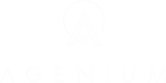
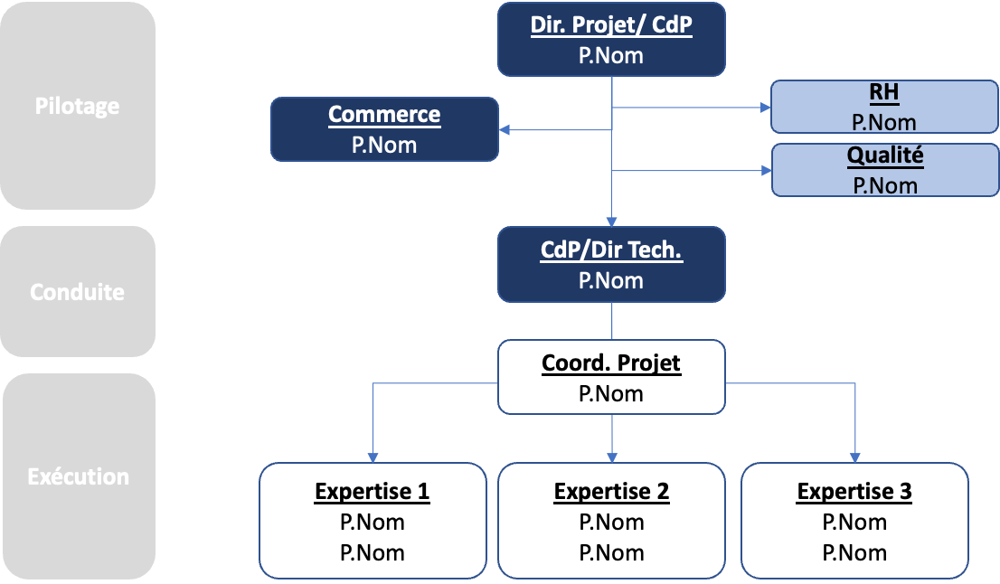
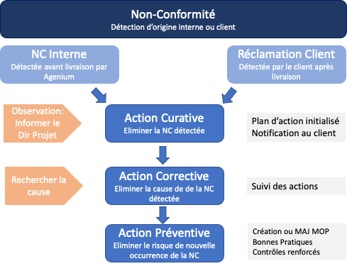
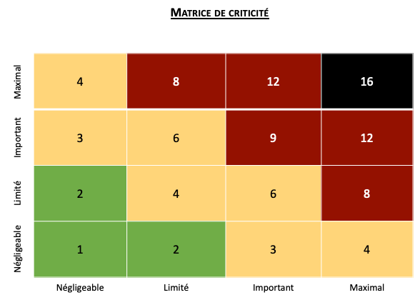

# PMAQ — Modèle Agenium IT & Systems

> Source unique : `PMAQ-Type-AIS.docx`. Les sections, exemples, consignes de modèle et champs non renseignés sont conservés dans leur ordre. Les blancs du document ne sont pas complétés.

<!-- Tableau 1 du document source, bloc 1. -->

| Client |  |
| --- | --- |
| A l’attention de |  |

<!-- FIGURE SOURCE : PMAQ-Type-AIS.docx, bloc 1, section « PMAQ — Modèle Agenium IT &amp; Systems ». Ancrage conservé après le contenu du bloc source. -->

PMAQ générique

<!-- Tableau 2 du document source, bloc 11. -->

| AGENIUM IT & SYSTEMS |  |
| --- | --- |
| Référence du document | xxx |
| Edition. Révision | x.x |
| Date |  |
| Rédacteur |  |

Sommaire

- 1. — Introduction — 2
- 1.1. — Objet du document — 3
- 1.2. — Portée du document — 3
- 1.3. — Classification (Optionnel) — 3
- 1.4. — Procédure d’approbation et de mise à jour — 3
- 1.5. — Destinataires - Diffusion — 3
- 1.6. — Auteurs — 3
- 1.7. — Fiche d’évolution du Document — 4
- 2. — Documents applicables et de références — 5
- 2.1. — Gestion de la documentation — 6
- 2.2. — Documentation Applicable — 6
- 2.3. — Documentation de référence — 6
- 2.4. — Glossaire — 7
- 3. — Présentation du projet — 8
- 3.1. — Description du projet — 9
- 3.2. — Mission et objectifs Agenium — 9
- 3.3. — Localisation — 9
- 3.4. — Facteurs de succès du projet — 9
- 3.5. — Livrables attendus — 9
- 3.6. — Planning et jalons principaux — 9
- 3.7. — Obligations du client (optionnel) — 10
- 3.8. — Hypothèses et contraintes (optionnel) — 10
- 4. — Organisation et gouvernance du projet — 11
- 4.1. — Gouvernance du Projet — 12
- 4.2. — Reporting projet — 15
- 4.3. — Management Visuel (optionnel) — 15
- 5. — Réalisation de la mission — 16
- 5.1. — Réalisation et méthodes — 17
- 5.2. — Suivi des réalisations — 19
- 5.3. — Contrôle et vérifications — 20
- 6. — Management de la qualité — 22
- 6.1. — Gestion des compétences — 23
- 6.2. — Gestion d’une non-conformité — 24
- 6.3. — Gestion des risques — 26
- 6.4. — Gestion d’une demande de modification — 27
- 6.5. — Amélioration continue — 28
- 6.6. — Audit et retours d’expériences — 29
- 7. — Les outils — 31
- 7.1. — Moyens nécessaires — 31
- 7.2. — Outils du client — 31
- 8. — Confidentialité — 32
- 8.1. — Engagement de confidentialité — 32
- 8.2. — Sécurité et Protection des données — 32

## Introduction

### Objet du document

Ce document présente le Plan de Management et d’Assurance Qualité pour les activités réalisées par AGENIUM IT ET SYSTEMS (AIS dans la suite du document) dans le cadre

L’organisation Qualité retenue par AIS pour la conduite de ces prestations s’appuie sur son référentiel Qualité dont les dispositions et procédures sont totalement conformes avec la norme ISO9001 V2015.

### Portée du document

Le Plan de Management de l’Assurance Qualité (PMAQ) couvre :

- La description des processus de l‘ensemble des activités à réaliser
- La gouvernance : personnes impliquées (rôles et responsabilités), réunions et reporting
- Les règles de gestion notamment pour :

    - Les risques

    - Les non-conformités

    - Les modifications

    - La documentation

### Classification (Optionnel)

Ce document est classifié au niveau.

### Procédure d’approbation et de mise à jour

Approbation avec le client :

Décrire le processus d’approbation

Mise à jour :

Décrire le processus de mise à jour du document.

Exemple

Le PMAQ est mis à jour annuellement par le chef de projet et revu par le responsable qualité du projet

### Destinataires - Diffusion

<!-- Tableau 3 du document source, bloc 91. -->

| Nom | Organisme |
| --- | --- |
|  |  |

### Auteurs

<!-- Tableau 4 du document source, bloc 94. -->

| Nom | Organisme | Date |
| --- | --- | --- |
|  |  |  |

### Fiche d’évolution du Document

<!-- Tableau 5 du document source, bloc 97. -->

| Edition | Révision | Date | Objet de l’évolution |
| --- | --- | --- | --- |
| 1 | 0 |  |  |

## Documents applicables et de références

### Gestion de la documentation

Les dispositions de maîtrise des données garantissent qu'au cours des prestations :

- L'identification des versions successives des documents se fait de façon non ambiguë
- La documentation d’un produit demeure cohérente à ce dernier
- Les documents sont diffusés à tous les intervenants concernés

Le référentiel documentaire est constitué au cours de la phase de prise de poste et il est géré en configuration.

Un point de la situation des évolutions du référentiel documentaire est présenté à chaque COTECH.

Une synthèse de l’évolution de la situation du référentiel documentaire est présenté à chaque COPIL.

La documentation évolue pendant toute la durée du projet sous la responsabilité du chef de projet. Les remarques issues des revues sont intégrées dans les versions finales et sont tracées conformément à la gestion des changements.

Tous les participants qui disposent des droits nécessaires disposent d’un accès rapide et pratique à l’ensemble de la documentation. Le droit à en connaître est totalement maitrisé. Une gestion des versions des documents est assurée afin de générer rapidement les livrables contractuels.

### Documentation Applicable

Ensemble des documents client qu’Agenium doit appliquer :

<!-- Tableau 6 du document source, bloc 122. -->

| Id | Titre | Référence | version | date |
| --- | --- | --- | --- | --- |
| A1 |  |  |  |  |
| A2 |  |  |  |  |

### Documentation de référence

Ensemble des documents client qu’Agenium peut consulter sans obligation de l’appliquer

<!-- Tableau 7 du document source, bloc 128. -->

| Id | Titre | Référence | version | date |
| --- | --- | --- | --- | --- |
| R1 |  |  |  |  |
| R2 |  |  |  |  |

### Glossaire

Insérer un tableau

## Présentation du projet

### Description du projet

Présenter l’environnement client, les besoins et le périmètre du projet.

### Mission et objectifs Agenium

Présenter comment s’inscrit l’intervention d’Agenium dans le projet client.

Présenter les principaux axes de réalisation et leurs objectifs

### Localisation

Préciser ici si la mission est ex ou in situ.

Décrire son organisation physique.

### Facteurs de succès du projet

Paragraphe générique, peut être adapté à chaque mission :

<!-- Tableau 8 du document source, bloc 158. -->

| Objectifs | Facteurs de succès | Disposition |
| --- | --- | --- |
| Bonne marche du projet | Tenue des délais   Coopération entre les équipes | Équipe projet expérimentée. Procédure de « pilotage des projets » Agenium  Réunions régulières d’information et de rencontres des équipes prestataire et client |
| Qualité des livrables | Données d’entrée de qualité et exhaustives | Revue régulière avec le client pour vérifier les attendus Procédures de « contrôles qualité » Agenium |

### Livrables attendus

Liste ou tableau des livrables attendus

### Planning et jalons principaux

Indiquer ici le planning de la mission

### Obligations du client (optionnel)

Dans le cadre de l’engagement,

- Réaliser, dans les délais convenus, les tâches qui lui incombent.
- Être disponible…
- …

### Hypothèses et contraintes (optionnel)

Hypothèses :

- L’ensemble des données d’entrées respectent les pré-requis mentionnés
- Un accès aux outils du client
- …

Contraintes :

- Confidentialité
- Délais de validation
- Des documents spécifiques attendus
- Accès à des locaux sécurisés
- Conditions particulières
- ….

## Organisation et gouvernance du projet

### Gouvernance du Projet

#### Rôles et responsabilités

##### Organigramme du Projet

<!-- FIGURE SOURCE : PMAQ-Type-AIS.docx, bloc 207, section « Organigramme du Projet ». Ancrage conservé après le contenu du bloc source. -->

A modifier à l’aide du ppt « modèle organigramme projet » sur AG cloud/qualité/pilotage projet Agenium

##### Composition de l’Equipe et Personnel Clé

L’organisation projet d’Agenium est définie dans la procédure « pilotage de projets » du SMQ.

Elle est définie en 3 parties :

- Le pilotage
- La conduite
- L’exécution

Le pilotage de la mission est assuré par le directeur de projet, appuyé au sein du projet et d’Agenium par :

- Le commerce : chargé du suivi contractuel de mission
- Le service RH : afin d’assurer la gestion des compétences nécessaires au projet
- Le service qualité : pour assurer la standardisation et la qualité des livrables et des activités confiées
- La gestion des autorisations : Officier de sécurité
- La gestion des achats : assistance administrative

La direction des projets est garante de la conformité du pilotage de la mission selon les exigences client et Agenium.

Le directeur de projet est l’interlocuteur principal du client pour le suivi du projet.

La conduite du projet est assurée par le Chef de projet :

- Garant de des délais de la qualité et des couts du projet
- Rôle d’expert auprès de collaborateurs

En fonction de la dimension du projet il peut être secondé par un coordinateur de projet qui s’assure de la répartition des activités, la tenue du planning et escalade des difficultés rencontrées.

Le chef de projet supervise l’exécution du projet et met en place l’ensemble des indicateurs permettant de piloter la mission et d’escalader les informations à la direction des projets.

L’exécution du projet est réalisée par les équipiers qualifiés pour les expertises demandées.

##### Organisation de l’équipe client

Indiquer l’organisation client

#### Réunions

##### Tableau des réunions de pilotage de la mission

A titre d’exemple, peut être adapté au contexte projet

<!-- Tableau 9 du document source, bloc 248. -->

|  | Sujets | Participants Client | Participants Agenium | Supports | Livrables |
| --- | --- | --- | --- | --- | --- |
| COTECH Mensuelle Sur site client | Revue et validation de l’avancement technique: -Planning et livrables en cours -Revue des KPI -Validation livrables / jalons -Arbitrages nouvelles demandes -Répondre aux questions techniques / accès | Représentant technique Représentant achats | DP DT Équipier | -Ppt Cotech  -Planning -Plan d’action | -CR réunion  -Plan d’action |
| COPIL Trimestrielle Sur Site Client | -Approuver les demandes de modifications -Suivre le plan d’acomptage -Suivre les risques du projet -Résoudre les problématiques impactant le projet -Amélioration continue/PMAQ | Point Focal Technique Représentant achats | DP DT RCC | -Ppt COPIL -Gestion des risques -Planning -Plan d’action | -CR réunion -Plans d’action -Processus ou activité modifiée -PMAQ amendé |
| Suivi activité Hebdo En visio ou locaux AIS | -Suivre les avancements du projet  -Aborder problèmes techniques/organisationnels -Préparer les activités de la semaine suivante -Produire les KPI du projet |  | Equipe AIS DP  DT | -Plan d’action | -CR réunion -Plan d’Action  -Communication client si retard |
| Prépa COTECH Mensuelle En visio | -Revue des livrables et avancement du projet -Résoudre les problématiques techniques rencontrées -Synthèse des difficultés ou pistes d’amélioration décelées -Synthèse des KPI du Projet |  | Equipe AIS DP  DT | - CR et KPI hebdo -Gestion des risques | -Ppt COTECH |
| Management Visuel Hebdo Envoyé par mail | Découle de la réunion interne suivi d’activité –indicateurs visuels | Point focal Technique | DP, DT Equipe AIS | Actions et KPI de la semaine | Management visuel (A4) (PDF) |

### Reporting projet

- Il s’agit ici de décrire les KPI attendus du projet qui seront partagés avec le client.
- Le tableau ci-dessous décrit les indicateurs présentés au client lui permettant de piloter le projet et le respect des engagements.

<!-- Tableau 10 du document source, bloc 255. -->

| KPI |  | Instance |
| --- | --- | --- |
| Avancement | Respect du planning et des jalons contractuels Avancement réalisation des livrables Nombre de livrables traités / fonctionnalités traitées | COTECH  Suivi activités |
| Qualité | Nombre d’anomalies ou NC Avancement de traitement d’anomalies | Suivi activités COPIL |
| Financier | Suivi des coût et du budget | COPIL |
| Satisfaction client | Enquête de Satisfaction Client | COTECH |

### Management Visuel (optionnel)

Le « Management Visuel » est utilisé pour piloter et animer des équipes de manière simple et efficace à l’aide d’un ensemble d’éléments visuels facilitant le partage de l’information, le suivi des activités et la détection des problèmes, tout en promouvant la transparence et l’esprit d’équipe.

Le Management Visuel permet :

- De mobiliser l’ensemble des acteurs du projet sur un objectif commun : la satisfaction Client,
- D’améliorer la qualité et la quantité d’informations échangées au sein du projet
- De synthétiser des difficultés opérationnelles et les actions de résolution
- D’instaurer le sens de l’amélioration continue.

Il facilite le pilotage des opérations dans le cadre des réunions internes et externes établies sur le projet.

## Réalisation de la mission

### Réalisation et méthodes

Il s’agit ici de détailler par phase de projet, par type de livrable, par lot ou par jalon selon la mission considérée, les livrables et/ou la méthodologie de réalisation

#### Développement / méthodologie

##### Description

##### Critères d’acceptation

##### Méthodologie de réalisation

Tiré du plan de développement de SOGEPROM

Le développement s’effectuera en suivant le découpage initialement défini. Il est précisé que ce découpage pourra toutefois être occasionnellement revu en cours de projet avec l’accord du comité de pilotage.

Le développement sera organisé autour de sprints d’une durée de deux semaines. Une équipe de développement, ainsi que le responsable UX/UI travailleront sur les tâches qui leur seront assignées dans le cadre des sprints.

Afin de tenir les délais du projet, il est nécessaire de démarrer le développement de la partie Conformité en parallèle de la partie Annuaire : une fois le socle technique défini les développements peuvent être réalisés indépendamment. Le démarrage de ce développement sera malgré tout un peu décalé pour nous assurer que tout le besoin et les contraintes associées à ce besoin ont bien été identifiés.

Les tâches et les sprints sont matérialisés dans l’outil JIRA.

Une revue sera organisée à l’issue de chaque sprint. A cette occasion, un point sera effectué sur l’état d’avancement des tâches ainsi que sur les difficultés rencontrées lors du sprint. Les tâches du sprint suivant pourront être réorganisées si nécessaire au cours du sprint planning intervenant après la revue.

L’outil de version Git sera utilisé.

Cet outil permet, lors de la réalisation, de développer sur des « branches » séparées. Ceci assure une isolation des développements permettant de vérifier indépendamment les régressions qui pourraient être introduites. Chaque fonctionnalité sera ainsi développée sur sa propre branche : le développement comprend le code et les ressources correspondants à la fonctionnalité ainsi que, le cas échéant, les tests écrits pour celle-ci. Une fois la réalisation validée, la branche est fusionnée avec la branche principale pour intégrer la fonctionnalité de manière définitive au projet.

L’intégration continue du projet sera assurée par l’exécution de tous les tests (précédents et nouvellement créés) avant la fusion d’une branche à la branche principale.

Tout au long du développement de la partie écrite en Python, le respect des normes pep8 sera mesurée à l’aide du linter PyLint.

SonarQube sera également utilisé en cours de développement afin de monitorer l’aspect sécurité sur la partie de code concernée

#### Livrable 2 / Méthodologie

##### Description

##### Critères d’acceptation

##### Méthodologie de réalisation

### Suivi des réalisations

Il s’agit ici de détailler l’ensemble des outils déployés sur la mission pour assurer le suivi des réalisations.

La liste proposée est non exhaustive. Il est possible d’aborder ici les outils utilisés pour assurer ces suivis tels que Jira, Gant ou autre.

Il est possible d’aborder ici la gestion des faits techniques liés au développement de logiciels (attention, c’est un paragraphe différent que celui de la gestion des non-conformités du paragraphe 6)

#### Plans d’action

Décrire le support, le stockage, le partage des actions et sa mise à jour.

#### Outils de pilotage

Lister les outils/méthodologies de pilotage utilisées pour ce projet/cette mission.

Tiré du plan de développement de SOGEPROM

JIRA permet d’organiser et de suivre les tâches prévues, en cours et passées au long du développement du produit. Il permet aussi de garder une trace des tickets créés lors de la demande de fonctionnalités supplémentaires et pour le suivi des bugs détectés.

L’accès sera partagé avec le client.

Un planning prévisionnel est réalisé par Agenium et est disponible via l’outil. Ce planning évoluera en fonction de l’avancement du projet et des facilités ou difficultés rencontrées. Des réunions de suivi seront organisées toutes les 2 semaines afin de présenter les réalisations récentes et pour permettre d’ajuster le planning au fil du projet

#### Indicateurs de suivis

Lister et décrire les indicateurs de suivis (découle de la partie 4.2 reporting projet) : définition, règles de calcul, fréquence, …

Information importante : ces indicateurs seront collectés niveau groupe pour suivre l’avancement des projets.

### Contrôle et vérifications

Cette partie décrit l’ensemble des contrôles qui sont mis en place au sein du projet à des phases pertinentes qui seront également à détailler.

#### Méthodes de contrôles mises en place

Voici quelques exemples de contrôles pouvant être mis en place.

Check list : liste constituée d’un ensemble de points à vérifier lors de la réalisation d’un livrable

Auto vérification

Vérification par un tiers

Avec ou sans visa/tampon

Relecture croisée : un collègue non sachant relit le document ou le livrable pour détecter des manques ou des erreurs, pour vérifier la cohérence

Validation par le chef de projet

Échantillonnage

Test / recette

Simulation

Tiré du plan de développement de SOGEPROM :

La validation des fonctionnalités du projet se fera tout au long du développement au travers de tests. Ces tests servent à assurer le bon fonctionnement des applications lors des diverses modifications et ajouts qui ont lieu lors des cycles de développement. On distingue plusieurs niveaux de test.

- Les tests unitaires. Ces tests servent à assurer le fonctionnement des fonctionnalités bas-niveau de manière isolée (par exemple : connexion à la base de données, insertion ou modification d’une entrée). Dans un souci de qualité, ces tests sont automatiquement exécutés lors de la fusion de nouvelles fonctions dans le programme pour éviter les régressions.
- Les tests d’intégration. Ces tests vérifient le fonctionnement des fonctionnalités dans leur ensemble lorsqu’elles interagissent les unes avec les autres. Ces tests sont en partie automatisables. À l’instar des tests unitaires, la partie automatisée de ces tests sera systématiquement exécutée.
- Les tests de validation. Ces tests s’appuient sur des scénarios définis avec le client qui imitent les actions d’un utilisateur. Ces tests sont rarement automatisables et ne peuvent être réalisés que lorsque l’avancement du projet est conséquent. L’interface graphique sera testée de cette manière.

Parmi cet ensemble de tests les tests automatiques sont systématiquement rejoués et font donc partie des tests de non-régression. Certains tests d’IHM pourront également être identifiés comme faisant partie des tests de non-régression et donc être rejoués à chaque livraison.

Afin de valider une livraison pour mise en production : Une réunion de « GO / No Go » sera organisée afin de présenter le plan de test qui a été effectué ainsi que le résultat de ces différents tests :

- Techniques (pour la qualité et la sécurité du code) : Impact SonarQube
- Fonctionnels

Tiré du plan MAQ de SOGEPROM

Contrôle du process de développement

Le contrôle du processus de développement consiste à :

- Vérifier l’approche de développement choisie
- Vérifier les activités de gestion de projet
- S’assurer que la gestion en configuration est correctement réalisée, pour le code et les documents
- Contrôler l’analyse de risque
- Vérifier que les anomalies sont correctement prises en compte et traitées suivant les processus définis

Contrôle du code

En fonction du langage choisi, différents types de contrôles peuvent être mis en œuvre. Ils seront détaillés dans une version ultérieure du document

#### Enregistrements

Indiquer le modèle/Décrire ici le formulaire de contrôles permettant de collecter les enregistrements.

Si ce dernier se trouve intégré dans un outil il suffit d’insérer une copie d’écran.

## Management de la qualité

### Gestion des compétences

#### Matrice des compétences

Afin de garantir la capacité de réalisation des prestations confiées à Agenium, une matrice de compétence et de polyvalence est mise en place au sein de l’équipe projet xxxx selon les exigences qualité du SMQ Agenium.

Elle sera mise à jour en fonction des activités confiées et des collaborateurs affectés à la mission.

Les profils proposés pour la constitution de l’équipe xxxx d’Agenium possèdent les compétences et les expériences requises pour réaliser les prestations demandées par le client.

Afin d’assurer une continuité de services, des solutions de renforcement seront organisées au sein de l’équipe avec le potentiel support d’équipes complémentaires Agenium. L’appel à des experts référents est mis en place pour garantir un bon niveau de connaissance sur les métiers impliqués.

#### Maintien à niveau des compétences

L'organisation mise en place par AGENIUM pour la réalisation de ses projets repose sur les principes suivants :

- Garantir un haut niveau de qualité de services
- Mettre en place une équipe d’intervenants ayant une grande autonomie
- Privilégier la polyvalence de l’équipe pour garantir la continuité de service tout au long du projet
- Disposer d’un système souple permettant d’être réactif auprès des équipes projets du client
- Fiabiliser l’échange d’information avec le client
- Capitaliser et mettre en œuvre les « best practices », en s’appuyant sur une démarche d’amélioration continue.

Les Experts référents ont pour mission d’apporter les expertises nécessaires à l’équipe Projet et d’assurer le maintien et la pérennisation des compétences dans le cadre d’un plan de formation axé sur :

La création et la maintenance de la cartographie des métiers

La démarche de capitalisation et de retour d’expériences,

La pratique des nouveaux outils et méthodes exploités,

Les techniques de communication

### Gestion d’une non-conformité

La gestion des non-conformités est réalisée selon la procédure « gestion des anomalies » du SMQ de Agenium.

Les non-conformités peuvent être détectées par Agenium durant des audits internes, des contrôles qualité ou des réunions internes.

Les non-conformités ou anomalies sont enregistrées par l’équipe Agenium dans un outil interne de suivi de résolutions des non-conformités et peuvent mener à :

Une action curative

Une analyse des causes réalisée par l’équipe

Un plan d’action initialisé et suivi.

Dans le cas où la non-conformité est détectée par le client, toutes les remarques doivent être formalisées et adressées au directeur de projet. Une réponse est apportée dans le 24 heures et un plan d’action est proposé pour résoudre la NC.

L’ensemble des actions menées peut conduire à :

La mise à jour d’un mode opératoire

La mise en place de best practices

Le renforcement de contrôles (via check list, relecture croisée,)

Un suivi des non-conformités et le plan d’action d’amélioration continue seront présentés lors des COTECH.

Logigramme de traitement des NC :

<!-- FIGURE SOURCE : PMAQ-Type-AIS.docx, bloc 430, section « Gestion d’une non-conformité ». Ancrage conservé après le contenu du bloc source. -->

### Gestion des risques

La gestion des risques est réalisée selon la procédure « gestion des risques » du SMQ de Agenium disponible sur AG Cloud dans Qualité SMQ. Merci donc d’utiliser cette méthode de calcul de risque.

#### Procédure de gestion du risque

La hiérarchisation des risques se mesure suivant la matrice ci-dessous :

<!-- FIGURE SOURCE : PMAQ-Type-AIS.docx, bloc 439, section « Procédure de gestion du risque ». Ancrage conservé après le contenu du bloc source. -->

Cela permet d’établir un ordre de priorité dans la mise en place des mesures d’actions.

Elle est établie au travers une matrice de criticité allant de 1 à 16.

Un niveau de risque est évalué en fonction de deux critères :

R (risque) = Probabilité (P) x Gravité (G)

Niveaux de risque : ces niveaux de risques sont classés selon 4 ordres

Négligeable (notation 1 &amp; 2) : le projet n’est pas impacté ou de manière légère. Les quelques désagréments éventuels ne remettent pas en cause la qualité du projet et ne nécessite pas la mise en place d’actions particulières,

Limité (notation de 3 à 6) : le projet peut connaitre quelques désagréments qui pourront être surmontés facilement et sans difficultés. Une surveillance est mise en place sur ces risques.

Important (notation de 8 à 12): le projet pourrait connaitre des désagréments significatifs qui demandent la mise en place d’actions immédiates

Maximal (notation de 16) : le projet pourrait connaitre des conséquences immédiates significatives, voire irréversibles. Une gestion de crise est mise en place pour traiter et suivre ces risques.

La gestion du risque est évaluée selon la procédure « Gestion des risques » du SMQ Agenium en annexe du document.

#### Risques du projet

Insérer tableau des risques du projet selon procédure gestion du risques, disponible sur AG Cloud Qualité

<!-- Tableau 11 du document source, bloc 458. -->

| N° | Description | Nature | Impact | P | G | C | Actions en réduction |
| --- | --- | --- | --- | --- | --- | --- | --- |
| 1 | Risque 1 | Organisation | xxxx | 1 | 4 | 4 | Réalisées: xxx xxx Proposées: xxx |
| 2 | Risque 2 | Technique | xxx |  |  |  |  |

### Gestion d’une demande de modification

Cette procédure peut être activée dès lors que le client émet une demande de modification concernant les attendus de la mission.

Elle peut être également activée si le chef de projet Agenium identifie une demande non contractuelle du client.

La demande de modification englobe toute demande qui induit un impact sur les livrables ou le processus de réalisation. Il peut s’agir de :

- Modification
- Ajout / création
- Suppression

L’objectif de la procédure « gestion d’une demande de modification » est de gérer toutes les modifications détectées durant tout le déroulement de la mission et d’en assurer leur intégration contractuelle.

Cela permet de maintenir et de contrôler l’ensemble des attendus du projet pour éviter par exemple des dérives du périmètre de la mission.

Ces demandes ainsi identifiées sont présentées en comité de pilotage avec le client et formalisés par une action dans le plan d’action du compte rendu de la réunion.

La gestion d’une modification permet :

- De planifier et valider un changement
- De présenter l’impact
- De suivre la mise en place de la modification
- De partager l’information avec toutes les parties prenantes

Le chef de projet doit assurer la bonne application de la modification.

Toute demande de modification doit être considérée par Agenium et suivre le planning suivant :

- Demander au client de rédiger la demande (email ou courrier) afin de valider le besoin et le périmètre
- Agenium évalue l’impact de la demande sur le projet (cout, délais, planning, recrutement, …)
- Agenium rédige alors un avenant prenant en compte la demande ayant ou non un impact financier. Ce document prend en compte :

    - Le périmètre

    - Le cout éventuel

    - Les compétences / le profil attendu

    - Le planning actualisé

    - Les conditions (moyens nécessaires, formation, contraintes, réalisation, reporting et coût)

- Selon après approbation et contractualisation par le client de l’ensemble de ces nouvelles conditions, alors l’activité peut être réalisée par Agenium.
- Il est possible, en fonction du périmètre de la nouvelle demande, d’organiser une réunion de démarrage avec le client.
- Ces nouvelles tâches sont alors ajoutées au pilotage et au suivi du projet par le chef de projet.

### Amélioration continue

### Audit et retours d’expériences

Toutes les activités relevant du SMQ Agenium sont évaluées et auditées au moins une fois par an selon les exigences de la norme ISO 9001 v2015. Les audits sont planifiés sur la base du statut et de l’importance des activités.

Au sein d’Agenium, pour accompagner la mise en place des outils et garantir la bonne utilisation des procédures qualité au sein des projets, un ensemble d’audits internes est planifié par le responsable qualité.

L’audit interne permet de mesurer la maturité du projet en termes de respect des exigences qualité et de vérifier qu’il respecte les attentes en termes de pilotage, de conduite et d’exécution de projet.

#### Audits Internes

Sur une base annuelle chaque BU d’Agenium propose 1 à 2 projets/missions pour le planning d’audit interne.

L’auditeur ne fait pas partie de l’équipe projet qui est audité, il a la charge de vérifier la conformité du projet en termes :

- Respect du PMAQ de la mission :

    - Gouvernance : Respect de la procédure de pilotage des projets

    - Réalisation : documents et procédures standards sont appliqués, la documentation est nommée et stockée comme spécifié

    - Charge et ressources humaines

- Gestion de la relation client
- Respect de l’utilisation des procédures standards du SMQ support à la réalisation des missions (gestion du risque, gestion des non-conformités, gestion des compétences, …)

En fonction des remarques émises après l’audit, il propose un plan des actions préventives et correctives qui sera suivi dans les 2 mois après l’audit interne.

#### Audit client

#### Le client peut demander à auditer la mission selon les critères définis et décrits dans le présent document de PMAQ.

#### Dans ce cas le client prévient au moins Agenium un mois à l’avance. L’équipe d’auditeurs du client sera accueillie par le responsable qualité Agenium et le directeur de projet. L’audit sera conduit en présence du Chef de projet Agenium et du responsable qualité Agenium. Toutes les remarques et actions alors identifiées seront ajoutées au plan d’action de la mission et seront revues et suivies en comité de pilotage avec le client.

## Les outils

### Moyens nécessaires

IT / réseaux

matériel

telephonie…

### Outils du client

Lister les outils du client

## Confidentialité

### Engagement de confidentialité

Agenium…

### Sécurité et Protection des données

Agenium…..
