# S33 — Les enjeux et stratégies du projet

> Source unique : `A1N1S33_Nov-2025.pdf` — 55 pages. Les repères de page suivent l’ordre du PDF.

## Présentation et sommaire

### Les enjeux économiques, stratégiques, industriels et humains d’un projet SI

*Source : page 1.*

Les enjeux économiques, stratégiques, industriels et humains d’un projet SI

### Sommaire

*Source : page 2.*

- Organisation des entreprises
- Pourquoi un projet?
- Enjeux et objectifs
- Parties prenantes
- Schéma directeur
- Dimension / complexité
- La gouvernance
- Rôles
- Réunions
- Pilotage du projet :
- KPI
- tableau de bord
- SMQ

## Organisation des entreprises

### Une entreprise

*Source : page 3.*

**Définition — Source : l’INSEE.**

L’entreprise est une unité économique, juridiquement autonome dont la fonction principale est de produire des biens ou des services pour un marché.

L’entreprise est la plus petite combinaison d’unités légales qui constitue une unité organisationnelle de production de biens et de services jouissant d’une certaine autonomie de décision, notamment pour l’affectation de ses ressources courantes.

Il existe différents statuts d’entreprise, en connaissez-vous ?

On parle de « personne morale » pour une entreprise.

### Une entreprise

*Source : page 4.*

**2 visions d’entreprises:**

Privée : l'entreprise privée produit ou vend des biens ou des services avec pour finalité de réaliser des bénéfices tout en cherchant à assurer sa pérennité, prône la compétitivité et très attachée à sa réputation (pour apporter de nouveaux clients)

Publique: une organisation publique assure la création de services qui assurent le bien-être de tous les individus d'une société. Contrairement aux sociétés privées, la finalité principale des entreprises publiques n'est pas la réalisation d'un profit, mais le fait d'assurer un service public

### Une entreprise

*Source : page 5.*

**Ces 2 types d’entreprises se distinguent par 2 notions différentes de production:**

- La production marchande fait référence aux entreprises ayant pour principe de gestion de fixer des prix permettant d'effectuer un maximum de profit (pour les entreprises privées).
- La production non marchande, quant à elle, concerne les organismes d'État dont les principes de gestion sont basés sur des actions gratuites ou quasi gratuites. Ces dernières ne compensent pas le coût de production du bien ou de la prestation (pour les entreprises publiques).

### Taille d’entreprises:

*Source : page 6.*

- TPE (Très petite entreprise) : De 1 à 19 salariés et CA &lt; 2M€
- PME (Petite et moyenne entreprise) : de 20 à 249 salariés et CA &lt; 50M€
- ETI (entreprise de taille intermédiaire): de 250 à 4 999 salariés et CA &lt; 1,5 Md€
- GE (Grande Entreprise): &gt; 5000 salariés

### Organisation d’une entreprise

*Source : page 7.*

Travail en groupes pour organisation entreprise privée (20 minutes)

Réaliser un schéma organisationnel des principaux services d’une entreprise.

Représenter également les acteurs externes de son écosystème

Présentation de la structure au reste du groupe

### Proposition de correction

*Source : page 8.*

<!-- FIGURE SOURCE : A1N1S33_Nov-2025.pdf, page 8. Emplacement : dans cette sous-partie, avant la page suivante. Reproduction de la page entière pour conserver les légendes et les relations du schéma. -->

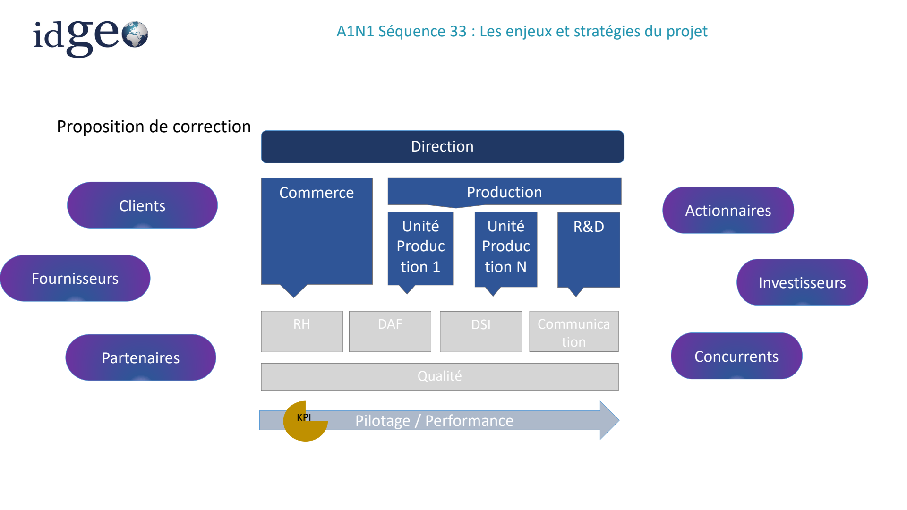

*Visuel original — `A1N1S33_Nov-2025.pdf`, page 8.*

### Exemple Organigramme d’une entreprise privée

*Source : page 9.*

<!-- FIGURE SOURCE : A1N1S33_Nov-2025.pdf, page 9. Emplacement : dans cette sous-partie, avant la page suivante. Reproduction de la page entière pour conserver les légendes et les relations du schéma. -->

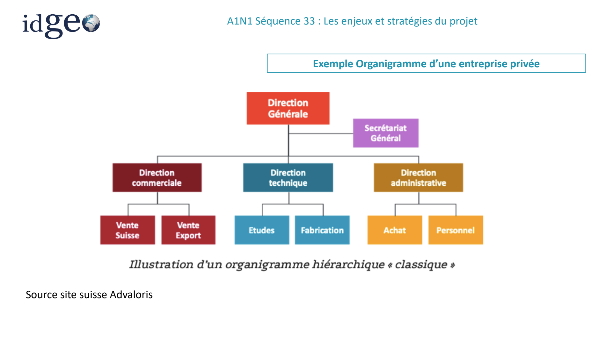

*Visuel original — `A1N1S33_Nov-2025.pdf`, page 9.*

### Organisation macro d’une entreprise publique

*Source : page 10.*

<!-- FIGURE SOURCE : A1N1S33_Nov-2025.pdf, page 10. Emplacement : dans cette sous-partie, avant la page suivante. Reproduction de la page entière pour conserver les légendes et les relations du schéma. -->

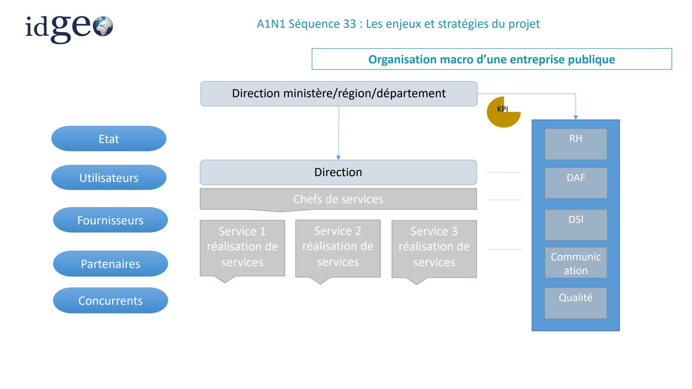

*Visuel original — `A1N1S33_Nov-2025.pdf`, page 10.*

### Le SI dans une entreprise

*Source : page 11.*

**Un système d’information dans une entreprise comporte différents aspects :**

- Fonctionnel
- Technique

**Les SI sont gérés et programmés par différents acteurs à différents niveaux:**

- infrastructure
- logicielle
- sécurité
- maintenance
- ….

A vous! – 20 min + présentation par groupe Représentez sous forme de schéma toutes différentes strates d’un SI au sein d’une entreprise ou d’un service.

### Schéma général d’un SI pour une entreprise

*Source : page 12.*

<!-- FIGURE SOURCE : A1N1S33_Nov-2025.pdf, page 12. Emplacement : dans cette sous-partie, avant la page suivante. Reproduction de la page entière pour conserver les légendes et les relations du schéma. -->

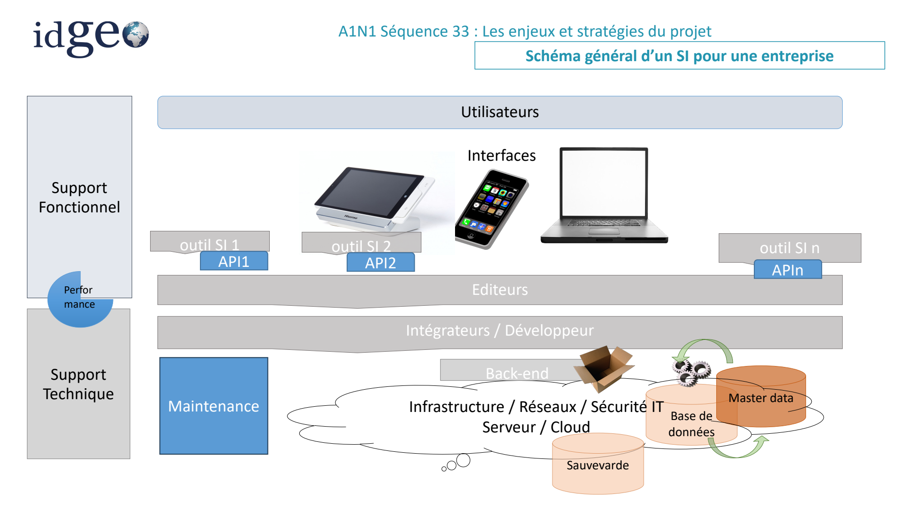

*Visuel original — `A1N1S33_Nov-2025.pdf`, page 12.*

## Pourquoi un projet SI ?

### Pourquoi un projet SI?

*Source : page 13.*

Raisons pour lesquelles une entreprise lance un projet informatique?

### Pourquoi un projet SI?

*Source : page 14.*

Raisons pour lesquelles une entreprise lance un projet informatique?

- Organisationnelle: Accompagner un changement ayant un impact: Organisationnel / humain / Technique Harmoniser des processus /des organisations (entreprises publiques, croissance externe…)
- Industrielle Innover, apporter une solution nouvelle sur le marché Améliorer la production ou toute étape de conception d’un produit (PLM, supply chain (optimisation des stocks)…
- Humaine: Favoriser la collaboration et le partage de connaissances Améliorer des conditions de travail (éviter des taches trop admin pour concentrer les personnes sur des taches à plus forte valeur ajoutée)
- Economique: Optimiser/Gagner en performance Faire du gain/ croissance

### Les enjeux stratégiques d’un projet SI

*Source : page 15.*

**Economique:**

L’Investissement engendré par le projet doit apporter des résultats financiers: Augmentation de Chiffre d’Affaires (CA) – gain financier Réduction de coût de réalisation d’une ou de plusieurs taches – économie conséquente Humain: Le projet peut influer sur l’organisation de l’entreprise et donc toucher l’humain: Bouleversement dans l’organisation Optimisation des ressources nécessaires à la réalisation d’une tâche (pluridisciplinarité, tache à forte valeur ajoutée Faciliter les traitements entre différents services ou organisations Technique: Le projet va permettre d’améliorer son positionnement sur un marché ou en interne: Compétitivité : réussir à réaliser mieux, dans un meilleur délai à un meilleur prix Innovation : proposer une nouvelle façon de travailler Performance: améliorer sa productivité et son efficacité

## Les parties prenantes

### Les parties prenantes

*Source : page 16.*

### Qui est impliqué dans un projet?

*Source : page 17.*

<!-- FIGURE SOURCE : A1N1S33_Nov-2025.pdf, page 17. Emplacement : dans cette sous-partie, avant la page suivante. Reproduction de la page entière pour conserver les légendes et les relations du schéma. -->

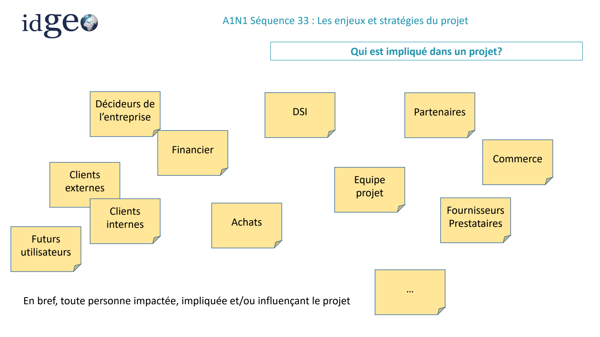

*Visuel original — `A1N1S33_Nov-2025.pdf`, page 17.*

### Les parties prenantes

*Source : page 18.*

**Une partie prenante, c’est :**

Une personne (ou organisation) impliquée dans le projet, ou qui peut être impactée par celui-ci.

Elle peut exercer une influence sur le projet.

**Objectif d’un chef de projet : animer l’ensemble des parties prenantes pour :**

- maximiser l’impact des parties prenantes favorables au projet
- minimiser l’impact des parties prenantes réfractaires

**Méthode:**

1-Identifier les parties prenantes (à personnes, groupes, organisation) 1.1 Analyser leurs attentes, leurs intérêts, et leur capacité d’influence sur le projet 1.2 Utiliser une matrice « Pouvoir / Intérêt » pour cibler les parties prenantes les plus influentes

2-Elaborer une stratégie permettant de les engager tout au long du projet 2.1 Répondre aux attentes et maîtriser les engagements 2.2 Prendre en compte leurs difficultés 2.3 Adapter la communication à leurs attentes

### Identifier les parties prenantes

*Source : page 19.*

Identifier les parties prenantes d’un projet SI dans une entreprise et son écosystème.

Le schéma ci-dessous présente les deux espaces à compléter : « Entreprise » et « Écosystème ».

<!-- FIGURE SOURCE : A1N1S33_Nov-2025.pdf, page 19. Emplacement : dans cette sous-partie, avant la page suivante. Reproduction de la page entière pour conserver les légendes et les relations du schéma. -->

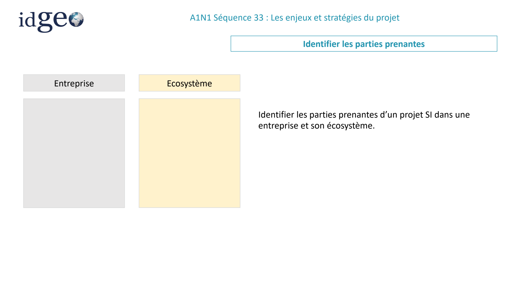

*Visuel original — `A1N1S33_Nov-2025.pdf`, page 19.*

### Identifier les parties prenantes

*Source : page 20.*

| Entreprise | Écosystème |
| --- | --- |
| Chef de projet ; demandeur ; utilisateurs ; DSI ; DAF ; direction ; équipe projet | Clients ; prestataires ; partenaires |

**Demandeur (client)** : personne ou organisation qui va émettre le besoin. Il peut lui-même être un utilisateur ou les représenter.

**Utilisateurs** : personnes qui auront à intégrer cet outil dans leur quotidien. Exemples :

- Logiciel de paie : gestionnaires de paie.
- Outils d’achats : client interne, acheteur, approvisionneur et fournisseur.

**Direction** : valideur du besoin, de l’enjeu, du budget et de l’impact attendu (financier, humain, technique) — sponsor.

**DSI** :

- Faciliter la communication entre le demandeur (besoin) et les équipes fonctionnelles et techniques qui réaliseront l’outil.
- Assurer la cohérence fonctionnelle et technique du projet vis-à-vis des outils déjà en place (SDI).
- Superviser le développement de l’outil en interne ou par la société extérieure (sous-traitance).

<!-- FIGURE SOURCE : A1N1S33_Nov-2025.pdf, page 20. Emplacement : dans cette sous-partie, avant la page suivante. Reproduction de la page entière pour conserver les légendes et les relations du schéma. -->

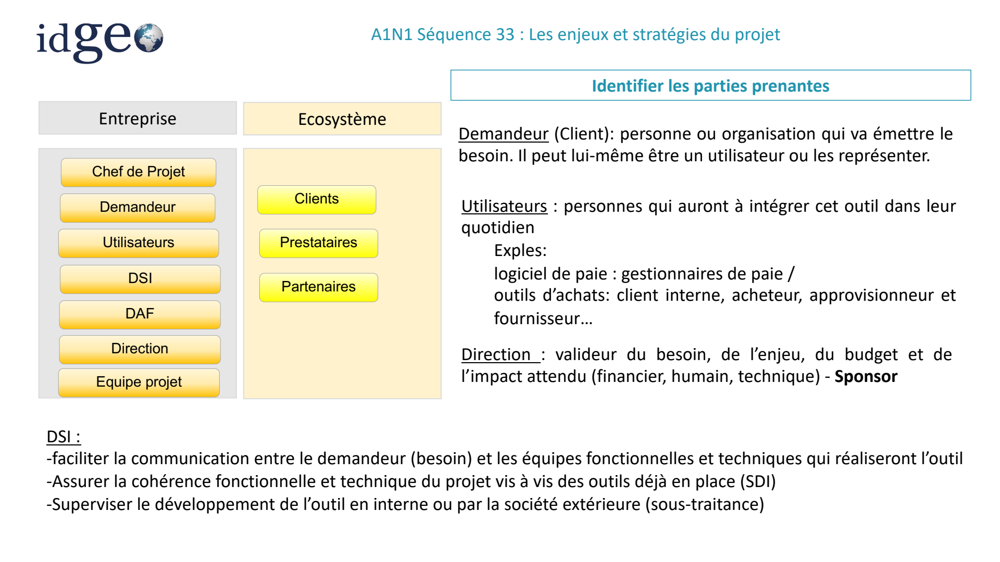

*Visuel original — `A1N1S33_Nov-2025.pdf`, page 20.*

### Matrice Pouvoir / Intérêt

*Source : page 21.*

**Pouvoir sur le projet** :

- Pouvoir de décision.
- Influence sur les décideurs.
- …

**Intérêt au projet** :

- Le résultat (produit, service) du projet impactera son quotidien.
- La réussite du projet est un objectif professionnel.

La matrice du support positionne les parties prenantes selon ces deux axes.

<!-- FIGURE SOURCE : A1N1S33_Nov-2025.pdf, page 21. Emplacement : dans cette sous-partie, avant la page suivante. Reproduction de la page entière pour conserver les légendes et les relations du schéma. -->

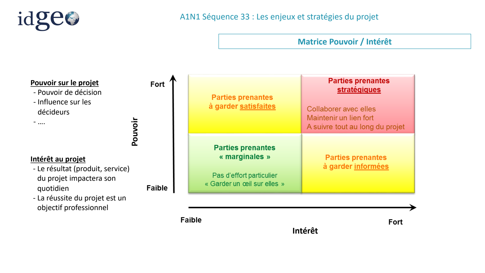

*Visuel original — `A1N1S33_Nov-2025.pdf`, page 21.*

### Exercice

*Source : page 22.*

- Identifiez les parties prenantes d’un projet porté par une collectivité visant à améliorer la gestion, la diffusion, la qualité et l’accessibilité des données de randonnée via le web, des cartes ou une appli pour sa région.
- Positionnez-les dans la matrice.

<!-- FIGURE SOURCE : A1N1S33_Nov-2025.pdf, page 22. Emplacement : dans cette sous-partie, avant la page suivante. Reproduction de la page entière pour conserver les légendes et les relations du schéma. -->

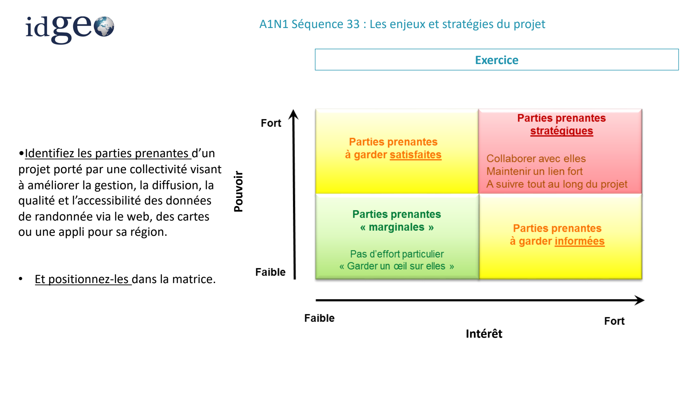

*Visuel original — `A1N1S33_Nov-2025.pdf`, page 22.*

### Solution proposée

*Source : page 23.*

<!-- FIGURE SOURCE : A1N1S33_Nov-2025.pdf, page 23. Emplacement : dans cette sous-partie, avant la page suivante. Reproduction de la page entière pour conserver les légendes et les relations du schéma. -->

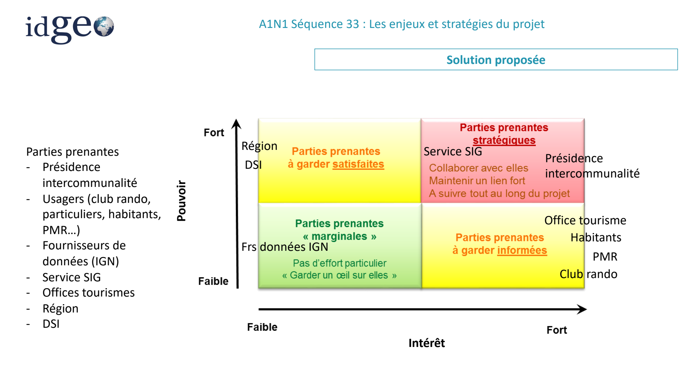

*Visuel original — `A1N1S33_Nov-2025.pdf`, page 23.*

### A retenir

*Source : page 24.*

**Le management des parties prenantes permet de :**

- les identifier
- gérer leurs attentes et leur implication dans le projet
- créer une zone de confiance
- anticiper des blocages potentiels

La satisfaction des parties prenantes se gère comme l’un des principaux objectifs du projet.

## La DSI et le schéma directeur

### Un rôle Majeur - La DSI et le SDSI

*Source : page 25.*

La Direction des Systèmes d’Information (DSI) gère un Schéma Directeur Informatique. Ce référentiel est l’application de la stratégie de l’organisation aux systèmes d’information et informatique. Il décrit l’évolution souhaitée des systèmes d’information et des ressources (individus, logiciels, matériels, règles d’organisation) nécessaires pour réaliser cette stratégie.

L’objectif PRINCIPAL du Schéma directeur et de garantir une cohérence au niveau des applications et développements informatiques d’une entreprise

**Exemples d’objectifs d’un Schéma Directeur**

- Optimiser des coûts informatiques,
- Harmoniser un outil multi-sites,
- Créer un tableau de bord de pilotage de la performance de l’entreprise,
- Moderniser les infrastructures,
- Intégrer une nouvelle activité de production
- Améliorer les parcours client

<!-- FIGURE SOURCE : A1N1S33_Nov-2025.pdf, page 25. Emplacement : dans cette sous-partie, avant la page suivante. Reproduction de la page entière pour conserver les légendes et les relations du schéma. -->

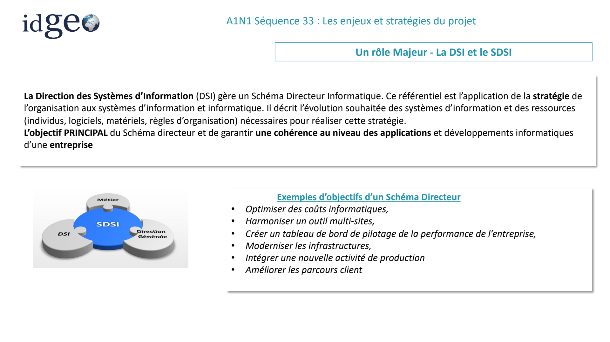

*Visuel original — `A1N1S33_Nov-2025.pdf`, page 25.*

### Schéma général de prise en compte des besoins

*Source : page 26.*

**Sans schéma directeur**

Les informaticiens sont en « prise directe » avec les utilisateurs. La hiérarchisation des priorités est réalisée sans vision stratégique, sans visibilité pour les utilisateurs.

**Avec un schéma directeur**

Les priorités sont décidées en cohérence avec la stratégie de l’entreprise. Le plan de travail informatique est :

- Plus stable.
- Partagé.
- Approuvé par tous.

<!-- FIGURE SOURCE : A1N1S33_Nov-2025.pdf, page 26. Emplacement : dans cette sous-partie, avant la page suivante. Reproduction de la page entière pour conserver les légendes et les relations du schéma. -->

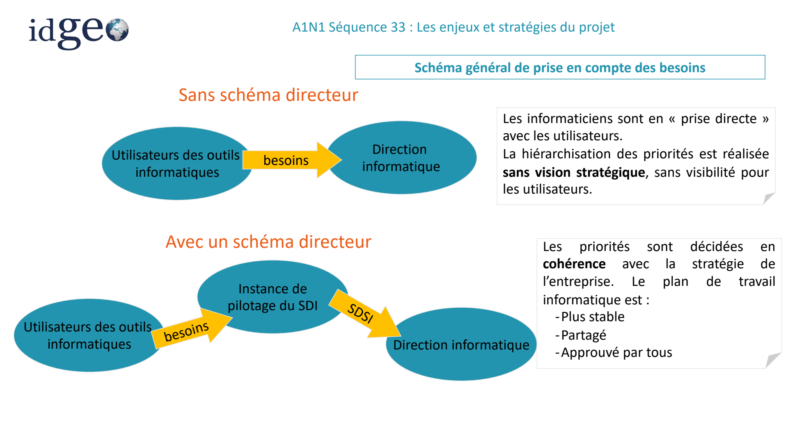

*Visuel original — `A1N1S33_Nov-2025.pdf`, page 26.*

### Intérêts du schéma directeur

*Source : page 27.*

**Pour la Direction Générale:**

Moyen de consigner les choix stratégiques. C’est le moment idéal pour mener, au niveau de la direction, une réflexion approfondie sur l’informatique au sein de l’entreprise : quelles sont les directions à donner ? quels sont les résultats à attendre ? quels sont les moyens à investir ?

**Pour la DSI:**

- Permet de spécifier les missions et moyens à déployer et d’effectuer, en fonction de cela, une planification globale des projets et des investissements.
- Garantir une cohérence des outils informatiques au sein de l’entreprise.

**Pour les utilisateurs:**

Permet d’exprimer leurs attentes, de constater qu’elles sont prises en compte et traitées selon un processus harmonisé et équitable.

### SDSI

*Source : page 28.*

Démarche visant à intégrer au sein d’un même planning de déploiement un ensemble de besoins SI, qui auront été:

- Approuvés par les décideurs (DSI, Direction, DAF et Direction des services)
- Priorisés et budgétisés
- Planifiés

Le Schéma Directeur est un outil de pilotage et d’ajustement permanent des évolutions du système d’information.

Pour cela, il faut : Fixer les règles de qualification des projets (niveau de priorité) Formaliser (systématiser) l’évaluation des nouveaux projets (critères, instances, arbitrage, …) Revoir à fréquence régulière (trimestrielle) le portefeuille des projets et leur planification

Le SDSI est un plan d’actions sur 3 à 5 ans, revu tous les 3 à 6 mois.

<!-- FIGURE SOURCE : A1N1S33_Nov-2025.pdf, page 28. Emplacement : dans cette sous-partie, avant la page suivante. Reproduction de la page entière pour conserver les légendes et les relations du schéma. -->

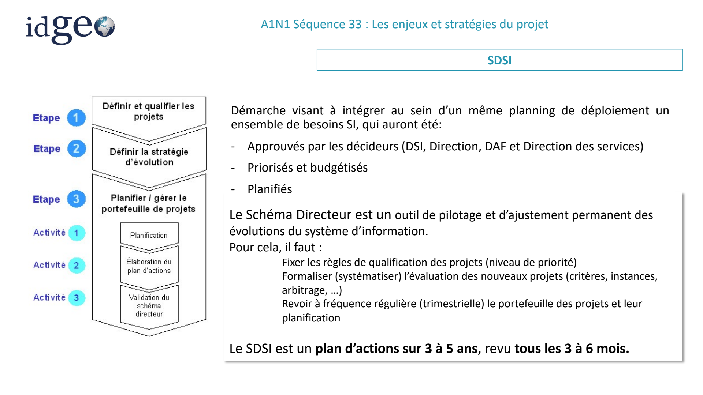

*Visuel original — `A1N1S33_Nov-2025.pdf`, page 28.*

## Dimension et complexité du projet

### Dimension / Complexité d’un projet

*Source : page 29.*

**Un projet informatique peut avoir des critères qui dimensionnent sa complexité:**

- Nombre d’utilisateurs, nombre de pays
- Type d’utilisateurs : internes / externes
- Nombre d’outils existant sur le périmètre du projet
- Volume et nature des documents/données à traiter (contrats, normes spécifiques à respecter,…)
- Le nombre de processus de l’entreprise impactés (administratif ou production…)
- État de l’infrastructure informatique déjà existante
- Sécurité informatique
- Contraintes temporelles
- ….

### Dimension du projet

*Source : page 30.*

**Exemples de projet:**

- Changement de l’outil de paie dans une PME: 2 gestionnaires de paie, 1 DAF
- Mise en place d’un outil de gestion des demandes de congés dans une entreprise : x employés, y managers, z assistantes RH.
- Harmonisation de la gestion des stocks sur 3 sites de la même société ayant 3 ERP différents et sur 2 pays.
- Implémenter un outil achats permettant de centraliser tous les appels d’offres et les contrats d’une organisation achat d’un grand groupe de 500 acheteurs sur 6 pays et travaillant avec 10 000 fournisseurs sur des achats production.

**En résumé:**

Ne pas négliger la dimension d’un projet et ses impacts humains, techniques et économiques. Il ne suffit pas de développer un nouvel outil pour qu’il soit utilisé.

Cette démarche doit être surveillée (pilotage) et accompagnée (conduite du changement) à chaque étape du projet afin de s’assurer l’adhésion du plus grand nombre des futurs utilisateurs.

## Gouvernance et rôles

### Gouvernance d’un projet

*Source : page 31.*

**Définition:**

La gouvernance de projet définit un mode de management et d’organisation. Elle permet d’identifier les rôles et les responsabilités de chaque partie prenante.

**Ses objectifs:**

- assurer le bon déroulement des activités, leur suivi
- faciliter la communication et la prise de décisions,
- organiser la séquence des réunions nécessaires au suivi du projet (création et suivi des réunions, communication entre les instances, def. des participants),
- Identifier rapidement les risques du projet et ajuster le planning Conseils

Définir la gouvernance le plus en amont possible dans le projet est l’une des clés de la réussite. Cela permet de structurer et de définir une organisation claire.

### Gouvernance d’un projet

*Source : page 32.*

**Exemple de gouvernance**

| Réunions | Objectifs | Participants — Client | Participants — Prestataire |
| --- | --- | --- | --- |
| Comité Stratégique Annuelle Site Client | - Partager la vision du Business à moyen et long termes - Partager la vision de l&#x27;évolution de la société - Identifier de nouvelles pistes pour travailler ensemble | Directeur Acheteur Experts | Directeur Dir Commerce Experts Dir Projet |
| Comité Pilotage Mensuelle Visio / Site | - Review des planning et objectifs - Suivre l&#x27;évolution des risques - Prendre des décisions | Client tech Acheteur Experts Manager | Chef de projet Commercial Expert Tech Consultant |
| Comité Technique Hebdomadaire Visio | - Revue technique des jalons du projet - Identification des problèmes et escalade - Mise à jour des plans d&#x27;actions | Client tech Resp tech | Chef de projet Expert Tech Equipe |

<!-- FIGURE SOURCE : A1N1S33_Nov-2025.pdf, page 32. Emplacement : dans cette sous-partie, avant la page suivante. Reproduction de la page entière pour conserver les légendes et les relations du schéma. -->

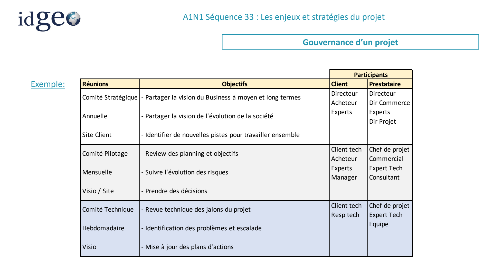

*Visuel original — `A1N1S33_Nov-2025.pdf`, page 32.*

### Rôle dans le pilotage de projet : MOA

*Source : page 33.*

**La MOA :**

- c’est le maître d’ouvrage, c’est-à-dire le sponsor, voire le propriétaire du projet. Dans une relation client-fournisseur, le MOA est le client
- donne les objectifs du futur système, le budget et intervient au niveau du pilotage et de la vue fonctionnelle.
- nomme un assistant maître d'ouvrage (AMOA)

**La MOA assure les missions :**

- d'expression de besoins
- de conduite du changement

**La MOA intervient à un niveau fonctionnel pour:**

- vérifier la conformité des solutions avec les exigences, adapter l'organisation, définir les nouvelles procédures
- préparer et piloter la conduite du changement (sensibiliser les personnes, formation)
- Assurer la communication vers les utilisateurs

### Rôle dans le pilotage de projet : AMOA

*Source : page 34.*

**L'assistance à MOA (AMOA) :**

- nommé par la MOA pour agir par délégation afin de mener à bien le projet. Il est l’œil du MOA dans l’exécution du projet
- Il a une meilleure connaissance technique que la MOA pour échanger avec la MOE
- Formalise les objectifs en exigences
- Prépare les validations des solutions qui seront pilotées par la MOA
- Supervise le planning de la MOE (maîtrise d’œuvre)

L'AMOA (entité appartenant à la même entreprise ou à des sociétés externes spécialisées dans les domaines requis) est constituée de spécialistes pour : formaliser le besoin des utilisateurs sous forme de cahier des charges fonctionnel définir les exigences de management de projet et d'assurance qualité préparer et conduire les appels d'offres et aider au dépouillement des offres définir et conduire les opérations de validation vis-à-vis de la MOE

### Rôle dans le pilotage de projet : MOE

*Source : page 35.*

La MOE est l’entité qui est chargée de l’exécution du projet.

En d’autres termes, il réalise le projet selon les besoins exprimés par le MOA.

Dans une relation client-fournisseur, la MOE est le fournisseur

**Elle met en œuvre:**

- le planning
- les moyens humains et logistiques (prestataires, ...) Pour réaliser les livrables définis du projet.

Ces livrables (documents ou produits) sont définis dans un contrat mentionnant les dates et jalons de livraison et les détails de calcul des pénalités éventuelles en cas de retard ou de non-conformité.

**La relation MOA - MOE permet de:**

- formaliser les besoins de la MOE pour réaliser le système
- vérifier par la MOA que les réalisations sont conformes aux attentes.

### Exemple MOA – AMOA - MOE

*Source : page 36.*

<!-- FIGURE SOURCE : A1N1S33_Nov-2025.pdf, page 36. Emplacement : dans cette sous-partie, avant la page suivante. Reproduction de la page entière pour conserver les légendes et les relations du schéma. -->

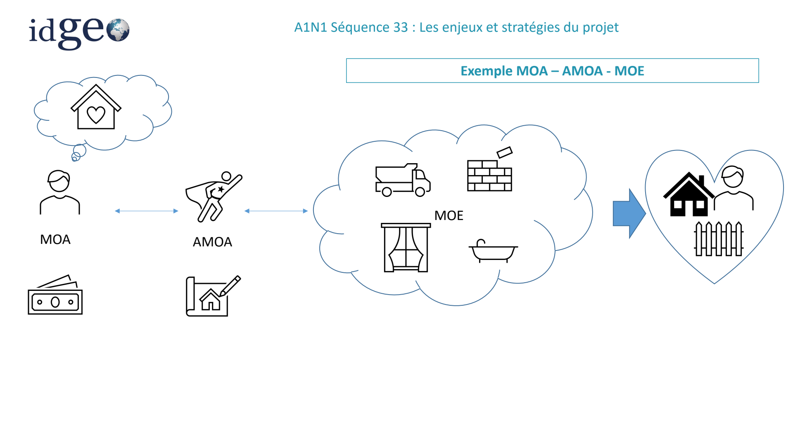

*Visuel original — `A1N1S33_Nov-2025.pdf`, page 36.*

### Exercice (15 à 20 min)

*Source : page 37.*

**Proposer une gouvernance projet pour la situation suivante:**

La DSI d’une entreprise EUROSOC a confié à une entreprise GOTO, la mise en place d’un outil de gestion de ticketing pour la gestion du service client de son entreprise.

EUROSOC réalise plusieurs activités de livraison, emballage, gestion de stocks pour différents clients.

Le développement de l’outil est prévu sur 1 an et grâce à GOTO, ils ont choisi un éditeur de logiciel pour la solution et un ESN pour l’intégration.

Le service client de l’entreprise comporte 50 collaborateurs, répartis dans les différentes typologies de services. Le directeur des services souhaite optimiser le traitement des litiges et améliorer la visibilité des performances.

- Qui sont les parties prenantes?
- Identifier la MOA, AMOA et MOE
- Qui doit être impliqué dans la gouvernance projet?
- Quelles réunions mettriez-vous en place?

### Correction Exercice

*Source : page 38.*

- Qui sont les parties prenantes? GOTO, DSI, futurs utilisateurs, ESN, Editeur, Chef de service + 1 collab de chaque service proposé
- Identifier la MOA : EUROSOC DSI /GOTO (AMOA) / MOE (CP ESN Intégration + CP Editeur)
- Qui doit être impliqué dans la gouvernance projet – DSI Société + chef de service / AMOA / CP MOE
- Quelles réunions mettriez-vous en place?

hebdo – MOE AMOA Mensuelle – AMOA MOA (MOE si besoin)

## Pilotage, indicateurs et tableaux de bord

### Pilotage projet

*Source : page 39.*

Un tableau de bord est un outil d’aide à la décision qui permet grâce à la mise en place d’indicateurs clés (KPI) de piloter efficacement un projet.

KPI signifie Key Performance Indicator en anglais.

Aussi appelés indicateurs clés de performance (ICP), ils sont très utilisés dans le suivi de projet et permettent de mesurer les performances de vos projets.

Les KPI doivent être définis conjointement par le chef de projet et son équipe avant de démarrer le projet.

Pour bien définir des KPI:

- Il est associé à un objectif précis
- Il implique forcément une décision
- Il n’est jamais muet
- Pour être pertinent, il doit être simple

### Définition d’un indicateur

*Source : page 40.*

Il s’agit d’une information (issue d’une mesure) qui aide à évaluer une situation et à prendre une décision adaptée. Un indicateur doit être réaliste, mesurable et défini dans le temps.

La valeur d’un indicateur est très souvent représentée par un graphique afin de voir son évolution dans le temps.

La représentation de tous les indicateurs choisis se fait de façon synthétique dans un tableau de bord où l’on retrouve :

- le nom de chaque indicateur
- sa règle de calcul, son unité de mesure,
- ses dates de début et de fin
- le seuil ou la performance attendue
- la valeur réelle de l’indicateur

Il est important de bien choisir ses KPI afin d’être capable d’identifier rapidement les écarts et les risques d’écarts par rapport à l’objectif, ainsi que l’efficacité des mesures d’améliorations lancées.

Cela permet également de communiquer efficacement avec les différents acteurs du projet.

### Fiche descriptive d’un indicateur

*Source : page 41.*

**Nom:**

**Mode de calcul:**

Fréquence

**Données d’entrée:**

**Date de début:**

**Date de fin:**

**Objectif de performance:**

**Représentation graphique:**

### Créer son tableau de bord de pilotage

*Source : page 42.*

Un tableau de bord de pilotage doit contenir au minimum 5 indicateurs permettant d’obtenir une vision claire et précises du projet en termes de:

- délais : jalons de planning respectés, état d’avancement d’une tache,…
- coût: ressources mais aussi dépenses
- qualité: non-conformité de livrables, insatisfaction client,…
- performance : temps de traitement d’un dossier, nombre de commandes passées par jour,…
- Gestion des risques: selon identification des risques du projet

**Et on peut ajouter également un indicateur RH mesurant:**

- Implication des équipes : motivation, absences, back up…,

### Exemple de tableaux de bord

*Source : page 43.*

<!-- FIGURE SOURCE : A1N1S33_Nov-2025.pdf, page 43. Emplacement : dans cette sous-partie, avant la page suivante. Reproduction de la page entière pour conserver les légendes et les relations du schéma. -->

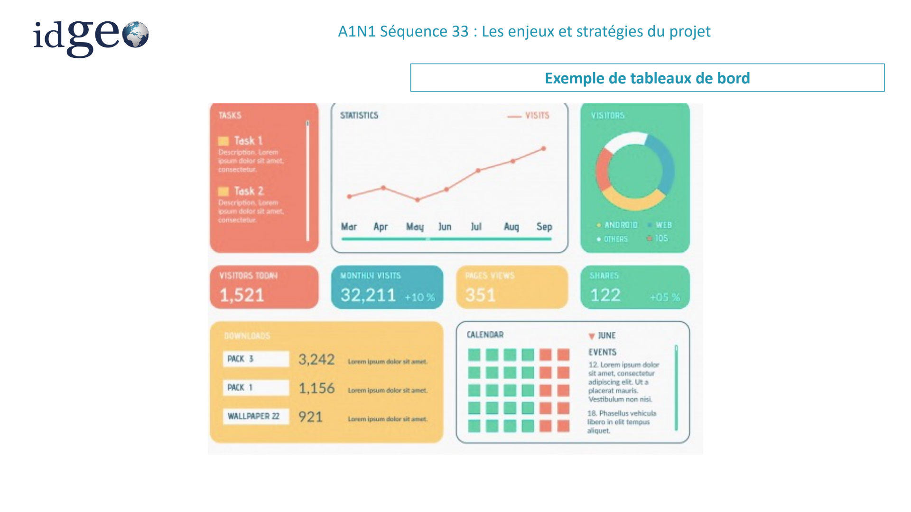

*Visuel original — `A1N1S33_Nov-2025.pdf`, page 43.*

### Exemples de tableaux de bord (suite)

*Source : page 44.*

<!-- FIGURE SOURCE : A1N1S33_Nov-2025.pdf, page 44. Emplacement : dans cette sous-partie, avant la page suivante. Reproduction de la page entière pour conserver les légendes et les relations du schéma. -->

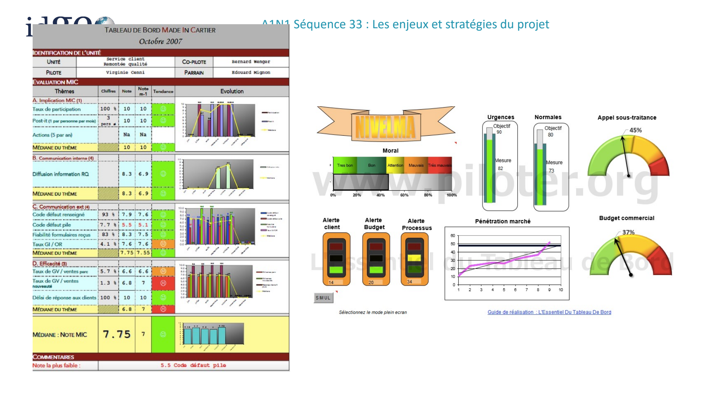

*Visuel original — `A1N1S33_Nov-2025.pdf`, page 44.*

## Qualité et système de management de la qualité

### Qualité

*Source : page 45.*

Dessiner un cochon.

### Standards et qualité

*Source : page 46.*

Il est donc important de définir des standards dans un projet ou une organisation afin de s’assurer de la cohérence des éléments produits.

La notion de QUALITE entre en jeu.

Elle se présente au sein de l’entreprise sous la forme d’un SMQ (Système de Management de la qualité) et est déclinée pour un projet en PAQ (Plan d’Assurance Qualité)

<!-- FIGURE SOURCE : A1N1S33_Nov-2025.pdf, page 46. Emplacement : dans cette sous-partie, avant la page suivante. Reproduction de la page entière pour conserver les légendes et les relations du schéma. -->

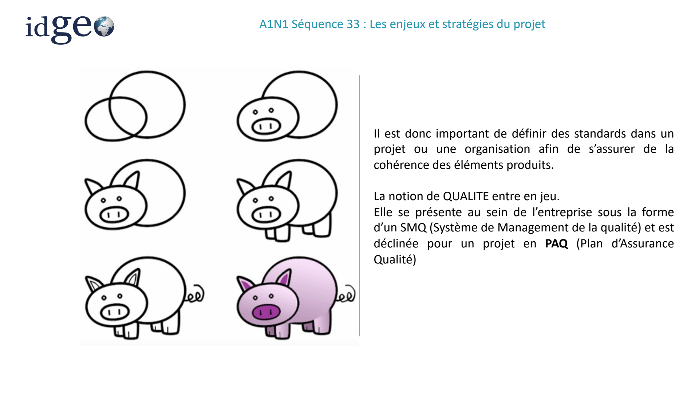

*Visuel original — `A1N1S33_Nov-2025.pdf`, page 46.*

### SMQ

*Source : page 47.*

Le Système de management de la qualité SMQ est l’organisation mise en place par une entreprise (ou un organisme) pour atteindre sa politique et ses objectifs qualité.

On parle de système, car le SMQ (Système de Management de la Qualité) englobe des acteurs, des activités, des matériels divers dans l’entreprise et en même temps interdépendants pour atteindre l’objectif visé en lien avec la satisfaction du client final.

Ce système est coordonné et piloté par la ligne managériale de l’entreprise, qui se donne ainsi les moyens d’atteindre les priorités qu’elle a elle-même définies.

Le SMQ doit correspondre à la réalité de l’organisation de l’entreprise et non constituer un système factice, établi en théorie, dans le seul souci de répondre à l’exigence externe du client. Un bon SMQ est adapté précisément à la culture de l’entreprise, à son contexte, ses services, ses managers, ses produits… Il se montre alors performant.

### SMQ : de quoi parle-t-on ?

*Source : page 48.*

Le Système de Management de la Qualité, ou SMQ, réunit des règles et des valeurs qui concourent au fonctionnement optimal d’un organisme ou d’une entreprise. Formalisé au début des années 1990 avec la norme ISO 9000/9001, le SMQ se décline aujourd’hui autour de 7 grands principes.

La grande force de la norme ISO 9001 est qu’elle est conçue pour s’adapter à la nature de l’organisation au sein de laquelle elle est appliquée. Ainsi, elle fournit une direction à suivre, mais n’impose aucune technique ou méthode spécifique qui pourrait ne pas être adaptée au fonctionnement ou à la taille de l’entreprise.

En suivant consciencieusement les fondamentaux du management de la qualité, l’entreprise ou l’organisation est en mesure d’accroître sa rentabilité, sa stabilité financière et assurer sa création de valeur.

Pour l’entreprise, obtenir une certification ISO 9001, c’est aussi rassurer ses clients quant à la qualité de ses services et ses produits. Un véritable atout, d’autant que la norme est reconnue dans le monde entier !

### Les ⑦ principes du système de management de la qualité

*Source : page 49.*

PRINCIPE 1 : ORIENTATION CLIENT

L’objectif de n’importe quelle entreprise, quel que soit son domaine d’activité, est de satisfaire les attentes de sa clientèle en lui fournissant des produits et services adaptés à ses exigences.

Ce que cela sous-tend, c’est que c’est le client qui doit guider les actions de l’entreprise. Il s’agit donc d’identifier ses attentes, voire de les anticiper, pour augmenter sa satisfaction et parvenir à terme à le fidéliser.

À l’heure des réseaux sociaux, où il est plus que commun de partager son mécontentement avec d’autres potentiels clients, l’entreprise doit tout mettre en oeuvre pour ne pas décevoir les attentes que l’on porte en elle.

### Les ⑦ principes du système de management de la qualité

*Source : page 50.*

PRINCIPE 2 : LEADERSHIP

Au sein du système complexe que représente une organisation, c’est la direction qui est chargée de définir la stratégie à suivre, les objectifs à atteindre et les moyens pour y parvenir.

C’est aussi à elle qu’incombe la lourde tâche de créer les conditions favorisant l’amélioration.

Pour ce faire, le leader doit faire en sorte de communiquer les objectifs de la manière la plus claire possible et de partager les valeurs de l’entreprise avec ses collaborateurs, en montrant l’exemple. Il doit par ailleurs générer un climat de confiance, basé sur l’encouragement et la reconnaissance.

Des pilotes de processus sont nommés et c’est eux qui dynamiseront la démarche.

### Les ⑦ principes du système de management de la qualité

*Source : page 51.*

PRINCIPE 3 : IMPLICATION DU PERSONNEL

Afin de s’assurer que le personnel est pleinement impliqué dans le projet, il est impératif de trouver des moyens de favoriser et valoriser son engagement.

En d’autres termes, le salarié doit être conscient de la valeur ajoutée que représente sa contribution personnelle, quelle que soit la place qu’il occupe au sein de l’entreprise, indépendamment de son ancienneté ou de son niveau hiérarchique.

Il est également nécessaire de vérifier que chacun dispose des habilitations et des compétences requises pour réaliser les tâches qui lui sont confiées, au risque de compromettre le but recherché.

### Les ⑦ principes du système de management de la qualité

*Source : page 52.*

PRINCIPE 4 : APPROCHE PROCESSUS

Ce 4e principe insiste sur le fait que les activités de l’entreprise doivent être envisagées comme autant de processus corrélés entre eux.

L’objectif est ici de mettre en exergue le cheminement menant à un résultat observé, afin de le comprendre et d’en dégager plus facilement des axes d’amélioration.

En agissant de cette manière, l’organisation renforce la cohérence et l’efficacité de son système, sa capacité à gérer les risques, et par la même, la confiance que sa clientèle porte en elle.

### Les ⑦ principes du système de management de la qualité

*Source : page 53.*

PRINCIPE 5 : AMÉLIORATION CONTINUE

Pour rester compétitive et performante dans un contexte économique en constante évolution, une organisation doit elle-même évoluer.

C’est le fameux principe d’amélioration continue, qui va de pair avec la notion de qualité et trouve par exemple son application dans le cycle PDCA ou roue de Deming.

Pour entrer en résonance avec ce 5e principe, l’entreprise doit rechercher les opportunités d’améliorations partout où elles se trouvent, qu’elles soient appliquées par rupture ou de manière progressive, et inscrire l’effort d’innovation dans la culture de l’entreprise afin d’impliquer les collaborateurs, à tous les étages de la hiérarchie.

### Les ⑦ principes du système de management de la qualité

*Source : page 54.*

PRINCIPE 6 : PRISE DE DÉCISION FONDÉE SUR LES PREUVES

Face au degré d’incertitude parfois élevé que peut impliquer la prise de décision, l’organisation doit se tourner vers des sources de données et preuves fiables, par le biais des indicateurs clés de performances par exemple, pour pouvoir poser des actions en toute connaissance de cause.

De plus, ces différents éléments doivent être analysés de manière objective afin d’éviter les mauvaises interprétations qui pourraient conduire à un choix malencontreux.

PRINCIPE 7 : MANAGEMENT DES RELATIONS AVEC LES PARTIES INTÉRESSÉES

Les « parties intéressées » correspondent aux divers acteurs avec lesquels l’entreprise est amenée à collaborer au quotidien, notamment ses fournisseurs, prestataires et autres partenaires commerciaux.

Concrètement, si elle veut améliorer ses performances, les conserver dans le temps et répondre aux attentes de ses clients, elle doit soigner ces relations professionnelles en partageant par exemple les informations utiles de manière adéquate ou mettre en place des stratégies d’amélioration de façon conjointe.

## À retenir

### A retenir

*Source : page 55.*

**Un projet SI :**

- Répond à un besoin économique, humain ou industriel de l’entreprise
- S’intègre dans une stratégie SI à travers un schéma directeur
- Implique un ensemble de parties prenantes
- Est piloté / financé par la MOA, assistée ou non d’une AMOA
- Est réalisé par la MOE
- Est piloté grâce à la gouvernance et la mise en place d’indicateurs
- Répond à des exigences qualité de l’entreprise
