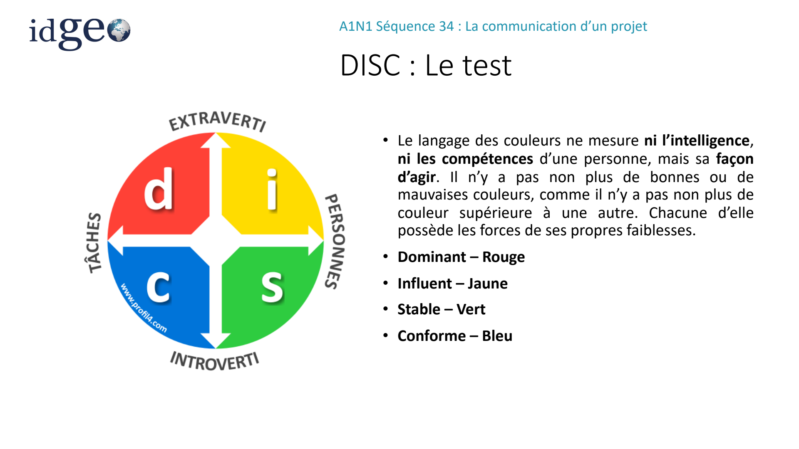
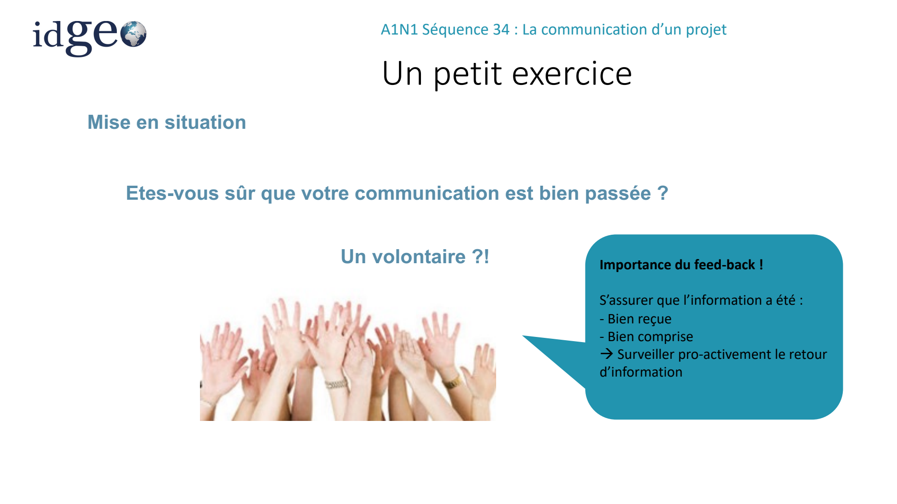
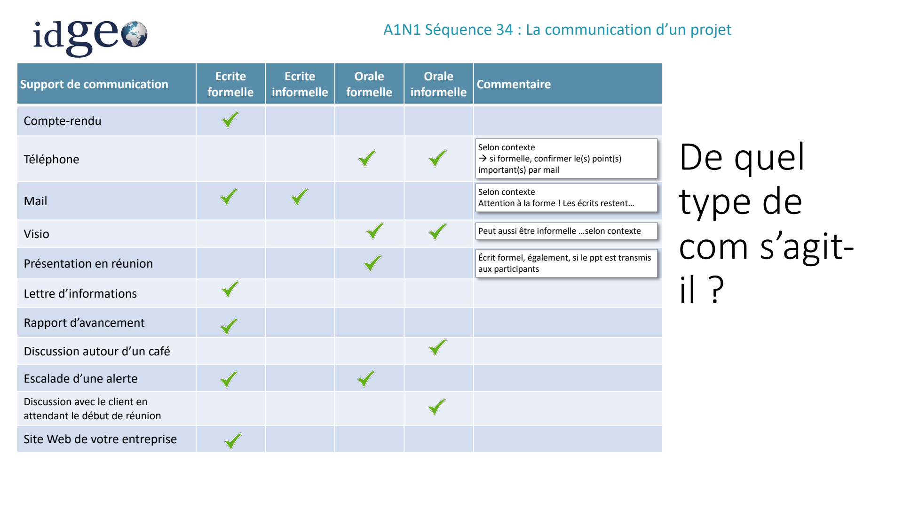
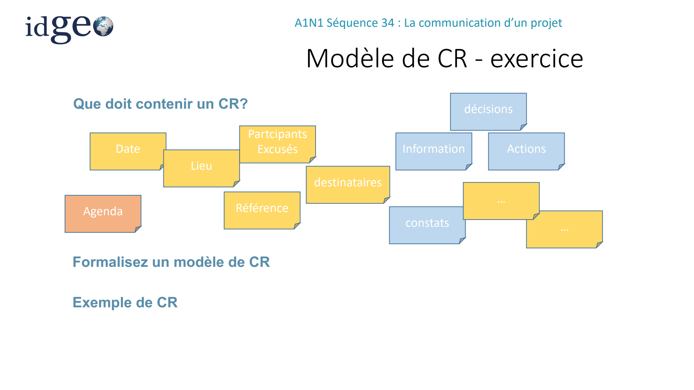
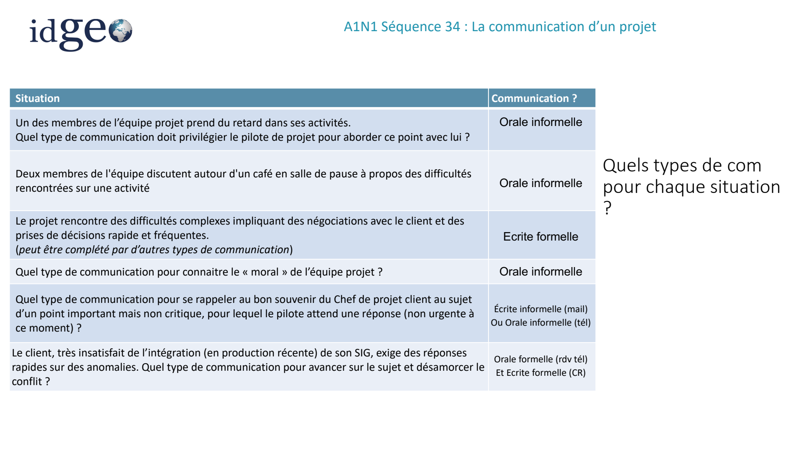

# S34 — La communication d’un projet

> Source unique : `A1N1S34_Nov-2025.pdf` — 50 pages. Les repères de page suivent l’ordre du PDF.

## DISC et communication

### Plan de la séquence

*Source : page 1.*

Ice breaker : DISC Management de la communication Les types de communication Les réunions Les rapports et comptes rendus La conduite du changement Résistance au changement Méthodes de gestion du changement Gestion des conflits

### DISC

*Source : page 2.*

- Cette méthode a pour objectif de décrypter nos comportements, nos interactions et notre façon de réagir avec les autres. Des notions telles que l’éducation, l’intelligence ou l’expérience ne sont pas prises en compte dans cette évaluation. Seule compte notre façon d’être et ce qui en découle.
- L’outil DISC offre une réelle polyvalence.
- En recrutement, il permet d’établir un profil de poste précis et optimise le processus d’embauche. Les besoins du poste sont mis en évidence et le choix du candidat se fait en fonction des attentes exprimées. Grâce à l’utilisation du DISC, la compatibilité entre recruteur et candidat est ainsi renforcée, tout comme l’intégration de la nouvelle recrue dans l’entreprise.
- En conseil/coaching, le DISC permet d’intervenir sur des problématiques relatives à la communication, individuelle (mieux se connaître pour mieux s’apprécier) comme collective (team building, cohésion d’équipe, communication interne)

**Faisons le test**

### DISC : Le test

*Source : page 3.*

- Le langage des couleurs ne mesure ni l’intelligence, ni les compétences d’une personne, mais sa façon d’agir. Il n’y a pas non plus de bonnes ou de mauvaises couleurs, comme il n’y a pas non plus de couleur supérieure à une autre. Chacune d’elle possède les forces de ses propres faiblesses.
- Dominant – Rouge
- Influent – Jaune
- Stable – Vert
- Conforme – Bleu

<!-- FIGURE SOURCE : A1N1S34_Nov-2025.pdf, page 3. Emplacement : dans cette sous-partie, avant la page suivante. Reproduction de la page entière pour conserver les légendes et les relations du schéma. -->

*Visuel original — `A1N1S34_Nov-2025.pdf`, page 3.*

### DISC: Le Rouge (Dominant)

*Source : page 4.*

- Comment le repérer : Il aime l’action, le mouvement. Il aborde les autres de façon directe et se focalise sur le but/le résultat à atteindre. Il n’aime pas le blabla et lorsqu’il a quelque chose à dire, il va droit à l’essentiel. D’ailleurs, il parle plus qu’il n’écoute, il ordonne plus qu’il ne demande. On le remarque dans un groupe car il a une tendance à vouloir diriger. Les règles ne le concernent pas trop. Il recherche les défis personnels !
- Talents : concentré sur les objectifs, décide rapidement, résout les problèmes, autonome, il agit.
- Poussé dans ses retranchements, il se transforme : impulsif, dominateur, indifférent à autrui et étroit d’esprit. Il aura tendance à écraser les autres, minimiser les risques et monopoliser la parole/le pouvoir.
- Comment il voit le changement : un nouveau défi à relever.
- S’adapter à un rouge : être direct, concis, rapide et affirmé. Il n’aime pas perdre son temps. Parler de défi, de ce qu’il va gagner et laisser le décider par lui-même.

### DISC: Le Jaune (Influent)

*Source : page 5.*

- Comment le repérer : Il est social, enthousiasme et communicatif ! Il est soucieux d’entretenir de bonnes relations avec les autres. Il aime créer la bonne ambiance et a besoin d’être reconnu par les autres. Il s’entend bien avec tout le monde et on l’apprécie dans un groupe. Toujours de bonne humeur, il est expressif, ouvert d’esprit. Il a une forte tendance à passer du coq à l’âne et il est parfois difficile à suivre. Quand il pense, il voit les choses en grand, il est parfois un peu trop utopiste voire bien éloigné des réalités. L’organisation, les détails, les procédures, très peu pour lui !
- Talents : persuasif, créatif, optimiste, fédérateur, la bonne humeur.
- Poussé dans ses retranchements, il se transforme : éparpillé, il en oublie la réalité (utopiste), trop général et désorganisé, il n’arrive plus à prendre du recul. S’il perd l’appui du groupe, il perd confiance en lui.
- Comment il voit le changement : une aventure, une occasion de découvrir de nouvelles choses.
- S’adapter à un jaune : être chaleureux, laissez-le s’exprimer, soutenez ses idées, acceptez qu’il saute du coq à l’âne et guidez-le dans sa réflexion.

### DISC: Le Bleu (Conforme)

*Source : page 6.*

- Comment le repérer : Il a un fort désir de connaître et de comprendre tout ce qui l’entoure. Il aime réfléchir avant d’agir et peut sembler froid et indifférent. Il écoute pour comprendre, analyser et aime le détail. C’est une personne concentrée, qui prend du recul et ne laisse pas les émotions interférer dans sa prise de décision. Son bureau est tout le temps bien rangé. Il est motivé par l’idée de se conformer à des standards élevés. C’est un cartésien et un fin tacticien.
- Talents : rigueur, analyse, qualité du travail, factuel, maîtrise, résout les problèmes.
- Poussé dans ses retranchements, il se transforme : perfectionniste, critique, rigide, froid, indécis.
- Comment il voit le changement : crainte de perdre le contrôle.
- S’adapter à un bleu : être précis, concret et factuel. Ne le brusquez pas, ne soyez pas trop flou, car vous perdriez en crédibilité. Prouvez ce que vous avancez avec un raisonnement logique.

### DISC: Le Vert (Stable)

*Source : page 7.*

- Comment le repérer : Il est sérieux et fiable. C’est une personne calme, qui aime l’harmonie, que les choses soient claires et simples. Il écoute les histoires des autres plus qu’il ne parle. Son moteur, c’est de servir les autres, de leur être utile. Il aime que les choses soit posées, conviviales et personnelles. C’est le meilleur liant dans un groupe ayant des caractères différents. Il pense collectif avant individuel. Il n’aime pas être sous les feux des projecteurs, il prend son temps, il n’apprécie pas le conflit.
- Talents : grande capacité d’écoute, loyauté, coopérant, indispensable dans un groupe.
- Poussé dans ses retranchements, il se transforme : il se met en retrait, est entêté, devient soupçonneux et rigide. Il peut avoir tendance à ne pas assez s’affirmer face aux autres et peut se montrer peu sûr de lui.
- Comment il voit le changement : il n’aime pas trop les changements brusques, car il perd sa stabilité et l’harmonie
- S’adapter à un vert : posez-lui des questions, écoutez attentivement ses réponses sans lui couper la parole. Créez une relation personnalisée avec lui, soyez patient.

### Un petit exercice

*Source : page 8.*

**Mise en situation**

**Etes-vous sûr que votre communication est bien passée ?**

**Un volontaire ?!**

Importance du feed-back !

**S’assurer que l’information a été :**

- Bien reçue
- Bien comprise à Surveiller pro-activement le retour d’information

<!-- FIGURE SOURCE : A1N1S34_Nov-2025.pdf, page 8. Emplacement : dans cette sous-partie, avant la page suivante. Reproduction de la page entière pour conserver les légendes et les relations du schéma. -->

*Visuel original — `A1N1S34_Nov-2025.pdf`, page 8.*

## Les types de communication

### Plan — Les types de communication

*Source : page 9.*

Les types de communication Management de la communication Quand l’instaurer?

Les réunions et les compte-rendus Conduire une réunion La conduite du changement Résistance au changement Méthodes de gestion du changement Gestion des conflits

### Les communications

*Source : page 10.*

- Différentes formes de la communication
- Écrite / orale
- Formelle (rapports, comptes rendus, instructions) / informelle (courriels, mémos, discussions)
- Verbale (débit, intonation, etc.) / non-verbale (gestuelle, posture, etc.)
- Différents axes de communication
- Interne (au sein du projet) / externe (client, fournisseurs, autres projets, organisations, public)
- Verticale (plus haut et plus bas dans l’organisation) / horizontale (entre pairs)
- Quelques clés pour communiquer efficacement
- Déterminer la forme de communication la plus adaptée
- Etre factuel, synthétique et précis
- Utiliser l’écoute active et la reformulation
- Adopter une attitude ouverte et positive

**Une communication est efficace (et même efficiente !) lorsque :**

- l’information est fournie dans le bon format, au bon moment, au bon public, avec le bon impact
- seule l’information nécessaire est fournie

### 3 types de communication

*Source : page 11.*

- communication inter-personnelle : basée sur l’échange de personne à personne (un émetteur / un récepteur)

Exple: entretien individuel, un entretien téléphonique

- communication de groupe : basée sur l’échange d’une personne à plusieurs personnes (un émetteur / plusieurs récepteurs ciblés)

Exple: une réunion d’information, une formation, présentation webinaire…

- communication de masse :

basée sur l’échange d’une ou plusieurs personnes à plusieurs personnes (un ou des émetteurs / plusieurs récepteurs non ciblés ou quasiment pas dans un public le plus large possible)

Exple: réunion d’information, annonce à la radio, les informations,…

## Management de la communication

### Plan — Management de la communication

*Source : page 12.*

- Ice breaker : DISC
- Les types de communication
- Management de la communication
- Quand l’instaurer?
- Les réunions et les compte-rendus
- Conduire une réunion
- La conduite du changement
- Résistance au changement
- Méthodes de gestion du changement
- Gestion des conflits

### Management de la communication

*Source : page 13.*

**Objectif : assurer l’efficacité de la communication du projet**

- Une communication efficace améliore les chances de succès du projet
- Les pilotes de projet passent le plus clair de leur temps à communiquer, à faciliter et à assurer la communication entre les parties prenantes…. dès le 1er jour du projet
- Elle permet de développer une zone de confiance entre les acteurs
- Manager la communication

**à C’est définir comment assurer l’échange des informations appropriées sur le projet**

- Lister les parties prenantes et leur rôle dans l’organisation du projet
- Déterminer pour chacune les besoins en communication (niveau de détail, fréquence)
- Définir les supports de communication (CR, rapport, journal, mail …)
- Préciser le responsable de chaque type de communication
- Définir les processus d’escalade pour la communication des alertes
- Formaliser le plan de communication

### Quand l’instaurer

*Source : page 14.*

**La communication est à instaurer dès le début d’un projet.**

Pour rappel, le projet s’il est défini et lancé résulte d’un besoin d’évolution.

Il risque donc de générer du changement, des questionnements, des doutes, il est donc nécessaire d’introduire des moyens de communication au plus tôt.

### Les moyens de communication

*Source : page 15.*

En fonction de la maturité et de la taille du projet / du résultat et de la population visés, il existe plusieurs moyens de communication :

- Une newsletter
- Réunions de communication et d’échanges
- Symposium
- Interview
- Réseaux internes d’entreprise
- Réseaux sociaux
- Réunions de travail, brainstorming

**Au sein de projets SI, les moyens les plus utilisés seront:**

- Réunions de communication et d’échanges
- Réunions de travail, brainstorming On va les retrouver tout au long des phases du projet.

### Exemples de réunions projets

*Source : page 16.*

Il existe de nombreux types de réunions que l’on peut organiser à tous les stades du projet:

- Réunion de brainstorming
- Interview
- Réunion de Go/No Go
- Revue de cahier des charges avec le client
- Réunion de lancement interne ou avec le client
- Comités de pilotages
- Suivis hebdo d’activité
- Atelier de travail
- Réunion d’amélioration continue
- Retour d’Expérience projet
- Gestion d’une Non Conformité
- …

### Les réunions

*Source : page 17.*

**Pour chaque type de réunion, il est important de définir :**

- Les objectifs
- la fréquence,
- les participants,
- les destinataires du CR,
- le rédacteur du CR et si nécessaire le protocole de validation du CR

Il est recommandé de les décrire dans la gouvernance du projet.

### Les réunions - Exemple

*Source : page 18.*

**Exemple de forme de réunion**

- AIC (Animation à Intervalle Court) –
- Ce sont des réunions rapides env 15 minutes pour suivre le projet à des intervalles très réguliers (journalier).

Elle suppose la définition de KPI précis, d’informations et de thématiques à piloter pour faciliter les analyses et prises de décisions.

En cas d’écart significatif, l’AIC permet de réagir rapidement: il s’agit d’étudier les incidents et causes du problème (absence, manque données d’entrées…), de trouver des actions de résolution à mettre en œuvre sans perdre de temps. Les équipes suivent ensuite la résolution des incidents et des actions et remontent au niveau supérieur si besoin.

- Attention, L’AIC n’est pas :
- une réunion d’information,
- une réunion où aucune décision n’est prise,
- la revue d’un grand nombre d’indicateurs,

### De quel type de communication s’agit-il ?

*Source : page 19.*

| Support de communication | Écrite formelle | Écrite informelle | Orale formelle | Orale informelle | Commentaire |
| --- | --- | --- | --- | --- | --- |
| Compte rendu | ✓ |  |  |  |  |
| Téléphone |  |  | ✓ | ✓ | Selon contexte. Si formelle, confirmer les points importants par mail. |
| Mail | ✓ | ✓ |  |  | Selon contexte. Attention à la forme ! Les écrits restent… |
| Visio |  |  | ✓ | ✓ | Peut aussi être informelle, selon contexte. |
| Présentation en réunion |  |  | ✓ |  | Écrit formel, également, si le PPT est transmis aux participants. |
| Lettre d’informations | ✓ |  |  |  |  |
| Rapport d’avancement | ✓ |  |  |  |  |
| Discussion autour d’un café |  |  |  | ✓ |  |
| Escalade d’une alerte | ✓ |  | ✓ |  |  |
| Discussion avec le client en attendant le début de réunion |  |  |  | ✓ |  |
| Site web de votre entreprise | ✓ |  |  |  |  |

<!-- FIGURE SOURCE : A1N1S34_Nov-2025.pdf, page 19. Emplacement : dans cette sous-partie, avant la page suivante. Reproduction de la page entière pour conserver les légendes et les relations du schéma. -->

*Visuel original — `A1N1S34_Nov-2025.pdf`, page 19.*

## Conduire une réunion et rédiger un compte rendu

### Conduire une réunion

*Source : page 20.*

- Le chef de projet, dans son rôle de garant de l’avancement du projet et de l’implication des parties prenantes est amené à piloter les réunions.
- Le positionnement du chef de projet:
- Anime la réunion
- Défend toujours le travail de son équipe auprès du client
- Arbitre les points de litige/les priorités
- Est force de proposition
- Alerte et sait dire non au client si une demande est hors cadre

### Conduire une réunion

*Source : page 21.*

**Les 3 phases de conduite de réunions**

1- Préparation de la réunion:

- Gérer l’invitation (salle, créneau horaire, matériel …)
- Définir l’ordre du jour et le diffuser aux participants avant la réunion
- S’assurer de la disponibilité des personnes clés
- Définir les objectifs à atteindre à l’issue de la réunion
- Evaluer les risques et les opportunités
- Préparer l’argumentaire correspondant
- S’assurer la présence d’allié/sponsor

### Conduire une réunion

*Source : page 22.*

2- Déroulement de la réunion:

- Rappeler les objectifs en début de réunion et s’y tenir
- Animer la réunion et s’assurer que tous les points sont abordés
- Gérer le temps et recadrer les discussions
- Prendre en compte les problèmes et rechercher des solutions
- Reformuler les propos
- Synthétiser en fin de réunion les points essentiels et les actions à mettre au CR

3- Rédaction du CR:

- Rédiger et diffuser rapidement le CR
- Mettre à jour le plan d’action
- Programmer la réunion suivante si besoin

### Modèle de CR - exercice

*Source : page 23.*

**Que doit contenir un compte rendu ?**

- Date et lieu.
- Participants et excusés.
- Décisions, informations et actions.
- Destinataires.
- Référence.
- Agenda.
- Constats.
- …

Formalisez un modèle de compte rendu.

Le support mentionne également un « Exemple de CR ».

<!-- FIGURE SOURCE : A1N1S34_Nov-2025.pdf, page 23. Emplacement : dans cette sous-partie, avant la page suivante. Reproduction de la page entière pour conserver les légendes et les relations du schéma. -->

*Visuel original — `A1N1S34_Nov-2025.pdf`, page 23.*

### Le compte rendu

*Source : page 24.*

- Le compte rendu permet de :
- Rappeler les personnes présentes/absentes
- Tracer les échanges et acter les décisions A chaque réunion son CR : Ce qui n’est pas écrit n’a pas été dit !
- Partager les connaissances
- Partager les actions
- Rédiger un compte rendu
- Etre factuel : citer des faits
- Structurer plutôt que rédiger
- Mettre en avant les actions et décisions
- Respecter formalisme du document tel que défini dans le SMQ (Système de Management de la Qualité) sur la documentation
- Style simple et direct, ne pas être vague
- Eviter les « on … », « il faut … », « prochainement », « rapidement », le conditionnel
- Expliciter les acteurs, les dates, les conditions, les alternatives
- Ne pas se noyer dans les détails Tout ce que vous écrirez pourra être
- Citer les sources retenu contre vous (ou votre entreprise…) !

## Alertes et mises en situation

### Les alertes

*Source : page 25.*

- Une alerte, c’est :
- l’escalade d’une difficulté rencontrée sur le projet ou le produit, qui peut avoir une incidence forte sur la suite du projet, ou sur des parties prenantes importantes/influentes à Elle peut aussi bien concerner la qualité des livrables que celle du projet Ex1 : impossibilité d’utiliser le produit dans des conditions normales Ex2 : décalages réguliers de planning approchant des jalons critiques pour le client
- Avant de remonter une alerte : Apprendre tardivement l’état grave d’une situation est inefficace
- Récupérer toutes les informations concernant la difficulté
- Analyser la situation (s’aider si besoin d’outils : 5 pourquoi, Ishikawa, QQCOQP …)
- Réfléchir à des alternatives ou solutions de contournement à Ne pas se laisser gagner par le stress : Réagir à froid

### Les alertes

*Source : page 26.*

- Communiquer :
- Auprès de vos resp. hiérarchique &amp; opérationnel : Transmettre l’alerte au travers d’un message synthétique et précis à ne connaissent pas les détails du projet mais comprennent la situation et les risques
- Aux équipes : Mobiliser et fédérer à surmonter la difficulté ensemble
- Au Client: Rassurer, être factuel et proactif

**:**

- Veiller à ce que cela ne se reproduise plus
- Organiser un workshop pour analyser les causes racines et trouver une procédure à mettre en place pour anticiper le problème, l’identifier au plus tôt s’il se produisait quand même, et le résoudre rapidement sans stress.
- Cette réunion est à organiser avec un membre clé de l’équipe projet, une personne de la qualité qui intègrera cette procédure au SMQ de l’entreprise si besoin et un manager qui aura une vision plus globale de la problématique.

### Quels types de communication pour chaque situation ?

*Source : page 27.*

| Situation | Communication ? |
| --- | --- |
| Un des membres de l’équipe projet prend du retard dans ses activités. Quel type de communication doit privilégier le pilote de projet pour aborder ce point avec lui ? | Orale informelle |
| Deux membres de l&#x27;équipe discutent autour d&#x27;un café en salle de pause à propos des difficultés rencontrées sur une activité | Orale informelle |
| Le projet rencontre des difficultés complexes impliquant des négociations avec le client et des prises de décisions rapide et fréquentes. (peut être complété par d’autres types de communication) | Ecrite formelle |
| Quel type de communication pour connaitre le « moral » de l’équipe projet ? | Orale informelle |
| Quel type de communication pour se rappeler au bon souvenir du Chef de projet client au sujet d’un point important mais non critique, pour lequel le pilote attend une réponse (non urgente à ce moment) ? | Écrite informelle (mail) Ou Orale informelle (tél) |
| Le client, très insatisfait de l’intégration (en production récente) de son SIG, exige des réponses rapides sur des anomalies. Quel type de communication pour avancer sur le sujet et désamorcer le conflit ? | Orale formelle (rdv tél) Et Ecrite formelle (CR) |

<!-- FIGURE SOURCE : A1N1S34_Nov-2025.pdf, page 27. Emplacement : dans cette sous-partie, avant la page suivante. Reproduction de la page entière pour conserver les légendes et les relations du schéma. -->

*Visuel original — `A1N1S34_Nov-2025.pdf`, page 27.*

### Quiz !!!

*Source : page 28.*

**Laquelle de ces propositions est VRAIE ?**

A. Toute la communication du projet doit être effectuée par le pilote du projet B. Toute la communication du projet doit être tracée par écrit C. Le pilote du projet doit s’assurer que la communication est efficace D. Le pilote du projet doit être présent dans chaque réunion

### À retenir

*Source : page 29.*

**La communication projet permet de :**

- Tracer les éléments importants du projet (décisions, actions, alertes …)
- Utiliser les alertes de façon pertinente
- Installer une zone de confiance avec les équipes et avec le client

**Points d’attention**

- Etre factuel
- Adapter la communication (format, type, support) au contexte du message
- S’assurer que les messages sont passés et compris
- Communiquer c’est aussi fédérer

La communication représente une part essentielle du travail du pilote de projet

### Cas pratique 1

*Source : page 30.*

**Il s’agit de simuler une réunion mensuelle de suivi du projet avec le client:**

Constitution de 2 groupes :

- 1 client
- 1 prestataire

Cadre: développement d’un outil de propositions d’itinéraires permettant aux professeurs de visualiser les lieux de stages de leurs étudiants afin d’optimiser les visites en entreprises.

C’est un établissement scolaire gérant des BTS et des Bachelors. (environ 300 étudiants) Nous sommes en mai, le travail a démarré en janvier et l’outil doit pouvoir être mis en production avec une utilisation pour mi-octobre.

**Contexte:**

- Le client est inquiet de la période d’été qui arrive et souhaite être rassuré sur l’avancement du projet
- Il a également une demande complémentaire qui lui semble essentielle à intégrer dans le projet (proposition de paramétrage de trajets favoris)
- Il remet en cause la qualité du travail effectué, il lui semble que des erreurs sont commises et que les sujets ne sont pas traités comme il le souhaite
- Pour information, l’équipe intervenant sur le projet est constituée de 3 personnes intervenant à temps plein de la manière suivante:
- sur site client à 50% du temps
- 50% du temps en entreprise
- pas forcement en même temps.

### Cas pratique 1 Prestataire

*Source : page 31.*

A prendre en compte par l’équipe « prestataire »

**Chef de projet et son équipe:**

- Préparer les éléments à voir durant la réunion
- Préparer les éléments d’avancement projet au client (planning; organisation)
- Préparer un argumentaire permettant de démontrer au client la qualité et le bon suivi du projet
- Trouver des arguments le rassurant mais ne mettant pas en péril le contenu du contrat donc la charge de l’équipe Penser aux rôles de chacun durant la réunion

### Cas pratique 1 Client

*Source : page 32.*

**A prendre en compte par l’équipe « client »:**

**Objectifs:**

- Comprendre comment l’équipe est organisée et demander des améliorations
- Argumenter le mécontentement sur des erreurs constatées ou des comportements de l’équipe en présentiel
- Obtenir les congés de l’équipe pour les diminuer car le projet n’avance pas assez vite
- Argumenter pour obtenir le développement complémentaire

## La conduite du changement

### Plan — La conduite du changement

*Source : page 33.*

- Ice breaker : DISC
- Management de la communication
- Les types de communication
- Les réunions
- Les rapports et comptes rendus
- La conduite du changement
- Résistance au changement
- Méthodes de gestion du changement
- Gestion des conflits

### Conduite du changement

*Source : page 34.*

Tout projet peut engendrer un changement, à plus ou moins fort impact qu’il est important de prendre en compte dès le début du projet.

Des personnes parfois habituées depuis des années à réaliser des taches selon une certaine procédure, seront peut être en difficulté devant un nouveau processus/outil/mode opératoire.

La conduite du changement se base sur des outils de communication et sur la culture et/ou les valeurs de l’entreprise pour désamorcer les situations de:

- Résistance au changement
- Désinformation
- Intention de dénigrement d’un projet

### Résistance au changement

*Source : page 35.*

**Il existe différentes formes de résistance du changement:**

- inertie : l'individu va faire croire qu'il embrasse pleinement la transformation alors qu'il n'en est rien et surtout ne va pas bouger.

Ex : le collaborateur qui brasse un maximum d'air, mais qui n'avance pas sur ses missions

- argumentation : tout est prétexte à argumenter contre le projet et démontrer la prévalence de la situation actuelle face aux changements proposés.
- révolte : résistance dans l'action.

Ex : menaces de démissions

- sabotage : sous couvert d'acceptation du projet, tout faire pour ridiculiser le bien-fondé de ce dernier Ex : fausses rumeurs d'incompétence du CP, sur les finalités du projet…

### Résistance au changement

*Source : page 36.*

Les craintes ressenties face au changement peuvent être de différentes natures.

Il est ainsi essentiel de savoir identifier la cause première de ces appréhensions afin de les aborder sous le bon angle et les dissiper le plus rapidement possible, tout en adaptant le rythme du changement à ses équipes.

Identifier les sources de résistance pour mieux les gérer.

**Elles sont de plusieurs types:**

- individuelles
- Collectives
- Directement liées au changement

### Résistance au changement

*Source : page 37.*

**Causes individuelles**

Intimement liées à l'individu, sa personnalité, son mode de fonctionnement, ses connaissances, sa capacité d'adaptation, son ouverture d'esprit, son éducation, etc.

**Elles se caractérisent notamment par :**

- l'intérêt individuel avant le collectif : le collaborateur voit uniquement qu'il va devoir changer ses habitudes sans voir le côté positif du changement sur l'équipe et/ou l'entreprise.
- crainte de ne pas être à la hauteur : l'individu pense ne pas avoir les compétences suffisantes
- manque de confiance : mise en doute de la réussite du projet, remise en question des compétences de la hiérarchie.
- vision erronée du projet , conditionnée par la personnalité et les expériences passées.

### Résistance au changement

*Source : page 38.*

**Causes collectives ou organisationnelles**

- acquis sociaux : divers avantages offerts par l'entreprise, qui peuvent être menacés.
- mode de fonctionnement : les employés d'entreprises peu flexibles dans leur organisation ou très structurées dans leur hiérarchie appréhenderont difficilement la souplesse d’un nouveau modèle
- routines standardisées : difficile d'envisager de changer ses habitudes.

### Résistance au changement

*Source : page 39.*

**Causes liées directement au changement lui-même**

- perte de temps et d'énergie : changer ses habitudes demande un certain temps et une bonne dose de dynamisme que certains ne sont pas prêts à donner.
- surcoût inutile : mettre des sommes astronomiques sous couvert d'innovation technologique ou de mise à jour de logiciel, par exemple.
- complications organisationnelles inutiles : réorganisation du service qui va compliquer la communication, par exemple.
- stratégies d'intérêts personnels entre supérieurs hiérarchiques ou membres de la direction.

### Résistance au changement

*Source : page 40.*

**Comment réagir ?**

- Ecoutez, dialoguez, expliquez en amont le projet en vous assurant que tout le monde a bien cerné le pourquoi du comment.
- Assurez-vous également que chacun puisse exprimer ses doutes et ses craintes quant à ce changement.
- Impliquez au maximum les équipes.
- Axer l’argumentaire sur le côté bénéfique, les rôles de chacun
- Donner du sens au projet : Expliquer, par exemple, que le projet n'est pas figé dans ses moindres détails et qu'il sera possible, probable même, d'y apporter quelques modifications et rectifications au fur et à mesure de son avancement, le cas échéant.

### Conduite du changement mal maîtrisée

*Source : page 41.*

**Conduite du changement mal maîtrisée**

Dans ce cas, c’est la gestion même du changement ou bien la personne en charge de cette transformation qui est remise en question et mal vécue par les salariés.

**Les réticences sont alors de l'ordre :**

- méfiance vis-à-vis du CP: qui est-il ? D'où sort-il ? Qui dit qu'il maîtrise le sujet ? Quelles sont ses références ? Intérêts personnels ?
- rejet du CP: trop jeune, milieu professionnel trop éloigné, trop différent, mauvaise réputation, approche inadéquate vis-à-vis des salariés, etc.
- conduite du changement mal/non appréhendée : sentiment d'abandon et climat de grande incertitude.

### Clés Conduite du changement

*Source : page 42.*

**Actions:**

- informer
- Écouter
- Collecter les besoins, attentes, craintes
- Catégoriser
- Prioriser
- Communiquer régulièrement
- Former/ accompagner
- Supporter
- Suivre l’évolution de l’utilisation de l’outil

## Gestion des conflits

### Plan — Gestion des conflits

*Source : page 43.*

- Ice breaker : DISC
- Management de la communication
- Les types de communication
- Les réunions
- Les rapports et comptes rendus
- La conduite du changement
- Résistance au changement
- Méthodes de gestion du changement
- Gestion des conflits

### Comprendre le conflit

*Source : page 44.*

- Il existe 7 types de conflit :
- d'objectifs,
- de méthodes,
- d'intérêts,
- de besoins,
- de valeurs,
- de perceptions des faits
- d'opinions.

### Savoir se parler pour dénouer le conflit

*Source : page 45.*

- La rencontre doit être organisée dans un lieu neutre, confortable (autour d'une table), favorisant la confidentialité.
- L'horaire de la rencontre mérite aussi d'être choisi avec soin. Privilégiez le matin plutôt que le soir, et le début de semaine puisque la tolérance diminue avec la fatigue.
- Le conflit amène de la peur et génère de la méfiance, c'est pourquoi il est approprié de travailler sur le niveau de confiance dans l'équipe
- Pour entrer dans une dynamique constructive, il faut dépasser trois a priori de départ, trois illusions qui peuvent biaiser la réalité :
- une vision manichéenne des choses "c'est blanc ou noir",
- c'est de dire que c'est perdu d'avance
- de penser que si l'autre agit ainsi, c'est en vertu de telle pensée. Cela revient à lui prêter des intentions qu'il n'a pas forcément.

### Gérer le conflit en tant que tiers

*Source : page 46.*

- Lorsque les protagonistes ne peuvent gérer seuls le conflit, l'intervention d'un tiers devient nécessaire.
- Ce dernier, qui d'une autorité liée à sa fonction et son expérience, doit rester bienveillant dans la recherche de solutions. Il provoque alors une rencontre dont il expose brièvement la raison d'être et la finalité.
- En présentant les faits et en rendant explicites les causes du problème, le médiateur invite les deux collaborateurs à se mettre en position d'adultes responsables et à chercher tous les deux à résoudre le conflit. Ainsi, il privilégie la relation à la solution
- Si cela ne fonctionne pas car les tensions sont trop vives ou que les parties ne tombent pas d'accord, vous allez devoir, en tant que tiers, agir en tant qu'arbitre.
- Le tiers doit alors prévenir, lors d'une nouvelle entrevue, qu'il va devoir trancher, même si la décision peut ne pas satisfaire toutes les parties.

### Gestion du conflit – posture manager

*Source : page 47.*

- Instaurer une cohésion et un bon esprit d’équipe passe également par la définition de règles de gestion des conflits.
- Prendre en charge rapidement les tensions au sein d’une équipe permet de les régler plus facilement et de réduire l’influence qu’elles peuvent avoir sur le fonctionnement de l’équipe.
- Une procédure claire de résolution des conflits permet ainsi aux collaborateurs de se sentir plus en sécurité au sein de l’équipe : même si des désaccords surviennent (ce qui est inévitable), ils savent que ceux-ci seront gérés et désamorcés rapidement.
- En tant que manager, la résolution d’un conflit entre collaborateurs implique d’adopter une posture de médiateur. La médiation est un processus spécifique et réglementé, qui implique 4 grandes étapes successives :
- Les solutions doivent être décomposées en objectifs précis qui pourront vous permettre un suivi de la situation.

### Gestion du conflit – posture manager

*Source : page 48.*

1. la présentation du cadre et des règles de la médiation : il est important que les personnes sachent où elles mettent les pieds dès le début du processus. Il faut donc communiquer sur votre posture en tant que médiateur (neutre et tiers de confiance), sur la nécessaire proacevité des collaborateurs dans la résolution du conflit et sur la bienveillance dans les échanges (dont vous êtes garant) ;

2. l’explication de chacune des personnes concernées : les différentes parties prenantes doivent avoir la possibilité d’expliquer chacune leur vision du conflit. Vous êtes alors garant de la possibilité pour chacun de s’exprimer sans être coupé et de l’absence de jugements ou d’accusations directes ;

3. la recherche des points d’accords, de désaccords, mais aussi des intérêts et besoins formulés par les personnes impliquées : en tant que médiateur, vous pouvez ici aider à faire avancer le travail, mais ce sont bel et bien les collaborateurs qui doivent être force de propositions ;

4. l’élaboration de solutions concrètes basées sur les intérêts et besoins de chacun : ces solutions doivent être décomposées en objectifs précis qui pourront vous permettre un suivi de la situation.

### Cap vers la coopération

*Source : page 49.*

- Pour pérenniser les bienfaits de la gestion du conflit, enfin, il faut établir un contrat de confiance.
- Ce contrat doit être réaliste (il prend en considération les intérêts des deux parties), écrit (mail ou papier), spécifique (l'accord prévoit des comportements et/ou actions précis, observables sur le terrain), temporel (prévoir d'autres rdv), et équitable (satisfait au mieux les intérêts des deux parties).
- En clair, ce doit être un contrat qui R.E.S.T.E.

### Cas Pratique 3

*Source : page 50.*

- Dans votre équipe projet, 2 collaborateurs travaillant ensemble sur des sujets de même nature sont en désaccord car ils remettent en cause l’expertise et le savoir faire de l’autre.
- Ils n’ont plus confiance en leur travail mutuel et cela crée des tensions dans l’équipe de 5 personnes qui travaillent ensemble dans un openspace.
- Les remarques à peine voilées se font de plus en plus fréquentes et instaurent une ambiance morose.
- Cela joue également sur la productivité de l’équipe.
- La situation arrive à vos oreilles par les collaborateurs subissant cette situation

Comment gérez-vous cette situation?

Que pensez-vous mettre en œuvre?
