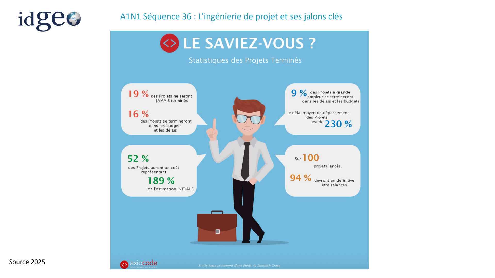
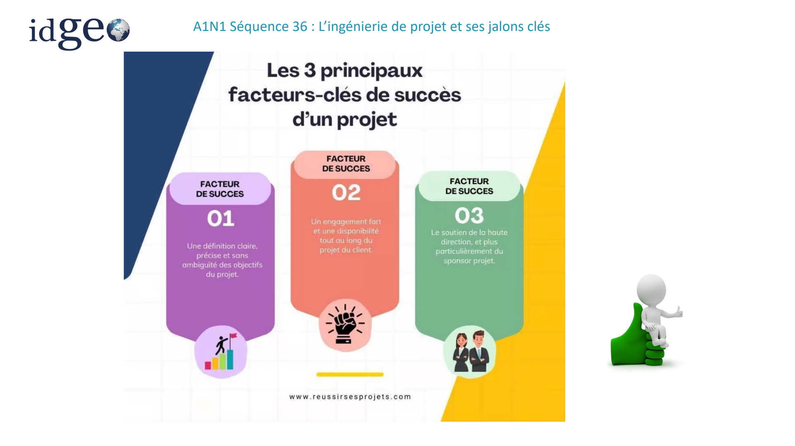
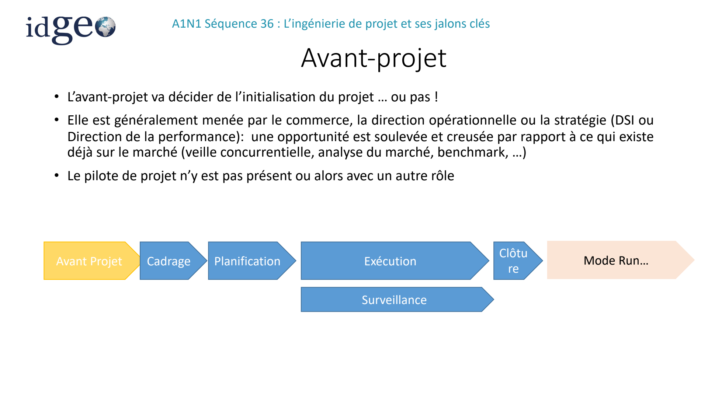
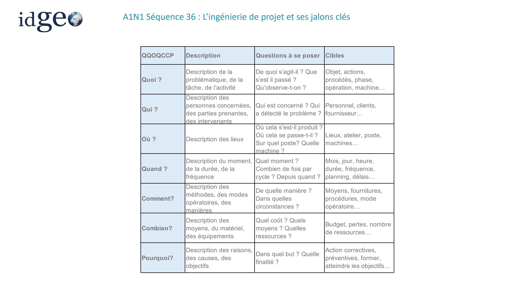
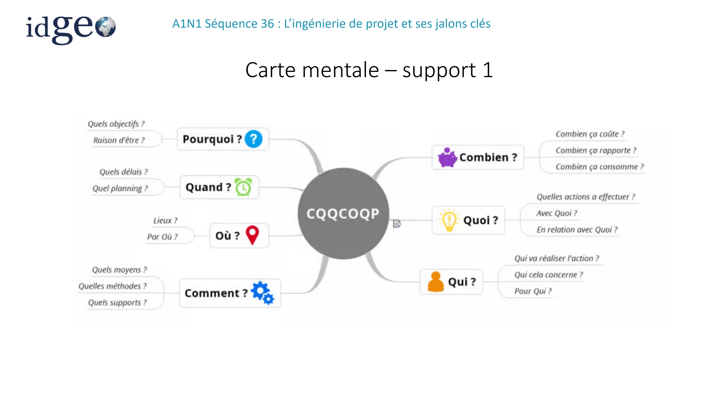
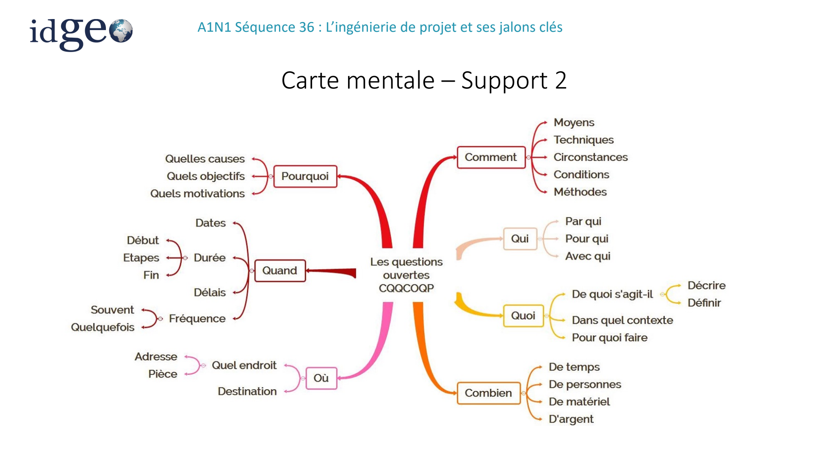
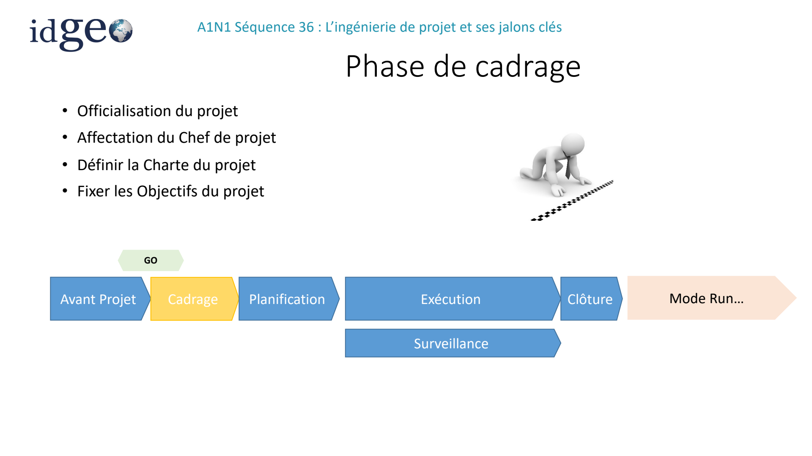

# S36 — L’ingénierie de projet et ses jalons clés — Partie 1

> Source unique : `A1N1S36_Nov25-part1.pdf` — 46 pages. Les repères de page suivent l’ordre du PDF.

> Ce fichier reprend les 46 premières pages du support complet S36. Il est transcrit séparément, sans fusion avec celui-ci. [Consulter le support complet](s36-ingenierie-projet-jalons.md).

## Définitions et points d’attention

### Plan de la séquence

*Source : page 1.*

- Définitions et points d’attentions
- Les phases d’un projet et ses livrables clés
- La note de cadrage ou charte projet

### Projet - Définition

*Source : page 2.*

- Un projet est un processus unique qui consiste en
- un ensemble d'activités coordonnées et maîtrisées,
- comportant des dates de début et de fin,
- entrepris dans le but d'atteindre un objectif conforme à des exigences spécifiques,
- incluant des contraintes de délais, de coûts et de ressources.

### Projet - Définition

*Source : page 3.*

**La réalisation du projet est:**

- unique, éphémère, de qualité
- et il faut le réaliser dans un temps défini
- et dans la limite d'une enveloppe budgétaire

### Contraintes

*Source : page 4.*

**Triangle qualité-coût-délais (QCD) :**

Il s’agit de représenter simplement et de façon synthétique les éléments clés, qui, bien préparés et maitrisés assureront le succès du projet.

Les notions de coût, qualité et délais d’un projet sont donc des contraintes essentielles à prendre en considération pour le pilotage et la définition d’un projet.

<!-- FIGURE SOURCE : A1N1S36_Nov25-part1.pdf, page 4. Emplacement : dans cette sous-partie, avant la page suivante. Reproduction de la page entière pour conserver les légendes et les relations du schéma. -->

*Visuel original — `A1N1S36_Nov25-part1.pdf`, page 4.*

### Causes d’échecs d’un projet

*Source : page 5.*

<!-- FIGURE SOURCE : A1N1S36_Nov25-part1.pdf, page 5. Emplacement : dans cette sous-partie, avant la page suivante. Reproduction de la page entière pour conserver les légendes et les relations du schéma. -->

*Visuel original — `A1N1S36_Nov25-part1.pdf`, page 5.*

### La compréhension d’un projet

*Source : page 6.*

<!-- FIGURE SOURCE : A1N1S36_Nov25-part1.pdf, page 6. Emplacement : dans cette sous-partie, avant la page suivante. Reproduction de la page entière pour conserver les légendes et les relations du schéma. -->

*Visuel original — `A1N1S36_Nov25-part1.pdf`, page 6.*

### Causes Classiques d’échec

*Source : page 7.*

- Changement des priorités de l'organisation - 39 %
- Changement des objectifs du projet - 37 %
- Collecte imprécise des exigences - 35 %
- Vision ou objectif inadéquat pour le projet - 29 %
- Communication inadéquate / mauvaise - 29 %
- Les opportunités et les risques n'ont pas été définis - 29 %
- Estimations des coûts inexactes - 28 %
- Mauvaise gestion du changement - 28 %
- Soutien insuffisant du sponsor - 26 %
- Dépendance à l'égard des ressources - 26 %
- Estimation inexacte de la durée des tâches - 25 %
- Gestionnaire de projet inexpérimenté - 22 %
- Ressources limitées/imposées - 21 %
- Prévision inadéquate des ressources - 18 %
- Procrastination des membres de l'équipe - 13 %
- Dépendance des tâches - 12 %

Chiffres issus de PMI

### Les trois principaux facteurs-clés de succès d’un projet

*Source : page 8.*

<!-- FIGURE SOURCE : A1N1S36_Nov25-part1.pdf, page 8. Emplacement : dans cette sous-partie, avant la page suivante. Reproduction de la page entière pour conserver les légendes et les relations du schéma. -->

*Visuel original — `A1N1S36_Nov25-part1.pdf`, page 8.*

### Qu’est ce que la gestion de projet?

*Source : page 9.*

- Gérer son projet apparait comme une clé de la réussite de son projet
- Comment la définiriez-vous?

### Qu’est ce que la gestion de projet?

*Source : page 10.*

C’est un ensemble de moyens, d’activités et d’actions qui vont être mises en place au sein du projet afin de:

- organiser le bon déroulement
- atteindre les objectifs fixés en termes de délais, cout et qualité
- piloter et communiquer sur le projet Elle s’appuie sur des méthodes, techniques et outils adaptés à chaque étape du projet (de l’avant projet à sa clôture)

## Les phases du projet et leurs livrables

### Etapes d’un projet

*Source : page 11.*

**Enchaînement des phases** : avant-projet, cadrage, planification, exécution, clôture, puis mode Run. La surveillance accompagne la réalisation du projet.

Le schéma situe notamment : besoin, Go/No Go, charte projet, Kick Off, livrables de suivi de projet, réunion de clôture, maintenance/évolution, PAQ V0, PAQ V1, PAQ Vn, tests, livraison et formations.

| Phase | Contenu du support |
| --- | --- |
| Avant-projet | Décision de faisabilité |
| Cadrage | Définition du projet, objectif, contrat |
| Planification | Organisation détaillée du projet : temps, coût, risques, découpage du projet en tâches… |
| Exécution ou réalisation | Coordination des ressources pour arriver aux objectifs ; réalisation du périmètre par les équipes |
| Surveillance, contrôles et pilotage | Vérification de la maîtrise des objectifs, mesure et actions correctives |
| Clôture | Formalisation de la fin du projet avec le client ; réaffectation des ressources sur d’autres activités |

<!-- FIGURE SOURCE : A1N1S36_Nov25-part1.pdf, page 11. Emplacement : dans cette sous-partie, avant la page suivante. Reproduction de la page entière pour conserver les légendes et les relations du schéma. -->

*Visuel original — `A1N1S36_Nov25-part1.pdf`, page 11.*

### Etapes d’un projet

*Source : page 12.*

<!-- FIGURE SOURCE : A1N1S36_Nov25-part1.pdf, page 12. Emplacement : dans cette sous-partie, avant la page suivante. Reproduction de la page entière pour conserver les légendes et les relations du schéma. -->

*Visuel original — `A1N1S36_Nov25-part1.pdf`, page 12.*

## Avant-projet

### Avant-projet

*Source : page 13.*

- L’avant-projet va décider de l’initialisation du projet… ou pas !
- Cette phase est généralement menée par le commerce, la direction opérationnelle ou la stratégie (DSI ou direction de la performance) : une opportunité est soulevée et creusée par rapport à ce qui existe déjà sur le marché (veille concurrentielle, analyse du marché, benchmark…).
- Le pilote de projet n’y est pas présent, ou alors avec un autre rôle.

<!-- FIGURE SOURCE : A1N1S36_Nov25-part1.pdf, page 13. Emplacement : dans cette sous-partie, avant la page suivante. Reproduction de la page entière pour conserver les légendes et les relations du schéma. -->

*Visuel original — `A1N1S36_Nov25-part1.pdf`, page 13.*

### Phase avant projet - Définition

*Source : page 14.*

- L'objectif de cette phase est de disposer d'informations pertinentes pour éclairer la décision de démarrer ou non le projet.
- Les informations d’ordre techniques recueillies permettent de savoir si :
- les compétences et les moyens techniques de l'organisation sont mobilisables en interne ou en externe pour le projet.
- définir le bilan économique du projet en termes de retour sur investissement (ROI) et par rapport au marché

### Phase avant projet - Définition

*Source : page 15.*

Il est judicieux de baser la décision de lancement d’un projet suite à une analyse ‘terrain’ comme:

- L’expression de besoin C’est un descriptif expliquant les raisons pour lesquelles le projet et l’installation sont nécessaires. Il décrit aussi le type et les caractéristiques de performances de l’installation et les améliorations que cela va apporter.
- L’étude de marché dont l’objectif est d’aider les décideurs à définir le type de projet à développer, le montage financier, et toutes les informations à analyser au préalable. Elle contient les opportunités à développer le projet en interne ou en externe et ce que cela va pouvoir apporter.

Ces éléments permettent de confirmer ou non le lancement du projet : GO / No GO

### Outils pour définition du besoin

*Source : page 16.*

- Outils pour définir le périmètre du besoin projet:
- Interviews
- Analyse de l’existant basée sur des outils de collecte des besoins et des problèmes (analyse des flux, recueil des insatisfactions, QQOQCCP…)
- Brainstorming avec l’ensemble des services ou des parties prenantes

### QQOQCCP

*Source : page 17.*

- Le QQOQCCP (Quoi, Qui, Où, Quand, Comment, Combien, Pourquoi), appelé aussi méthode du questionnement est un outil d’aide à la résolution de problèmes comportant une liste quasi exhaustive d’informations sur la situation.
- Très simple d’utilisation, le QQOQCCP s’utilise également dans diverses configurations telles que l’élaboration d’un nouveau processus ou encore la mise en place d’actions correctives.
- La méthode QQOQCCP : Quoi, Qui, Où, Quand, Comment, Combien, Pourquoi, est un outil adaptable à diverses problématiques permettant la récolte d’informations précises et exhaustives d’une situation et d’en mesurer le niveau de connaissance que l’on possède. Elle s’intègre parfaitement dans diverses démarches permettant entres autres :
- de définir un processus ou de rédiger une procédure
- de préparer un rapport
- de donner les lignes directrices pour le lancement d’un plan d’action
- d’élaborer un diagnostic
- d’animer un brainstorming
- La méthode de questionnement QQOQCCP permet de décrire une situation en répondant aux questions suivantes d’une manière générale

### Tableau QQOQCCP

*Source : page 18.*

| QQOQCCP | Description | Questions à se poser | Cibles |
| --- | --- | --- | --- |
| Quoi ? | Description de la problématique, de la tâche, de l’activité | De quoi s’agit-il ? Que s’est il passé ? Qu’observe-t-on ? | Objet, actions, procédés, phase, opération, machine… |
| Qui ? | Description des personnes concernées, des parties prenantes, des intervenants | Qui est concerné ? Qui a détecté le problème ? | Personnel, clients, fournisseur… |
| Où ? | Description des lieux | Où cela s’est-il produit ? Où cela se passe-t-il ? Sur quel poste? Quelle machine ? | Lieux, atelier, poste, machines… |
| Quand ? | Description du moment, de la durée, de la fréquence | Quel moment ? Combien de fois par cycle ? Depuis quand ? | Mois, jour, heure, durée, fréquence, planning, délais… |
| Comment? | Description des méthodes, des modes opératoires, des manières | De quelle manière ? Dans quelles circonstances ? | Moyens, fournitures, procédures, mode opératoire… |
| Combien? | Description des moyens, du matériel, des équipements | Quel coût ? Quels moyens ? Quelles ressources ? | Budget, pertes, nombre de ressources… |
| Pourquoi? | Description des raisons, des causes, des objectifs | Dans quel but ? Quelle finalité ? | Action correctives, préventives, former, atteindre les objectifs… |

<!-- FIGURE SOURCE : A1N1S36_Nov25-part1.pdf, page 18. Emplacement : dans cette sous-partie, avant la page suivante. Reproduction de la page entière pour conserver les légendes et les relations du schéma. -->

*Visuel original — `A1N1S36_Nov25-part1.pdf`, page 18.*

### QQCCOQP

*Source : page 19.*

<!-- FIGURE SOURCE : A1N1S36_Nov25-part1.pdf, page 19. Emplacement : dans cette sous-partie, avant la page suivante. Reproduction de la page entière pour conserver les légendes et les relations du schéma. -->

*Visuel original — `A1N1S36_Nov25-part1.pdf`, page 19.*

### Carte mentale – support 1

*Source : page 20.*

<!-- FIGURE SOURCE : A1N1S36_Nov25-part1.pdf, page 20. Emplacement : dans cette sous-partie, avant la page suivante. Reproduction de la page entière pour conserver les légendes et les relations du schéma. -->

*Visuel original — `A1N1S36_Nov25-part1.pdf`, page 20.*

### Carte mentale – Support 2

*Source : page 21.*

<!-- FIGURE SOURCE : A1N1S36_Nov25-part1.pdf, page 21. Emplacement : dans cette sous-partie, avant la page suivante. Reproduction de la page entière pour conserver les légendes et les relations du schéma. -->

*Visuel original — `A1N1S36_Nov25-part1.pdf`, page 21.*

### QQCOQP mise en pratique

*Source : page 22.*

20 minutes

Appliquer la méthode QQCCOQP à l’environnement du projet sur lequel vous travaillez.

### Pour Synthétiser : Avant Projet

*Source : page 23.*

- La phase d’avant projet
- Identifie un besoin
- Le confronte aux contraintes techniques et économiques et aux risques en interne et en externe
- Le soumet aux décideurs
- Valide le besoin ou non de lancer le projet
- A retenir:
- Le chef de projet n’est pas encore nommé, il n’est nommé que si il y a un GO
- Cette phase doit se baser sur des documents d’étude de marché et d’expression du besoin

## Cadrage et charte projet

### Phase de cadrage

*Source : page 24.*

- Officialisation du projet.
- Affectation du chef de projet.
- Définir la charte du projet.
- Fixer les objectifs du projet.

Le schéma positionne le GO avant le cadrage.

<!-- FIGURE SOURCE : A1N1S36_Nov25-part1.pdf, page 24. Emplacement : dans cette sous-partie, avant la page suivante. Reproduction de la page entière pour conserver les légendes et les relations du schéma. -->

*Visuel original — `A1N1S36_Nov25-part1.pdf`, page 24.*

### Cadrage du projet

*Source : page 25.*

- Un document essentiel est la Charte du projet (ou note de cadrage). La charte initialisée par le Chef de projet et approuvée par le Sponsor, définit un ensemble de critères dimensionnant du projet:
- Présentation et objectifs du projet
- Périmètre du projet
- Les jalons principaux
- Les livrables
- Le budget et les sources de financement
- Les risques
- La gouvernance
- Initialisation des besoins en ressources : interne et externe (définition de poste, demande de sous-traitance), (lien fonctionnel dans un projet et non hiérarchique)
- Effort à fournir pour communication sur futur outil mais aussi au sein du projet pour tenir informé
- Identifier des risques (SWOT), mesure de l’impact des risques et matrice des risques

### Charte projet

*Source : page 26.*

- La charte de projet est le contrat de nomination du chef de projet par le sponsor qui est le donneur d’ordre (ou le commanditaire). Elle définit clairement les attentes, les réponses du projet et les pouvoirs et autorités du chef de projet.
- La charte de projet est aussi le document de référence pour :
- valider les enjeux, l’opportunité à saisir ou le problème à traiter, les bénéfices, le contenu, et les livrables du projet.
- chaque étape du projet
- et pour faire des arbitrages au sein de l’équipe, le cas échéant.

### Charte projet

*Source : page 27.*

**La charte projet se décompose en 7 parties:**

1. Présentation du projet

- Définissant les objectifs du projet et les critères de mesure de succès afin de confirmer l’atteinte des objectifs et résultats souhaités en mentionnant :
- La raison d’être du projet (ex. le problème opérationnel à traiter, l’opportunité business ou l’exigence légale et règlementaire)
- Les critères de mesure des objectifs pour confirmer la satisfaction des attentes.
- Les résultats opérationnels attendus à la fin du projet Les énoncés des objectifs doivent être concrets et précis Cette synthèse doit contenir tous les renseignements dont ont besoin les principales parties prenantes pour approuver le projet

### Charte Projet partie 1 - Définition des objectifs

*Source : page 28.*

- Un objectif définit un résultat à atteindre dans un contexte donné.

Le résultat est exprimé en verbes d'action, il est observable et mesurable.

Il doit être assorti de moyens, de délais, et suppose un mode de calcul et de contrôle.

Un objectif doit être discuté, négocié. Il est unique et mesurable Une mauvaise définition d’un objectif peut être une cause d’échec

- On parle d’objectif SMART :
- Spécifique (dans le sens personnalisé)
- Mesurable (quels indicateurs ?)
- Ambitieux (Si nous avons fait 100 en n-1 et à marché ISO, un nouvel objectif 100 démontre un manque d'ambition)
- Réaliste (dans le sens accessible : Pouvons-nous l'atteindre ?)
- Délimité dans le Temps (Combien de temps pour atteindre l'objectif, quels paliers intermédiaires (x en mars puis x en juin pour atteindre l'objectif en octobre)[

### Charte Projet partie 1 - Définition des objectifs

*Source : page 29.*

**En résumé, un objectif doit :**

- être clair, facile à comprendre
- prendre en compte que la réalisation dépend des activités de ceux à qui il a été fixé
- être mesurable grâce à des indicateurs chiffrés

Qu'est-ce qu''un indicateur de performance ?

Ce sont des critères, des points de repères qui permettent de constater la progression vers un but défini. Il doit y avoir un lien entre l'indicateur et l'objectif à atteindre, on cherche à mesurer le progrès réalisé

### Charte de projet

*Source : page 30.*

2. Périmètre du projet

- Donner une description générale des inclusions et exclusions du projet (qu’est ce qui est dans le périmètre et qu’est ce qui ne l’est pas)
- Vous pouvez également détailler les caractéristiques du produit ou du service à offrir ou le résultat à atteindre dans le cadre du projet.

### In / Out of the Box

*Source : page 31.*

En brainstorming avec des post-it, sur un tableau, le pilote de la réunion (chef de projet ou consultant extérieur spécialisé) dessine une boite.

Ce que l’on met à l’intérieur fait partie du périmètre du projet.

A l’extérieur ce que l’on ne gardera pas dans le périmètre projet.

C’est arbitré par le pilote de la réunion.

Cela fera l’objet d’un compte rendu et sera la base pour compléter le périmètre du projet dans la charte projet (note de cadrage)

### Charte projet

*Source : page 32.*

3. Jalons

- Il ne s’agit pas de donner des dates précises, mais d’indiquer les principaux jalons du projet.

Notamment, les phases et étapes du projet, ainsi que les points de vérification et d’approbation.

- Vous pouvez également indiquer les contraintes en termes de délais qui doivent êtres prises en compte plus tard en phase de planification. Je cite à titre d’exemples :
- Un gel des activités de la fin d’année;
- Un produit qui doit être lancé à une certaine date
- Une disposition réglementaire ou légale exigeant imposant une mise en conformité avant une date fixe.
- Ces dates ne bougeront pas, il est donc nécessaire de les mentionner pour les prendre en compte.
- Vous pouvez bien évidemment préciser dans votre charte de projet, que cet échéancier sera surement sujet à des modifications ultérieures.

### Charte projet

*Source : page 33.*

4. Livrables

- Définir les principaux produits, services ou résultats qui doivent être fournis dans le cadre du projet en vue de réaliser le bénéfice attendu.
- Attention : N’oublier pas d’inclure les produits livrables internes du projet qui sont requis pour le management de projet (CR, plan d’actions, réunions…)
- Il faudrait préciser aussi les critères d’évaluation de la réussite et de la qualité des livrables, ainsi que le processus et les acteurs d’approbation de chaque livrable.

### Charte Projet

*Source : page 34.*

5. Budget et sources de financement

- Présenter le budget global approuvé pour le projet et une estimation des coûts pour les différentes ressources (humaines, matérielles et financières) qui sont nécessaires pour la réalisation du projet.
- les estimations des coûts pouvant servir de base à cette section de la charte de projet. Les chiffrages détaillés seront quant à eux effectués en phase de planification.
- Il faudrait indiquer les différentes sources de financement qui seront utilisées pour supporter le projet.
- Le sponsor de projet et le gestionnaire de projet doivent comprendre clairement d’où provient le financement et quand les fonds vont être débloqués.
- 3 natures de ressources:
- Budget en euro
- Les moyens humains
- Les Moyens matériels
- Le budget sert à évaluer la faisabilité du projet, demander des financements, rendre des comptes, convaincre de l’utilité du projet…
- Il est aussi un instrument de suivi et de pilotage

### Les éléments indispensables à l’estimation des

*Source : page 35.*

coûts d’un projet

**Définir les éléments de base qui constituent votre projet :**

- Le planning initial du projet
- La durée de chaque tâche
- La durée totale du projet
- La quantité de ressources humaines nécessaire
- La quantité de ressources matérielles nécessaire
- constitution d’un planning prévisionnel de votre projet

### Deux méthodes d’estimation des coûts

*Source : page 36.*

La méthode analogique ou par analogie

- Analyse du projet : vous devez connaître les contours de votre projet pour faciliter la recherche d’un projet semblable.
- Recherche d’un projet similaire.
- Comparaison et chiffrage : des ajustements devront être effectués en fonction des différences entre les deux projets.
- La méthode par analogie permet d’obtenir des prévisions au plus proche de la réalité. C’est une solution de chiffrage rapide, mais moins précise.

### Deux méthodes d’estimation des coûts

*Source : page 37.*

La méthode ascendante

- Le but de cette méthode est d’estimer le coût de chaque groupement de tâches, puis d’additionner chacune de ces estimations afin d’obtenir le coût global du projet. Cette méthode est plus précise que la précédente car elle s’appuie sur l’expérience et l’avis des personnes qui exécutent les tâches en question.
- Cette méthode s’utilise lors de l’élaboration du budget. Une fois que tous les éléments du projet ont été chiffrés, on les additionne afin d’obtenir le coût total du projet

### Charte projet — Risques

*Source : page 38.*

6. Risques Présenter une évaluation initiale des risques, notamment les risques stratégiques qui ont été identifiés au début du projet.

Pour chaque risque identifié, évaluer son niveau d’impact et sa probabilité de survenance (exemple : faible, moyen ou élevé).

Par la suite, déterminer la stratégie appropriée à entreprendre pour maîtriser chaque risque identifié, et désigner la personne ou l’équipe chargée de traiter le risque, le cas échéant. (cf management des risques)

**Plusieurs traitements du risque sont possibles:**

1 - Éliminer le risque. Cette option consiste à éliminer complètement la probabilité ou l’impact du risque ; 2 - Atténuer le risque. Mettre en place un plan d’action pour réduire la probabilité ou l’impact du risque ; 3 - Transférer le risque. Transférer la responsabilité du risque à l’extérieur du projet (exemple, souscription d’une assurance); 4 - Accepter le risque. Se contenter de surveiller le risque et ne pas appliquer les stratégies susmentionnées.

### Analyse de la situation : SWOT

*Source : page 39.*

|  | Positif | Négatif |
| --- | --- | --- |
|  | STRENGHTS - Les FORCES | WEAKNESSES - Les FAIBLESSES |
| Interne | • Quelles sont nos forces ? • Que maîtrisons-nous bien dans notre chaîne de valeur ? • De quels avantages compétitifs disposons-nous? | • Quelles sont nos faiblesses ? • Que devons-nous améliorer au sein de notre chaîne de valeur ? • Quels sont les dysfonctionnements identifiés ? |
|  | OPPORTUNITIES - Les OPPORTUNITES | THREATS - Les MENACES |
| Externe | • Quels sont les opportunités et tendances positives dans notre environnement ? • Quels sont les chances qui s’offrent à nous au niveau de notre environnement concurrentiel, légal, socio-culturel, des nouvelles technologies…? | • A quel menaces, obstacles ou dangers de notre environnement devons-nous faire face ? • Quelle concurrence devons-nous affronter ? Nouveaux entrants potentiels ? • Les changements de technologie, de législation vont ils nous affecter ? |

Le SWOT peut être interne ou externe ; il peut ne pas être communiqué à tous les acteurs.

<!-- FIGURE SOURCE : A1N1S36_Nov25-part1.pdf, page 39. Emplacement : dans cette sous-partie, avant la page suivante. Reproduction de la page entière pour conserver les légendes et les relations du schéma. -->

*Visuel original — `A1N1S36_Nov25-part1.pdf`, page 39.*

### SWOT mise en pratique

*Source : page 40.*

- Réaliser le SWOT de votre projet
- Présentation de 2 SWOT

### Charte projet

*Source : page 41.*

7. Gouvernance du projet et Chef de projet Décrire la façon avec laquelle le projet sera géré et définir les instances de gouvernance qui vont être impliquées dans le processus d’approbation. Autrement dit, expliquer le processus décisionnel et indiquer qui prend quelle décision.

Les parties prenantes sont donc mentionnées dans cette partie avec leur rôle Par la même occasion, si ce n’est pas fait au début du document, il est possible d’exposer dans cette section qui est assigné comme chef de projet, quel est le niveau d’autorité dont il dispose.

**Ceci pourrait inclure:**

- Est ce qu’il pourrait engager des dépenses ? Jusqu’à quelle limite.
- Est ce qu’il a la capacité d’assembler une équipe ?

### RACI

*Source : page 42.*

- Le RACI est un outil qui permet de définir les rôles de chacun au sein d’un projet
- R: réalise
- A: approuve
- C: consulté
- I: Informé
- Il peut y avoir aussi S pour Support

### Exemple RACI

*Source : page 43.*

| Activité | CP | RT | COM | QTE | RH |
| --- | --- | --- | --- | --- | --- |
| Élaboration de l’offre technique et commerciale | C | R | A | I | C |
| Réalisation du planning du projet | R | A |  | I |  |
| Identification des ressources projet | R | A |  |  | C |
| Suivi du plan de facturation | R | A | I |  |  |
| Suivi d’une non-conformité | R | C |  | A |  |
| Gestion des risques | R | A | C | I |  |

<!-- FIGURE SOURCE : A1N1S36_Nov25-part1.pdf, page 43. Emplacement : dans cette sous-partie, avant la page suivante. Reproduction de la page entière pour conserver les légendes et les relations du schéma. -->

*Visuel original — `A1N1S36_Nov25-part1.pdf`, page 43.*

### RACI Cas pratique

*Source : page 44.*

Réaliser le RACI d’une partie de vos activités.

### Charte projet

*Source : page 45.*

**A retenir**

La charte projet est le document qui permet de finaliser les objectifs et le périmètre d’un projet, d’estimer le cout et la charge, d’identifier les risques et d’impliquer les parties prenantes et préciser leur rôle via la gouvernance.

C’est le document de base qui va supporter tout le déploiement du projet et le découpage plus détaillé futur du projet.

### Charte projet - Synthèse

*Source : page 46.*

Check-list permettant de vérifier que tous les éléments sont présents dans le Charte Projet:

- Des objectifs précis et mesurables ont été établis pour que les résultats du projet soient évalués.
- Le périmètre du projet est énoncé clairement, ce qui permet au lecteur de comprendre facilement les inclusions et les exclusions du projet.
- Les livrables sont répartis sur tout le cycle de vie du projet et des points de décisions sont prévues aussi.
- L’estimation des coûts et source de financement sont documentées.
- Les risques stratégiques sont identifiés et évalués.
- Le processus de gouvernance est défini et les instances ou comités concernés sont désignés.
- Les parties prenantes sont identifiées et les rôles et responsabilités sont définis et attribués à des personnes ou à des comités
