# S37 — Pilotage et performance de projet

> Source unique : `A1N1S37_Nov-2025.pdf` — 102 pages. Les repères de page suivent l’ordre du PDF.

## Objectifs et rappels

### Objectifs

*Source : page 1.*

- Pilotage et surveillance du projet
- Evaluer la performance du projet
- Formaliser le management de la qualité du projet dans le PAQ

### Mémo

*Source : page 2.*

- Caractéristiques du projet :
- un début et une fin déterminés : un projet est borné dans le temps
- effort : il y a un certain « volume » de travail
- unique : il ne s’agit pas d’une activité de routine. Chaque projet est différent et le résultat est propre à chaque projet.
- Il créé un résultat final : service, produit, résultat
- Un projet a un début déterminé par la signature / la validation d’un document
- Un projet a une fin, officialisée par :
- La réunion de clôture
- Un passage en production
- …

### Mémo - Etapes d’un projet

*Source : page 3.*

**Phases du projet** : avant-projet, cadrage, planification, exécution et clôture, puis mode Run. Le schéma situe les principaux jalons, livrables, PAQ, tests, livraison et formations.

- **Avant-projet** : décision ; stratégie ou commerce.
- **Cadrage** : définition du projet, objectif, contrat.
- **Planification** : organisation du projet — temps, coût, risques, découpage du projet…
- **Exécution ou réalisation** : coordination des ressources pour arriver aux objectifs ; réalisation du périmètre par les équipes.
- **Surveillance ou contrôles et pilotage** : vérification de la maîtrise des objectifs, mesure et actions correctives.
- **Clôture** : formalisation de la fin du projet avec le client ; réaffectation des ressources sur d’autres activités.

<!-- FIGURE SOURCE : A1N1S37_Nov-2025.pdf, page 3. Emplacement : dans cette sous-partie, avant la page suivante. Reproduction de la page entière pour conserver les légendes et les relations du schéma. -->

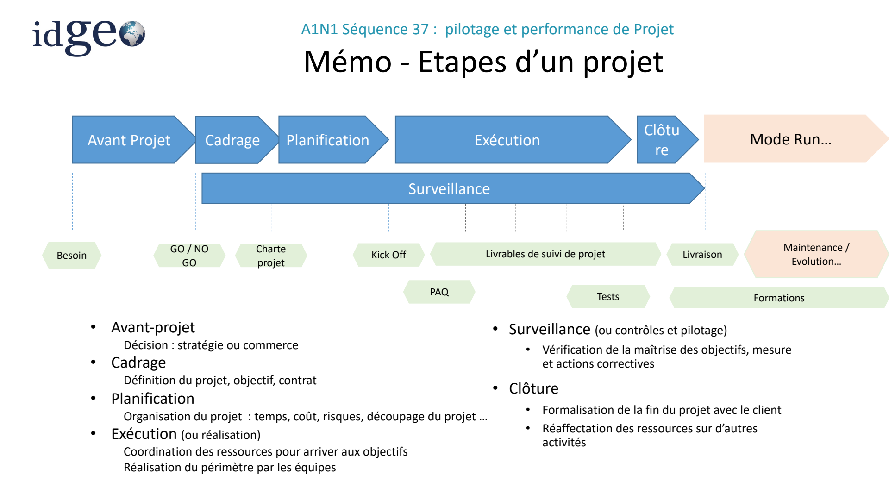

*Visuel original — `A1N1S37_Nov-2025.pdf`, page 3.*

### Comment peut dériver un projet

*Source : page 4.*

**Il y a de nombreuses possibilités pour qu’un projet dérive:**

Décalage dans le temps :

- mauvaise évaluation de la charge
- Retard: pas de retour client ou de la sous-traitance
- Évolution du besoin client
- ..
- Problème de qualité:
- Livrable erroné
- Documentation non préparée

### Comment peut dériver un projet

*Source : page 5.*

**Dépassement du budget:**

- mauvaise évaluation de la charge
- Des déplacements non pris en compte
- Une mauvaise évaluation des compétences nécessaires ..

Le management du projet est donc clé tout au long de sa durée de vie.

### Mémo – Les 3 éléments clés

*Source : page 6.*

En surveillant ces 3 éléments, il est possible d’éviter toute dérive du projet

<!-- FIGURE SOURCE : A1N1S37_Nov-2025.pdf, page 6. Emplacement : dans cette sous-partie, avant la page suivante. Reproduction de la page entière pour conserver les légendes et les relations du schéma. -->

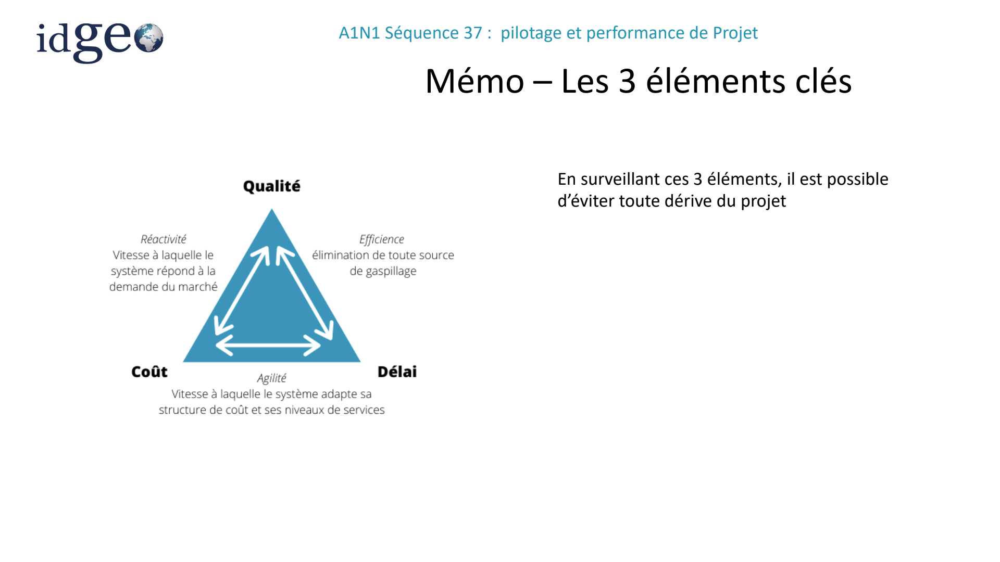

*Visuel original — `A1N1S37_Nov-2025.pdf`, page 6.*

### Pilotage: Eléments à suivre

*Source : page 7.*

- Pour piloter un projet, il est nécessaire de mettre en place des outils de pilotage afin de maitriser:
- La planification (planning, délais)
- Les couts/charges
- Les risques
- La qualité
- Les ressources (humaines et techniques)
- Les achats

## Planification et découpage du projet

### La planification

*Source : page 8.*

La planification consiste à mettre en place une méthode pour parvenir à un objectif et à organiser dans un temps défini un travail de groupe.

La planification de projet en entreprise suppose de mettre en place : les délais du projet, les périodes dédiées à chaque partie du projet.

Objectif : Gérer le contenu et l’organisation du projet

- S’assurer que tout le travail requis par le projet est effectué
- Suivre régulièrement les avancements des différentes étapes/livrables Comment ?
- Obtenir une vision détaillée du périmètre
- Évaluer les charges allouées à la réalisation de chaque tache
- Identifier les relations entre les taches (interdépendance, séquentielles)

### Définition arborescente du projet

*Source : page 9.*

Projet : Un seul début et une seule fin. Le début et la fin identifiés en tant qu'événements

-  (décision, revue, etc.) Sous-projet : Projet contenu dans le projet principal. Lié à un objet ou un livrable partiel du projet
-  Phase (étape, lot de travaux) : Ensemble d'actions qui marque un avancement significatif. Lié à un
-  type de compétences et à un degré dans la progression du projet Activité (ou Tâche) : Maille la plus fine de la planification. Action exécutable par une seule
-  ressource (ou un seul ensemble de ressources) Jalon : Événements clé d’un projet, montrant une certaine progression du projet, dates
-  importantes de réalisation d’un projet, réalisation concrète (production de livrables) Livrable : est tout résultat, document, mesurable, tangible ou vérifiable, qui résulte de
-  l’achèvement d’une partie de projet ou du projet.

Exemples : Un cahier des charges et une étude de faisabilité sont des livrables.

### Organigramme technique (OT)

*Source : page 10.*

Un formalisme pour bien définir l ’objectif principal et les objectifs secondaires du projet, pour

-  bien analyser le projet Réalisation d ’un organigramme technique (OT) : ensemble PBS+WBS+OBS

-

### Découpage du projet

*Source : page 11.*

PBS

- (Product Breakdown Structure) Organigramme des composants. Qu'est ce qu'on fabrique ?

QUOI ? = définir le(s) livrable(s)

WBS

- (Work Breakdown Structure) Organigramme des tâches. Comment on va le réaliser ?

COMMENT ? = définir les taches?

OBS

- (Organisation Breakdown Structure) Organigramme des responsabilités. QUI va réaliser les tâches ( ressources humaines) ?

TBS

- (Time Breakdown Structure) Organigramme temporel. Quel scénario : PERTT et Gantt.

QUAND ?

### WBS : Définition générale

*Source : page 12.*

- WBS = Work breakdown structure
- En français : SDP = Structure de Découpage du Projet
- Représentation sous forme d’une arborescence hiérarchique
- Concerne le périmètre, et les actions de pilotage
- Le WBS représente 100% du travail à accomplir
- L’intérêt est de décomposer tout le projet afin de ne rien oublier
- Se construit par découpage du projet
- Décomposition en sous-projets, lots, puis sous-lots, etc. …
- En théorie : pas de limite de profondeur ni de nombre de « feuilles »
- Affinage jusqu’à un « package » comprenant un ensemble d’activités cohérentes qui seront confiées à une même entité (éventuellement sous-traitée à un fournisseur)
- La structure du WBS peut être représentée de diverses manières :
- Phases du projet en second niveau, puis livrables du produit
- Livrables principaux en second niveau de décomposition
- En intégrant des lots qui seront sous-traités à un fournisseur

<!-- FIGURE SOURCE : A1N1S37_Nov-2025.pdf, page 12. Emplacement : dans cette sous-partie, avant la page suivante. Reproduction de la page entière pour conserver les légendes et les relations du schéma. -->

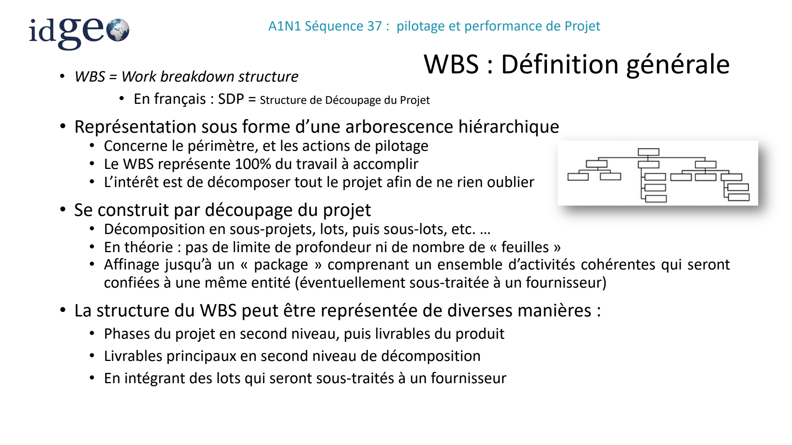

*Visuel original — `A1N1S37_Nov-2025.pdf`, page 12.*

### WBS : Représentation graphique

*Source : page 13.*

<!-- FIGURE SOURCE : A1N1S37_Nov-2025.pdf, page 13. Emplacement : dans cette sous-partie, avant la page suivante. Reproduction de la page entière pour conserver les légendes et les relations du schéma. -->

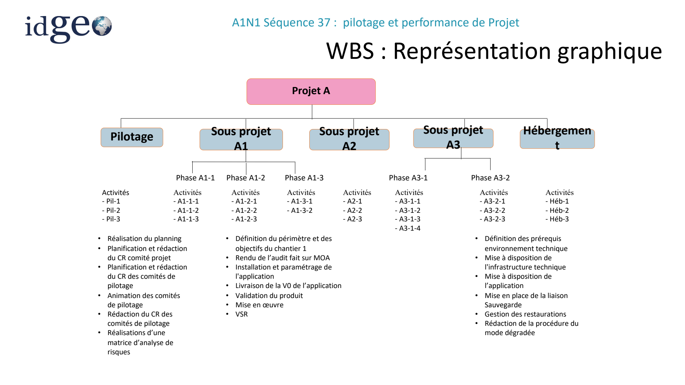

*Visuel original — `A1N1S37_Nov-2025.pdf`, page 13.*

### WBS : exemple par phase

*Source : page 14.*

<!-- FIGURE SOURCE : A1N1S37_Nov-2025.pdf, page 14. Emplacement : dans cette sous-partie, avant la page suivante. Reproduction de la page entière pour conserver les légendes et les relations du schéma. -->

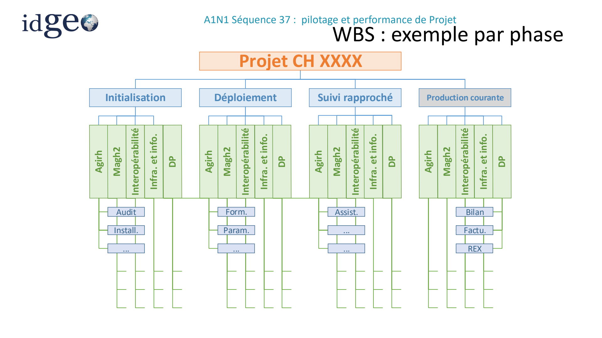

*Visuel original — `A1N1S37_Nov-2025.pdf`, page 14.*

### WBS : exemple par domaine

*Source : page 15.*

<!-- FIGURE SOURCE : A1N1S37_Nov-2025.pdf, page 15. Emplacement : dans cette sous-partie, avant la page suivante. Reproduction de la page entière pour conserver les légendes et les relations du schéma. -->

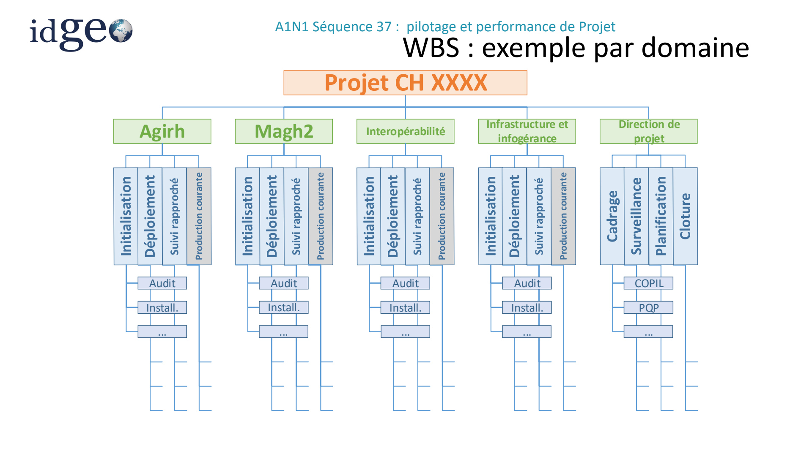

*Visuel original — `A1N1S37_Nov-2025.pdf`, page 15.*

### WBS : outils possibles

*Source : page 16.*

- Gestion possible via :
- MS Visio
- Formes libres (blocs, connecteurs, etc.)
- MS Project
- Abaisser la tâche !)$*(%+H !"#$%&amp;'(
- MS Excel !"#$% !"#$&amp; !"#$'
- Grouper les lignes -$./+0)$*(%+H1 !()*+,-%$%
- Sur le web:
- %$%$% -%$%$&amp; -%$%$'

!()*+,-%$&amp;

- Monday ...
- Trello !()*+,-%$' ...
- Canva -$./+0)$*(%+H2 ...
- Smartsheet
- $./+0)$*(%+H3

...

**456()'(7(8%**

...

<!-- FIGURE SOURCE : A1N1S37_Nov-2025.pdf, page 16. Emplacement : dans cette sous-partie, avant la page suivante. Reproduction de la page entière pour conserver les légendes et les relations du schéma. -->

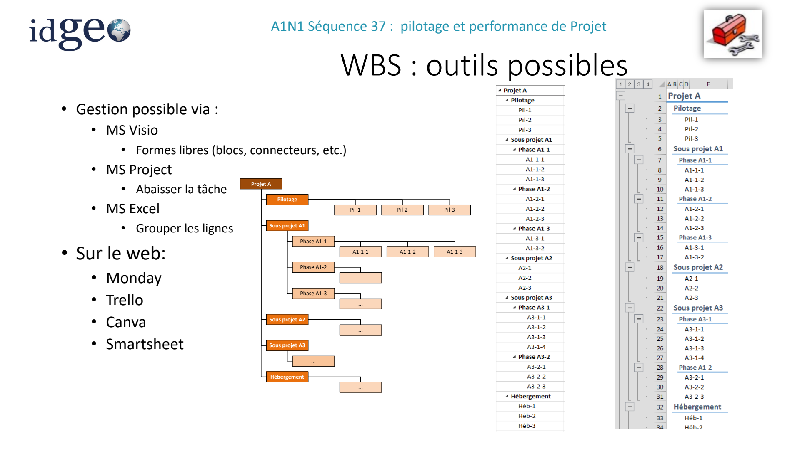

*Visuel original — `A1N1S37_Nov-2025.pdf`, page 16.*

### WBS : outil possible (MS Word)

*Source : page 17.*

- Liste numérotée à plusieurs niveaux

<!-- FIGURE SOURCE : A1N1S37_Nov-2025.pdf, page 17. Emplacement : dans cette sous-partie, avant la page suivante. Reproduction de la page entière pour conserver les légendes et les relations du schéma. -->

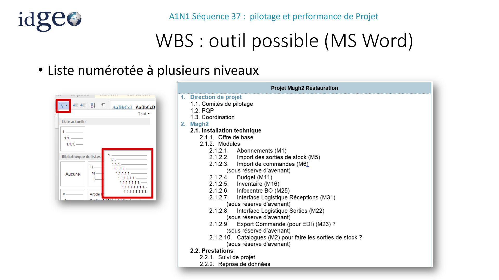

*Visuel original — `A1N1S37_Nov-2025.pdf`, page 17.*

### PBS (organigramme des composants)

*Source : page 18.*

Organigramme technique de produit (OTP , PBS en anglais pour

-  Product breakdown structure) : outil servant à analyser, documenter et communiquer les résultats d’un projet.

Il fournit une liste exhaustive et hiérarchisée (sous forme d’organigramme en

-  arbre) des délivrables qui participent au projet. Il fait partie de la technique de planification de projets basée sur les produits (ou délivrables).

Il constitue le squelette du projet le résultat final, (délivrable…) constitue donc

-  l’objectif du projet (Un objectif est par nature unique et mesurable)

### PBS — Organigramme structurel

*Source : page 19.*

- Le squelette du projet.
- Les livrables / produits.
- L’objectif du projet.

<!-- FIGURE SOURCE : A1N1S37_Nov-2025.pdf, page 19. Emplacement : dans cette sous-partie, avant la page suivante. Reproduction de la page entière pour conserver les légendes et les relations du schéma. -->

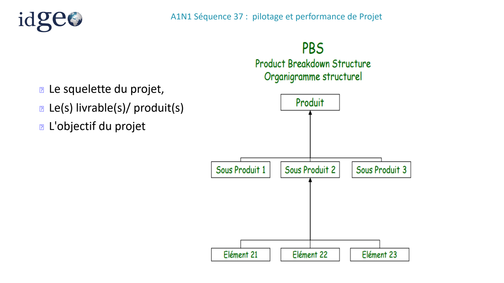

*Visuel original — `A1N1S37_Nov-2025.pdf`, page 19.*

### PBS : Base de données cadastre

*Source : page 20.*

<!-- FIGURE SOURCE : A1N1S37_Nov-2025.pdf, page 20. Emplacement : dans cette sous-partie, avant la page suivante. Reproduction de la page entière pour conserver les légendes et les relations du schéma. -->

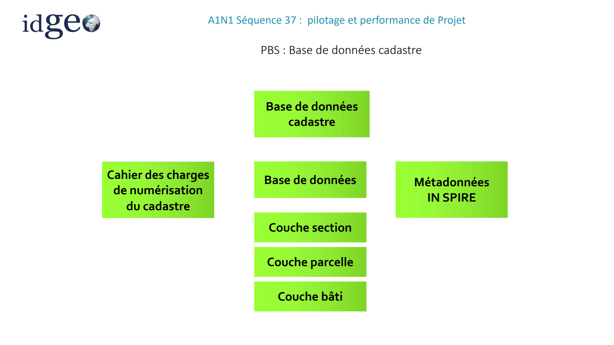

*Visuel original — `A1N1S37_Nov-2025.pdf`, page 20.*

### WBS — Organigramme des tâches

*Source : page 21.*

Les tâches à effectuer pour produire les livrables.

<!-- FIGURE SOURCE : A1N1S37_Nov-2025.pdf, page 21. Emplacement : dans cette sous-partie, avant la page suivante. Reproduction de la page entière pour conserver les légendes et les relations du schéma. -->

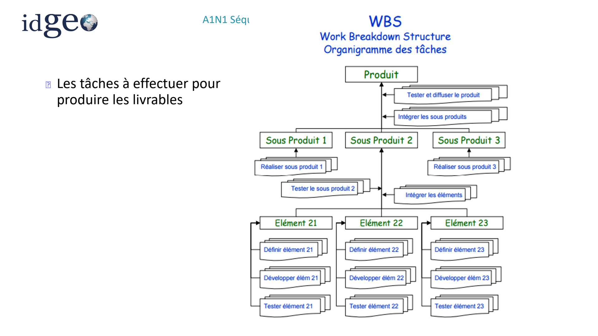

*Visuel original — `A1N1S37_Nov-2025.pdf`, page 21.*

### WBS : Base de données cadastre

*Source : page 22.*

<!-- FIGURE SOURCE : A1N1S37_Nov-2025.pdf, page 22. Emplacement : dans cette sous-partie, avant la page suivante. Reproduction de la page entière pour conserver les légendes et les relations du schéma. -->

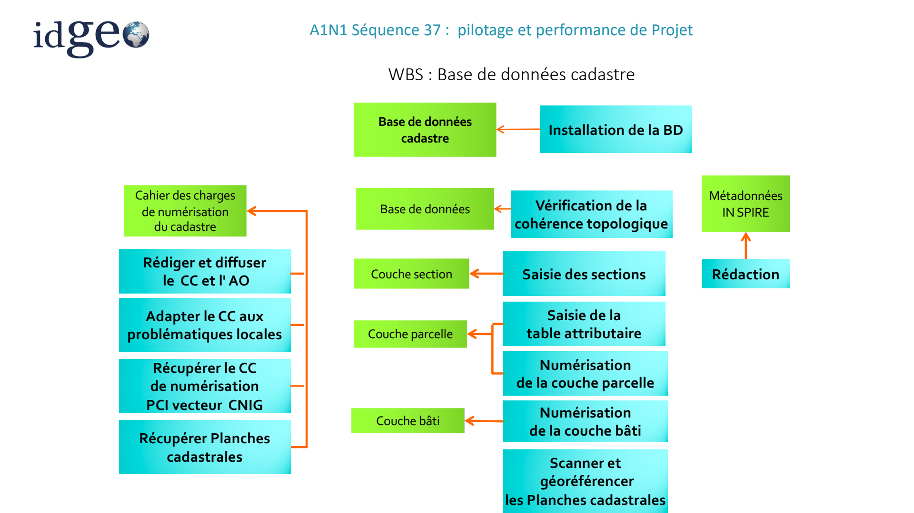

*Visuel original — `A1N1S37_Nov-2025.pdf`, page 22.*

### OBS

*Source : page 23.*

Les ressources humaines.

Le schéma présente l’OBS et les responsabilités associées aux activités et aux produits.

<!-- FIGURE SOURCE : A1N1S37_Nov-2025.pdf, page 23. Emplacement : dans cette sous-partie, avant la page suivante. Reproduction de la page entière pour conserver les légendes et les relations du schéma. -->

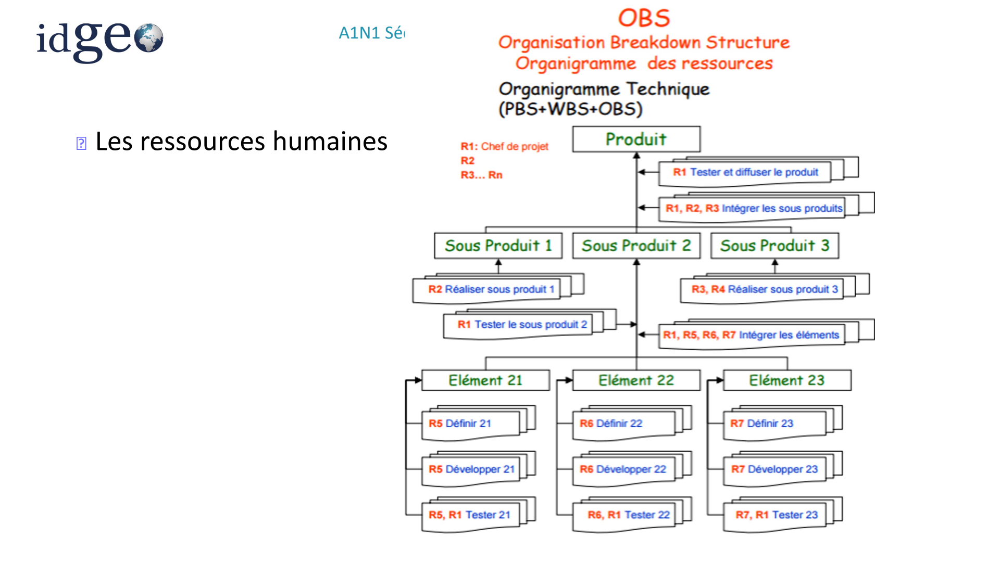

*Visuel original — `A1N1S37_Nov-2025.pdf`, page 23.*

### OBS — Base de données cadastre

*Source : page 24.*

<!-- FIGURE SOURCE : A1N1S37_Nov-2025.pdf, page 24. Emplacement : dans cette sous-partie, avant la page suivante. Reproduction de la page entière pour conserver les légendes et les relations du schéma. -->

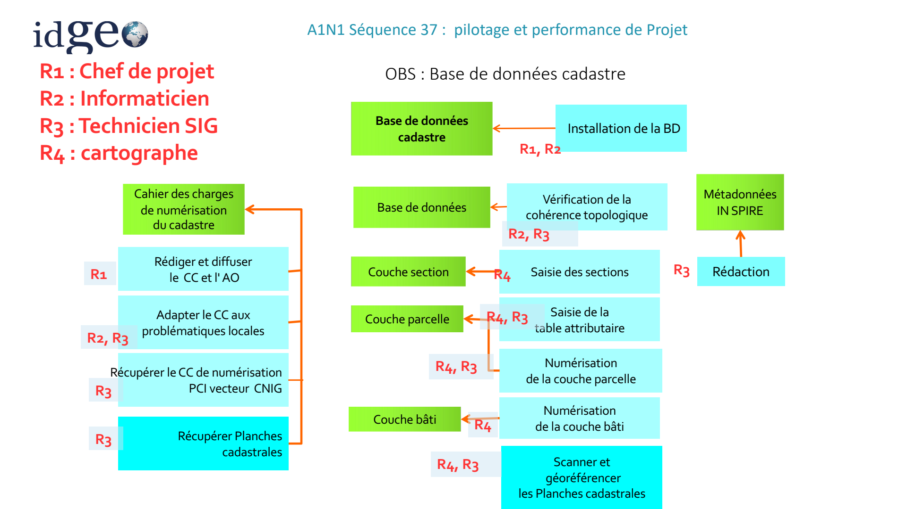

*Visuel original — `A1N1S37_Nov-2025.pdf`, page 24.*

### Exercice -

*Source : page 25.*

- Réaliser le découpage WBS de votre projet
- Ne pas oublier le management / pilotage / reporting

### WBS : Objectifs

*Source : page 26.*

- Comprendre le projet dans sa globalité
- Répartir clairement les différentes responsabilités
- Estimer la charge globale à partir de la charge par « package »
- Piloter au plus juste
- Orienter les seules informations utiles vers les responsables concernés
- Faciliter la négociation et la communication
- Comparer le projet avec des projets similaires Comparaison des activités d’un même niveau Ne rien oublier !

100% du travail à réaliser figure dans le WBS

## Gestion des délais

### Gestion des délais

*Source : page 27.*

Objectif : Gérer le projet dans les temps voulus

- Estimer leur durée des taches à réaliser
- Souvent, par analogie sur un même type d’activité sur un projet antérieur
- Il existe d’autres méthodes plus précises à base de calculs et/ou de statistiques
- Notions à dissocier:
- Charge: la charge est le temps effectif nécessaire à la réalisation d’une tache
- Délai: durée estimée de la réalisation d’une tache en tenant compte l’ensemble des temps alloués à(temps effectifs, attentes retour réponse…)
- Organiser et séquencer les activités
- Certaines activités peuvent être menées en parallèle
- D’autres sont interdépendantes
- Elaborer le « Planning », en tenant compte de toutes les contraintes :
- Client (disponibilités, organisationnelles, règlementaires, contractuelles, etc.)
- Projet (dépendance avec d’autres tâches, etc.)
- Equipe (travail sur d’autres projets, congés, etc.)
- Fournisseurs (disponibilités, contractuelles, etc.)
- Délais de validation…

### Gestion des délais (suite)

*Source : page 28.*

- Fixer les dates importantes en fonction de l’échéance finale
- Rétro planning, jalons principaux
- Maitriser les délais
- Suivre les délais au fur et à mesure de l’avancement des travaux : planning, plan de charge
- Ajuster le planning en fonction des options possibles (ressources, optimisation, …)
- Analyser les écarts de délais
- Sur les projets complexes : identifier le chemin critique
- Ensemble de tâches successives qui conditionnent le délai total du projet
- Tout retard sur une tâche du chemin critique a un impact sur la date de fin
- Une tâche hors du chemin critique dispose d’une « marge » (permet un décalage de la tâche sans impact sur la durée du projet) Cf. méthode PERT (program evaluation and review technique)
- Le chemin critique peut être différent après chaque replanification

### Gantt - Exemple

*Source : page 29.*

**Exemple avec MS Project** : affichage « Diagramme de Gantt » (affichage par défaut).

**Notions** :

- Tâche / jalon.
- Dépendance.
- Durée.
- Dates de début et de fin.

<!-- FIGURE SOURCE : A1N1S37_Nov-2025.pdf, page 29. Emplacement : dans cette sous-partie, avant la page suivante. Reproduction de la page entière pour conserver les légendes et les relations du schéma. -->

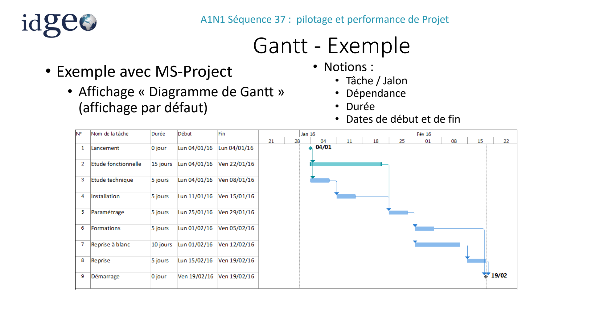

*Visuel original — `A1N1S37_Nov-2025.pdf`, page 29.*

### À retenir

*Source : page 30.*

**La planification des taches et des activités permet de :**

- Suivre et satisfaire au mieux les contraintes et exigences du client
- Anticiper les échéances et être capable de les communiquer
- Anticiper les éventuels décalages et proposer :
- des mesures de corrections de ces décalages (compression de délais, parallélisation de tâches…)
- et/ou éventuellement une replanification

## Coûts et charges

### Eléments clés du pilotage

*Source : page 31.*

- Pour piloter un projet, il est nécessaire de mettre en place des outils de pilotage:
- La planification (planning, délais)
- Les couts/charges
- Les risques
- La qualité
- Les ressources (humaines et techniques)
- Les achats

### Coûts / charges

*Source : page 32.*

Objectif : Livrer le projet dans le budget défini

- Le budget du projet :
- Comprend le coût des ressources &amp; moyens nécessaires à l’achèvement du projet
- Frais de personnels (principalement les salaires, et les frais de déplacements)
- Coûts de la sous-traitance (si des activités du projet sont sous-traitées)
- Frais de licences, Infrastructure, matériels pour le projet
- Provision pour pénalités de retard (projets complexes dont le risque de retard est important)
- Etc….
- Ne comprend généralement pas les coûts liés aux frais de structures
- Locaux, ordinateurs, encadrement, électricité, etc.
- Est estimé en avant-projet et affiné en début de projet
- N’est généralement pas égal au prix de vente du projet
- Doit dégager une marge pour financer les couts de structure et les investissements
- La marge peut être négative, lorsque l’objectif principal du projet n’est pas la rentabilité, et qu’il privilégie d’autres facteurs (client stratégique, récurrent important, etc.)

### Estimer les charges

*Source : page 33.*

- Pour estimer les charges nécessaires à un projet il est nécessaire d’avoir une adéquation entre:
- Compétences / expérience attendue
- Disponibilité
- Cout vendu et cout de revient

### Management des charges

*Source : page 34.*

**Manager les charges consiste à :**

Identifier et estimer les charges prévisionnelles, en début de projet à Définir la référence de base des charges, dont l’objectif est de comparer le réel, le prévu (et le vendu) Mesurer les charges réalisées régulièrement durant le projet Contrôler le respect des charges à Comparer le prévu et le réalisé, et, en cas d’écart, proposer des actions pour éviter les dérives

- Identifier et estimer les charges prévisionnelles
- Identifier les activités nécessaires au projet (grâce à la structure WBS par exemple)
- Estimer la charge prévisionnelle (en jours.hommes) pour chaque activité/prestation
- En cas d’écart entre Estimé et Vendu, alerter afin de définir la conduite à tenir
- Formaliser la référence de base des charges à Le suivi des coûts se fait sur la charge prévue

La « charge prévue » est une base de comparaison avec la future « charge réalisée » du projet.

Elle ne doit pas être modifiée en cours de projet (sauf en cas de modification de périmètre, formalisée généralement par un avenant)

### Management des charges

*Source : page 35.*

- Mesurer les charges réalisées
- Régulièrement : fréquence à définir en début de projet, idéalement hebdomadaire
- A partir des outils d’entreprise, ou d’outils créés pour le projet
- Relevé de temps passés, sprint agile….
- A travers un plan de charge
- Contrôler le respect des charges
- Evaluer le Reste-à-Faire
- Comparer le Prévu au « Réalisé + Reste-A-Faire »
- En cas d’écart, analyser les raisons et l’impact Et si nécessaire définir les actions pour essayer de limiter les écarts à
- Communiquer périodiquement l’état de suivi des charges à à historiser après chaque évaluation

<!-- FIGURE SOURCE : A1N1S37_Nov-2025.pdf, page 35. Emplacement : dans cette sous-partie, avant la page suivante. Reproduction de la page entière pour conserver les légendes et les relations du schéma. -->

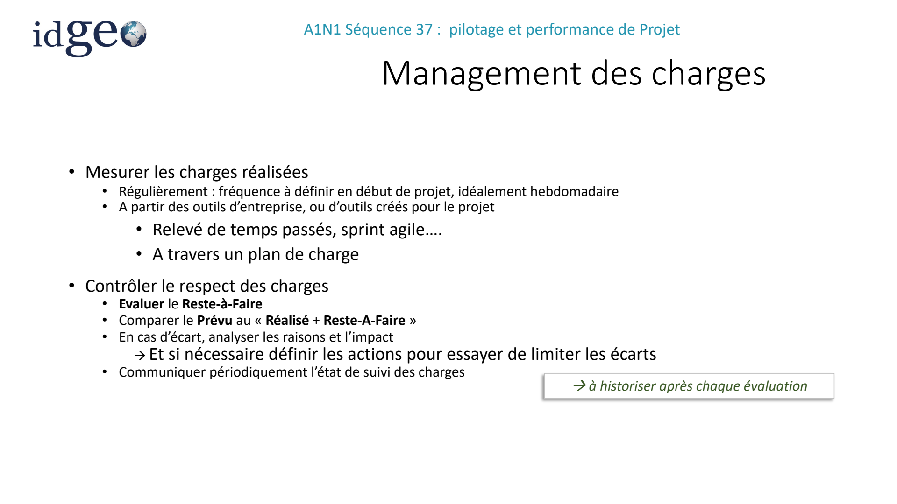

*Visuel original — `A1N1S37_Nov-2025.pdf`, page 35.*

### Charges – Données

*Source : page 36.*

| Donnée | Nature |  |
| --- | --- | --- |
| Charge prévue | Donnée définie en début de projet (en jours x hommes) | Négociation sur la charge vendue, le périmètre et la capacité de l’équipe projet à réaliser les travaux |
| Charge réalisée | Donnée constatée (en j.h) | Cf. imputation du temps passé |
| RAF | Donnée estimée (en j.h) | Par le réalisateur et le pilote de projet |
| Taux d’avancement | Donnée calculée (pourcentage) | Temps passé / (Temps passé + RAF) |
| Gain / perte | Donnée calculée (en j.h) | Charge prévue - (Temps passé + RAF) |

- Si charge prévue > temps passé + RAF : projet en gain. Risque de baisse de charge de l’équipe : attention à ne pas perdre le temps gagné.
- Si charge prévue < temps passé + RAF : projet en perte. Les coûts et les délais augmentent ; risque de retard (cf. Délais).

<!-- FIGURE SOURCE : A1N1S37_Nov-2025.pdf, page 36. Emplacement : dans cette sous-partie, avant la page suivante. Reproduction de la page entière pour conserver les légendes et les relations du schéma. -->

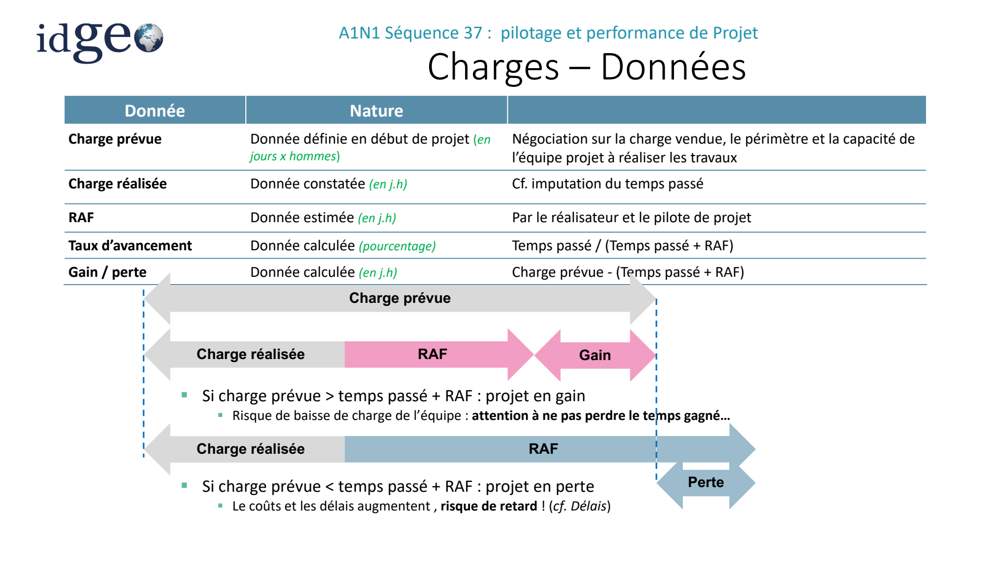

*Visuel original — `A1N1S37_Nov-2025.pdf`, page 36.*

### Charges - Exemple de suivi

*Source : page 37.*

Les différentes périodes peuvent être historisées dans un seul tableau, comme ici, mais aussi dans des onglets ou des fichiers différents.

| Tâche | Charge vendue | Charge prévue | Temps passé | RAF | Avancement | Gain sur vendu | Gain sur prévu |
| --- | --- | --- | --- | --- | --- | --- | --- |
| Semaine 1 |  |  |  |  |  |  |  |
| Audit | 10 | 11 | 3 | 9 | 25 % | -2 | -1 |
| Paramétrage | 5 | 6 | 1 | 3 | 25 % | 1 | 2 |
| Reprise | 5 | 6 | 2 | 4 | 33 % | -1 | 0 |
| Total semaine 1 | 20 | 23 | 6 | 16 | 27 % | -2 | 1 |
| Semaine 2 |  |  |  |  |  |  |  |
| Audit | 10 | 11 | 3,5 | 8 | 30 % | -1,5 | -0,5 |
| Paramétrage | 5 | 6 | 1 | 3 | 25 % | 1 | 2 |
| Reprise | 5 | 6 | 2 | 3 | 40 % | 0 | 1 |
| Total semaine 2 | 20 | 23 | 6,5 | 14 | 32 % | -0,5 | 2,5 |

<!-- FIGURE SOURCE : A1N1S37_Nov-2025.pdf, page 37. Emplacement : dans cette sous-partie, avant la page suivante. Reproduction de la page entière pour conserver les légendes et les relations du schéma. -->

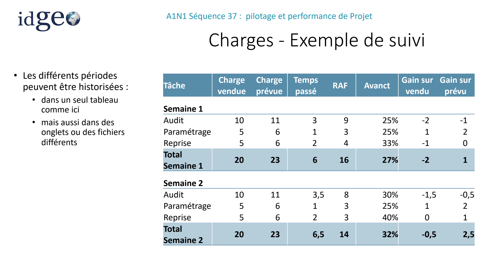

*Visuel original — `A1N1S37_Nov-2025.pdf`, page 37.*

### Notions importantes

*Source : page 38.*

- Charge:
- Temps réel permettant de réaliser la tache
- Délai:
- Durée pour laquelle la livraison est attendue Exemple: Modélisation 3D d’un objet:

|  | Préparation | Production | Validation | Intégration | Test | TOTAL (j) |
| --- | --- | --- | --- | --- | --- | --- |
| Charge | 2h | 70h | 1h | 3h | 4h | 11,5 |
| Délai | 3 semaines |  |  |  |  | 15 |
| Acteur | CP | Infographiste | CP | CP | IVVQ |  |

<!-- FIGURE SOURCE : A1N1S37_Nov-2025.pdf, page 38. Emplacement : dans cette sous-partie, avant la page suivante. Reproduction de la page entière pour conserver les légendes et les relations du schéma. -->

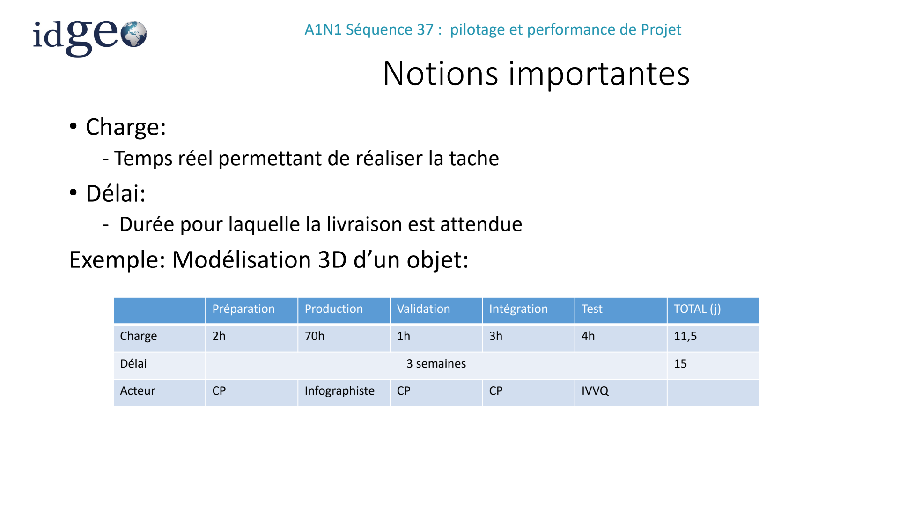

*Visuel original — `A1N1S37_Nov-2025.pdf`, page 38.*

### À retenir

*Source : page 39.*

- La gestion des Charges permet de :
- Maîtriser le budget du projet
- Pour le pilote de projet : maitrise de la charge liée aux prestations
- Consolidation du budget global par le contrôleur de gestion (affecté sur les gros projets)
- Anticiper les dépassements de charge
- Définir les actions à entreprendre en cas de dépassement de charge
- Suivre le réalisé (mesure du temps passé) et évaluer le RAF
- Régulièrement
- Simultanément
- Disposer en permanence d’une bonne vision de la situation

### TP – Web SIG

*Source : page 40.*

Cf Digiforma : e-learning A1N1 – Enoncé TP WebSIG

### Chiffrage du TP Web SIG

*Source : page 41.*

|  |  | Fréquence | CP | Expert Geom | Tech SIG | DEV | SOMME | hypothèses |
| --- | --- | --- | --- | --- | --- | --- | --- | --- |
| 0 | Pilotage projet |  |  |  |  |  |  |  |
| 0.1 | Initialisation | 1 | 8 | 4 |  |  | 12 |  |
| 0.2 | Réunion hebdo | 12 | 1 | 1 | 1 | 1 | 48 |  |
| 0.3 | Copil | 3 | 4 | 2 |  |  | 18 |  |
| 0.4 | Cotech | 12 | 1 | 1 |  |  | 24 |  |
| 1 | Analyse et diagnostic des données |  |  |  |  |  |  |  |
| 1.1 | Inventaire et documentation des sources existantes | 1 | 4 | 32 | 12 | 4 | 52 |  |
| 1.2 | Évaluation de la qualité et de la cohérence des données |  |  |  |  |  |  |  |
| 1.2.1 | vérification des projections | 1 | 1 | 4 | 15 | 2 | 22 |  |
| 1.2.2 | verification des attributs | 1 | 1 | 4 | 12 | 2 | 19 |  |
| 1.2.3 | verification des boublons | 1 | 1 | 4 | 12 | 2 | 19 |  |
| 1.3 | ELABORATION du modèle conceptuel de données (MCD) |  |  | 2 |  | 8 | 0 |  |
| 2 | Mise au format et préparation des données |  |  |  |  |  |  |  |
| 2.1 | Transformation et harmonisation des formats (vers GeoPackage / PostGIS) | 1 |  |  | 8 | 4 | 12 |  |
| 2.2 | Contrôle qualité (topologie, doublons, attributs manquants) | 1 | 2 |  | 8 |  | 10 |  |
| 2.3 | Automatisation de traitements par scripts Python / FME | 1 | 2 | 2 |  | 8 | 12 |  |
| 3 | Création du WebSIG |  |  |  |  |  |  |  |
| 3.1 | Conception de la base de données géospatiale (PostGIS) | 1 |  | 2 | 4 |  | 6 |  |
| 3.2 | Développement du portail WebSIG (ex : GeoServer + Leaflet ou QGIS Server + Lizmap) | 1 | 2 |  | 4 | 80 | 86 |  |
| 3.3 | Mise en page des cartes, symbolisation, légendes dynamiques | 1 |  |  | 6 |  | 6 |  |
| 3.4 | Gestion des droits utilisateurs | 1 |  | 2 |  | 16 | 18 |  |
| 4 | Tests Recette |  |  |  |  |  |  |  |
| 4.1 | Tests Techniques et fonctionnels | 2 | 1 | 4 |  | 12 | 34 |  |
| 4.2 | Redaction de la documentation utilisateur | 1 | 1 | 4 | 12 | 12 | 29 |  |
| 5 | Mise en place des reportings |  |  |  |  |  |  |  |
| 5.1 | Définition des indicateurs spatiaux (densité, distance, surfaces, etc.) | 6 | 1 | 2 | 2 |  | 30 | 6 KPI |
| 5.2 | Intégration avec outils BI (Power BI, Metabase ou Grafana) | 1 | 0,5 |  | 1 | 8 | 9,5 |  |
| 5.3 | Validation fonctionnelle avec les utilisateurs | 3 |  | 1 |  | 1 | 6 | 3 key users |
| 6 | Formation et support |  |  |  |  |  |  |  |
| 6.1 | rédaction des Supports de formation | 1 |  | 4 | 32 |  | 36 |  |
| 6.2 | Formation de l'équipe métier | 4 |  | 7 |  |  | 28 | 4 sessions de formation |
| 6.3 | Support fonctionnel à l'utilisation | 45 |  |  | 0,5 |  | 22,5 | proposition de support |
| 6.4 | Support technique | 45 |  |  |  | 0,5 | 22,5 | proposition de support |

| TOTAL EN HEURE 66,5 143 172,5 199,5 | 581,5 |
| --- | --- |
| TOTAL EN JOURS 8,3 17,9 21,6 24,9 | 72,7 |
|  | 3,6 charge en mois pour 1 ETP |

part actions CP dont support 5,6

<!-- FIGURE SOURCE : A1N1S37_Nov-2025.pdf, page 41. Emplacement : dans cette sous-partie, avant la page suivante. Reproduction de la page entière pour conserver les légendes et les relations du schéma. -->

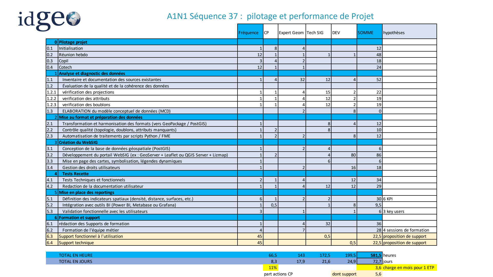

*Visuel original — `A1N1S37_Nov-2025.pdf`, page 41.*

### Conseil correction TP – Web SIG

*Source : page 42.*

**Pour estimer le délai dans le planning, quelques points à vérifier:**

- La charge en Equivalent Temps Plein (ETP) du projet
- Si elle est supérieure au délai attendu du projet; on peut l’analyser selon divers axes:
- Le nombre d’équipiers impliqués sur le projet et sur les différentes taches
- Si des taches sont réalisées à plusieurs, de qui dépendent-elles le plus?
- S’il faut envisager des temps d’attente, de validation de personnes externes à l’équipe projet
- Si des activités peuvent se réaliser en parallèle
- Si elle est inférieure, il faut alors vérifier l’enchainement des taches et vérifier si il y a des temps d’attente, de validation de personnes externes au projet.
- Le pourcentage de charge alloué au CP
- si c’est supérieur à 20% analyser pourquoi; votre CP a peut-être une casquette d’expert métier sur certaines taches
- Si inf à 20% cela semble normal
- Bien préciser les hypothèses de chiffrage sera un plus pour modifier/négocier la solution technique que vous avez proposée.

## Gestion des risques

### Eléments clés du pilotage

*Source : page 43.*

- Pour piloter un projet, il est nécessaire de mettre en place des outils de pilotage:
- La planification (planning, délais)
- Les couts/charges
- Les risques
- La qualité
- Les ressources (humaines et techniques)
- Les achats

### Gestion des risques

*Source : page 44.*

- Risques : évènements pouvant affecter le projet dans sa réussite finale.
- La nature de ces risques peut être :
- Humain
- Technique
- Légal
- Organisation
- Financier
- L’origine de ces risques peut être liée à des :
- Evènement ou Personnes internes
- Evènement ou Personnes externes (client, prestataire, fournisseur, …)
- Personnes non physique (virus informatique, épidémie,…)

### Gestion des risques

*Source : page 45.*

- Hiérarchisation des risques : la hiérarchisation des risques permet d’établir un ordre de priorité dans la mise en place des mesures d’actions.
- Elle est établie au travers une matrice de criticité allant de 1 à 16.
- Un niveau de risque est évalué en fonction de deux critères :
- C (Criticité) = Probabilité (P) x Gravité (G)

### Gestion des risques

*Source : page 46.*

- Niveaux de risque : ces niveaux de risques sont classés selon 4 ordres
- Négligeable (notation 1 &amp; 2) : le projet n’est pas impacté ou de manière légère. Les quelques désagréments éventuels ne remettent pas en cause la qualité du projet et ne nécessite pas la mise en place d’actions particulières,
- Limité (notation de 3 à 6) : le projet peut connaitre quelques désagréments qui pourront être surmontés facilement et sans difficultés. Une surveillance est mise en place sur ces risques.
- Important (notation de 8 à 12): le projet pourrait connaitre des désagréments significatifs qui demandent la mise en place d’actions immédiates
- Maximal (notation de 16) : le projet pourrait connaitre des conséquences immédiates significatives, voire irréversibles. Une gestion de crise est mise en place pour traiter et suivre ces risques.

### Matrice de criticité

*Source : page 47.*

| Probabilité / Gravité | Négligeable | Limité | Important | Maximal |
| --- | --- | --- | --- | --- |
| Maximal | 4 | 8 | 12 | 16 |
| Important | 3 | 6 | 9 | 12 |
| Limité | 2 | 4 | 6 | 8 |
| Négligeable | 1 | 2 | 3 | 4 |

<!-- FIGURE SOURCE : A1N1S37_Nov-2025.pdf, page 47. Emplacement : dans cette sous-partie, avant la page suivante. Reproduction de la page entière pour conserver les légendes et les relations du schéma. -->

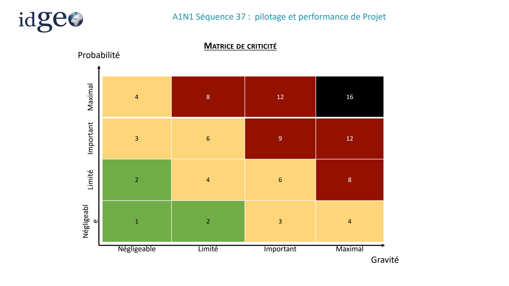

*Visuel original — `A1N1S37_Nov-2025.pdf`, page 47.*

### Matrice de risque

*Source : page 48.*

| N° | Description | Nature | Impact | P | G | C | Actions en réduction |
| --- | --- | --- | --- | --- | --- | --- | --- |
| 1 | Carences de compétences sur la maitrise de la chaine de production | Organisation | Difficulté à réaliser tout ou partie de la prestation Non qualité de certains livrables | 1 | 4 | 4 |  |
| 2 |  |  |  |  |  |  |  |

<!-- FIGURE SOURCE : A1N1S37_Nov-2025.pdf, page 48. Emplacement : dans cette sous-partie, avant la page suivante. Reproduction de la page entière pour conserver les légendes et les relations du schéma. -->

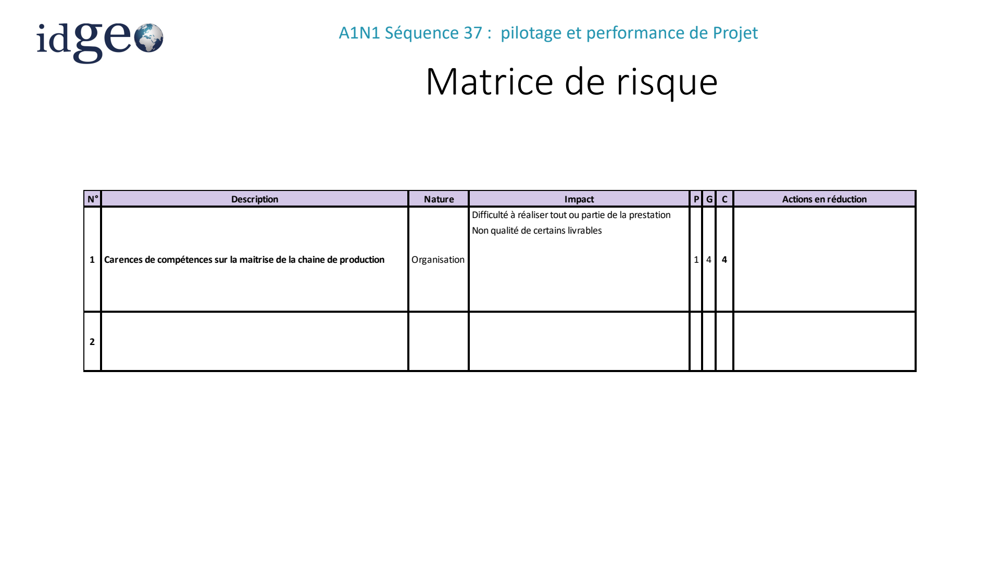

*Visuel original — `A1N1S37_Nov-2025.pdf`, page 48.*

### Autre exemple

*Source : page 49.*

<!-- FIGURE SOURCE : A1N1S37_Nov-2025.pdf, page 49. Emplacement : dans cette sous-partie, avant la page suivante. Reproduction de la page entière pour conserver les légendes et les relations du schéma. -->

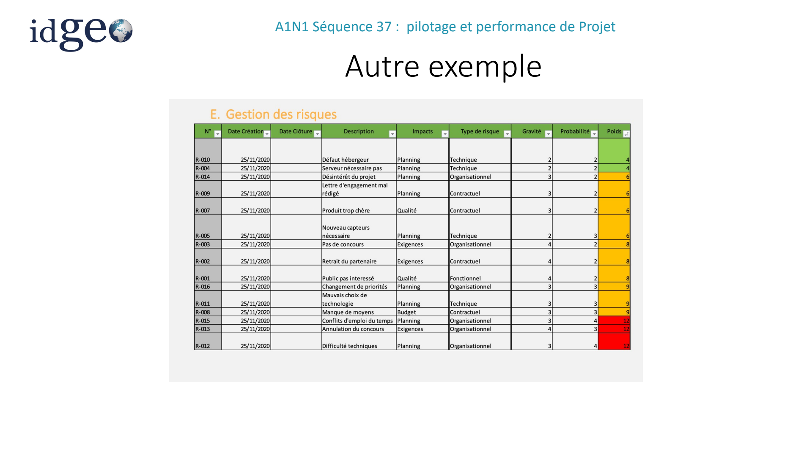

*Visuel original — `A1N1S37_Nov-2025.pdf`, page 49.*

### Exercice – Matrice de risques

*Source : page 50.*

- Réaliser la matrice des risques de votre TP WebSIG en tenant compte de vos hypothèses de chiffrage.

## Management de la qualité et PAQ

### Eléments clés du pilotage

*Source : page 51.*

- Pour piloter un projet, il est nécessaire de mettre en place des outils de pilotage:
- La planification (planning, délais)
- Les couts/charges
- Les risques
- La qualité
- Les ressources (humaines et techniques)
- Les achats

### Management de la qualité : qu’est ce que c’est ?

*Source : page 52.*

- Objectif : s’assurer que :
- Le projet atteint le résultat qui était demandé
- Le produit ou le service peut être utilisé pour ce pour quoi il avait été conçu
- Le commanditaire est d’accord avec le travail accompli et avec le résultat du projet
- Le projet et le produit respectent les normes et bonnes pratiques :
- Officielles (normes nationales, règlementation, etc.)
- Internes à l’établissement (norme de sécurité de l’établissement, etc.)
- Le management de la qualité s’intéresse à :
- La qualité du produit
- La qualité du projet

### Coût de la qualité

*Source : page 53.*

| Coût de la conformité | Coût de la non-conformité |
| --- | --- |
| **Coût de la prévention** : formation, documentation, temps pour le faire correctement. | **Coût des échecs** : correction et reprise, non-respect des délais, responsabilité, situation de crise, perte de confiance, perte d’affaires. |
| **Coût d’évaluation** : tests, inspections, implication du client. | |

**Adapter le niveau de qualité au contexte.** Le coût engendré par la mise en œuvre d’actions qualité doit être inférieur au coût engendré par la non-qualité. Tenir compte de tous les facteurs : financier, image, crédibilité, organisationnel…

<!-- FIGURE SOURCE : A1N1S37_Nov-2025.pdf, page 53. Emplacement : dans cette sous-partie, avant la page suivante. Reproduction de la page entière pour conserver les légendes et les relations du schéma. -->

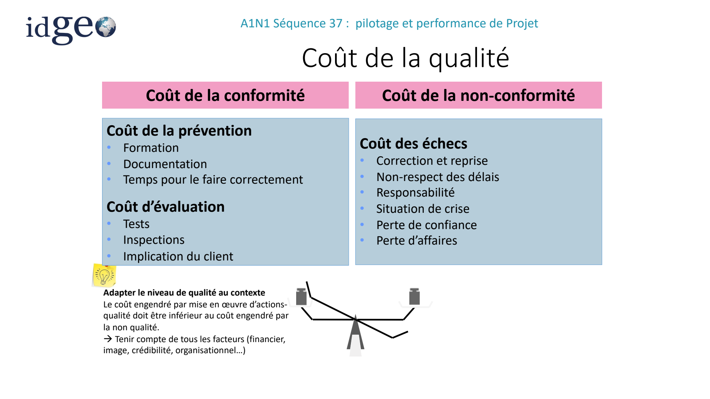

*Visuel original — `A1N1S37_Nov-2025.pdf`, page 53.*

### Management de la qualité : comment faire ?

*Source : page 54.*

- Recueillir les exigences de qualité du projet
- Quelques exigences exprimées :
- Produit : disponibilité, performances, sécurité, documentation, normes utilisées …
- Projet : respect des délais, traçabilité des décisions et des actions
- Exigences souvent non exprimées
- Produit : délais de réponse raisonnable, langue, non régression suite aux évolutions/corrections…
- Projet : compréhension par le pilote de projet des problématiques de l’établissement
- Mettre en œuvre la qualité sur le projet à travers 3 étapes :

**Contrôler,**

Planifier Réaliser …

Améliorer

**… les actions**

Décrire la •la qualité du décrites démarche et les projet &amp; produit à pour critères de •la démarche « assurer » la qualité attendus qualité qualité attendue

<!-- FIGURE SOURCE : A1N1S37_Nov-2025.pdf, page 54. Emplacement : dans cette sous-partie, avant la page suivante. Reproduction de la page entière pour conserver les légendes et les relations du schéma. -->

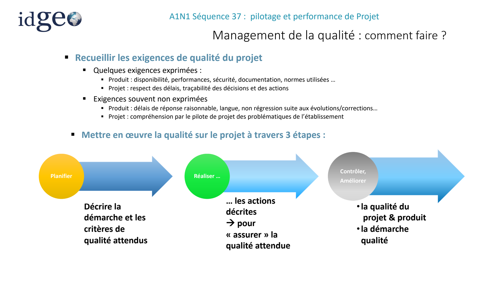

*Visuel original — `A1N1S37_Nov-2025.pdf`, page 54.*

### Amélioration continue

*Source : page 55.*

PDCA

L’idée de la roue de Deming est de toujours analyser ce qui vient d’être réalisé pour s’améliorer.

<!-- FIGURE SOURCE : A1N1S37_Nov-2025.pdf, page 55. Emplacement : dans cette sous-partie, avant la page suivante. Reproduction de la page entière pour conserver les légendes et les relations du schéma. -->

*Visuel original — `A1N1S37_Nov-2025.pdf`, page 55.*

### Management de la qualité : comment faire ?

*Source : page 56.*

- Planifier
- Décrire comment l’équipe projet va satisfaire aux exigences de qualité du produit et du projet
- Décrire les outils et méthodes utilisées
- Rédiger le plan d’assurance qualité
- Mettre en œuvre les actions décrites dans la planification de la qualité
- Sans oublier les actions définies dans nos processus qualité
- Exemples :
- Réalisation des recettes internes, fourniture des plans de tests et du résultat des tests
- Vérification des documents projets via une Checklist
- Réalisation d’un Audit du projet
- Contrôler et Améliorer
- Valider que les livrables et le travail permettent d’obtenir l’acceptation finale (client ou commanditaire)
- Identifier les causes d’un manque de qualité produit/projet; proposer des actions pour les éliminer
- Ex. d’outils de diagnostic : les 5 pourquoi d’Ohno, diagramme d’Ishikawa, diagramme de Pareto

### Le rôle du PAQ

*Source : page 57.*

- Il décrit comment le management de la qualité sera assuré durant le projet et les dispositifs mis en place pour le piloter/maitriser.

Exigences / outils qualité Exigences /attentes Client entreprise

PAQ

PROJET

<!-- FIGURE SOURCE : A1N1S37_Nov-2025.pdf, page 57. Emplacement : dans cette sous-partie, avant la page suivante. Reproduction de la page entière pour conserver les légendes et les relations du schéma. -->

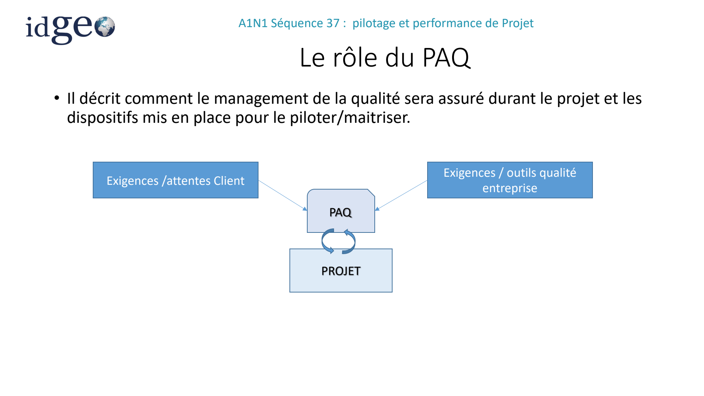

*Visuel original — `A1N1S37_Nov-2025.pdf`, page 57.*

### Le Plan d’assurance Qualité

*Source : page 58.*

Définition

Un plan qualité, ou plan d'assurance qualité (PAQ), est un document qui décrit les dispositions particulières mises en œuvre pour la réalisation d'un produit ou d'un service afin de répondre aux exigences contractuelles en matière de qualité.

C'est donc un outil du management de la qualité pour un projet.

Il permet aux client et prestataire de s'accorder sur le contexte, le périmètre, les enjeux (attraits et risques) ainsi que les véritables attentes du client dans le cadre de la prestation à réaliser.

Il s'agit donc d'un outil de référence, validé par les parties, de telle sorte que toute dérogation à ce plan doit faire l'objet d'un accord préalable entre les parties.

### Le Plan d’assurance Qualité

*Source : page 59.*

**Le PAQ contient différentes parties:**

- Ce que l'on doit réaliser (Pour quoi ?) : c'est l'objet de la prestation (contexte, objectifs et contraintes, attentes spécifiques, et conditions d'utilisation)
- Comment on va procéder, où l'on décrit :
- Quoi ? : description des livrables attendus (description en termes de résultats vérifiables du produit/service).
- Qui ? : description des intervenants (organisation, organigramme, rôles et responsabilités) ainsi que l'interface client/ fournisseur.
- Quand ? : les phases et jalons
- Combien ? : le planning
- Comment ? : description du processus de réalisation avec l'ensemble des activités à mener.
- Pour chaque activité, on définit l'objectif, les entrées/Sorties, les tâches (référence aux méthodes ou processus support utilisés), les responsabilités (RACI), les conditions de vérification avant passage à l'activité suivante.
- Où ? : Conditions particulières de réalisation

### Le Plan d’assurance Qualité

*Source : page 60.*

- Le management de la prestation :
- Management opérationnel : instances de communication externe (avec le client) et interne (avec l'équipe)
- Management contractuel : suivi des commandes, de la facturation
- Management stratégique : proposition d'amélioration, d'élargissement du périmètre, ...
- Management de qualité : vérification avant livraison, contrôles/revues et Enregistrement Qualité (cet élément est la preuve vérifiable de réalisation du contrôle), gestion des écarts, amélioration continue.
- Les processus ou méthodes mises en œuvre :
- processus spécifiques à la prestation : réception et vérification des entrées clients, phase de livraison, phase d'acceptation, phase de support, phase de garantie
- processus transverses : gestion des risques et procédure d'escalade, des changements, des non-conformités, de la configuration, de la documentation (cycle de validation), de la sécurité/ confidentialité, des ressources, des fournisseurs (qui sont partie prenante dans la réalisation de la prestation), des achats (matériels/ logiciels... qui participent à la réalisation de la prestation),...

### Le Plan d’assurance Qualité

*Source : page 61.*

**Voici le plan d’un PAQ pour le SIG:**

PAQ_IDGEO

PAQ Agenium

Table des matières PAQ

### Exemples de procédures de contrôle qualité

*Source : page 62.*

- Exemple de procédures de contrôle qualité à retrouver dans un PAQ

### Exemples de checklists pour contrôle des livrables

*Source : page 63.*

<!-- FIGURE SOURCE : A1N1S37_Nov-2025.pdf, page 63. Emplacement : dans cette sous-partie, avant la page suivante. Reproduction de la page entière pour conserver les légendes et les relations du schéma. -->

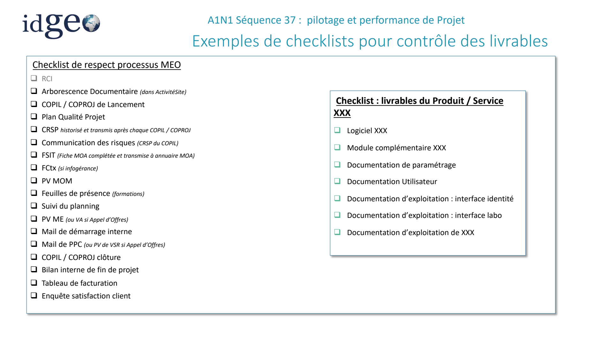

*Visuel original — `A1N1S37_Nov-2025.pdf`, page 63.*

### Gestion d’une non-conformité

*Source : page 64.*

<!-- FIGURE SOURCE : A1N1S37_Nov-2025.pdf, page 64. Emplacement : dans cette sous-partie, avant la page suivante. Reproduction de la page entière pour conserver les légendes et les relations du schéma. -->

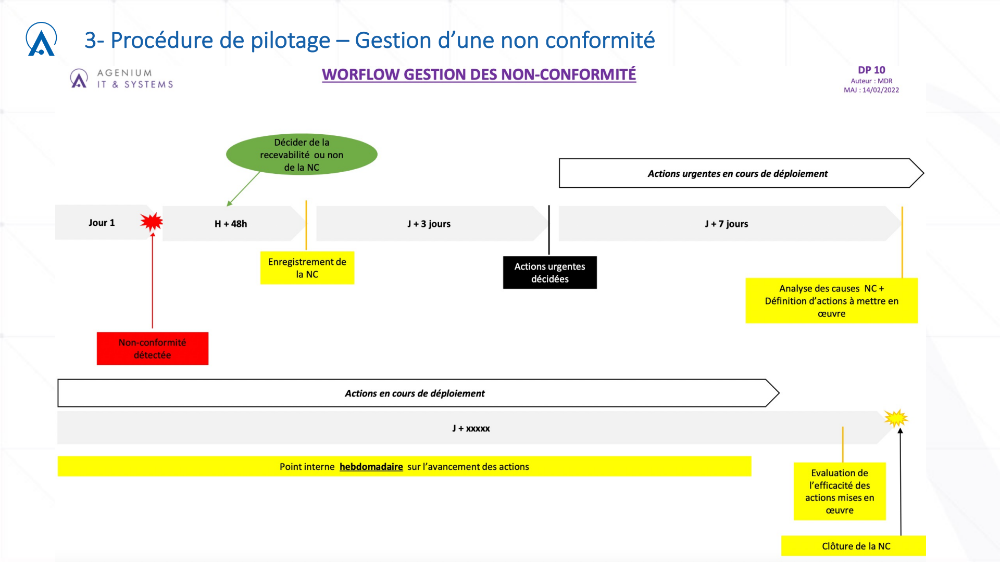

*Visuel original — `A1N1S37_Nov-2025.pdf`, page 64.*

### Exemple de processus de réclamation client

*Source : page 65.*

Une réclamation client est une non-conformité.

**Ce qui est important** :

- Y répondre formellement en suivant le processus décrit dans le PAQ.
- Enregistrer dans le système qualité.
- Définir un plan d’action.
- Être réactif.

<!-- FIGURE SOURCE : A1N1S37_Nov-2025.pdf, page 65. Emplacement : dans cette sous-partie, avant la page suivante. Reproduction de la page entière pour conserver les légendes et les relations du schéma. -->

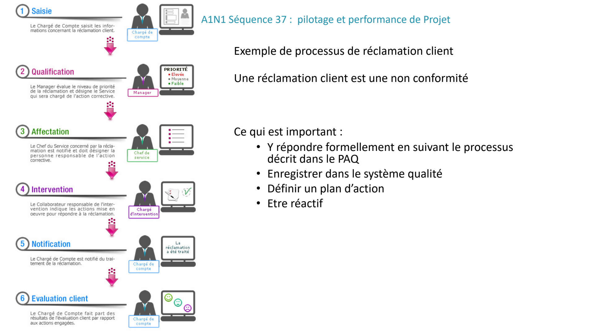

*Visuel original — `A1N1S37_Nov-2025.pdf`, page 65.*

### Gestion d’une nouvelle demande client

*Source : page 66.*

Cette procédure peut être activée dès lors que le client émet une nouvelle demande concernant les attendus de la mission.

Elle peut être également activée si le chef de projet Agenium identifie une demande non contractuelle du client.

L’objectif de la procédure « gestion d’une nouvelle demande» est de gérer toutes les demandes détectées durant le déroulement de la mission et d’en assurer l’intégration contractuelle.

Cela permet de maintenir et de contrôler l’ensemble des attendus du projet pour éviter par exemple des dérives du périmètre de la mission.

Ces demandes ainsi identifiées sont présentées en comité de pilotage avec le client et formalisés par une action dans le plan d’action du compte rendu de la réunion.

**La gestion d’une modification permet :**

- De planifier et valider un changement
- De présenter l’impact
- De suivre la mise en place de la modification
- De partager l’information avec toutes les parties prenantes

### Gestion d’une nouvelle demande client (suite)

*Source : page 67.*

Le chef de projet doit assurer la bonne application de la modification.

Toute demande de modification doit être considérée par Agenium et suivre le planning suivant :

1. Demander au client de rédiger la demande (email ou courrier) afin de valider le besoin et le périmètre

2. Agenium évalue l’impact de la demande sur le projet (cout, délais, planning, recrutement, …)

3. Agenium rédige alors un avenant prenant en compte la demande ayant ou non un impact financier. Ce document prend en compte : a. Le périmètre b. Le cout éventuel c. Les compétences / le profil attendu d. Le planning actualisé e. Les conditions (moyens nécessaires, formation, contraintes, réalisation, reporting et coût)

4. Après approbation et contractualisation par le client de l’ensemble de ces nouvelles conditions, alors l’activité peut être réalisée par Agenium.

Il est possible, en fonction du périmètre de la nouvelle demande, d’organiser une réunion de démarrage avec le client.

Ces nouvelles tâches sont alors ajoutées au pilotage et au suivi du projet par le chef de projet.

### Gestion des changements Demande de

*Source : page 68.*

(rappel - cf. Intégration) changement

- Un changement peut être
- Correctif ou préventif Evaluation du changement
- Demandé par une des parties prenantes
- Proposé par le pilote de projet (pour remettre le projet sur les rails)
- Il faut Autorité ?
- Eviter les changements inutiles !

Comité de Pilote de projet/pilotage

- Analyser l’objectif projet
- Attention au client qui exprime des solutions et non son besoin Décision ?
- Cf. 5 pourquoi d’Ohno pour revenir au besoin et à l’objectif non
- Analyser la demande et ses impacts (avec l’équipe) Oui
- Gérer l’arbitrage de chaque demande (Pilote de projet ? COPIL ? Autre comité ?) Prise en compte du
- Réviser les documents projets si impacts (planning, suivi des coûts, Plan de Management de Projet …) changement
- Documenter les demandes, et les décisions
- Communiquer les décisions Demande close Le processus de gestions des changements est décrit dans le Plan Qualité Projet

<!-- FIGURE SOURCE : A1N1S37_Nov-2025.pdf, page 68. Emplacement : dans cette sous-partie, avant la page suivante. Reproduction de la page entière pour conserver les légendes et les relations du schéma. -->

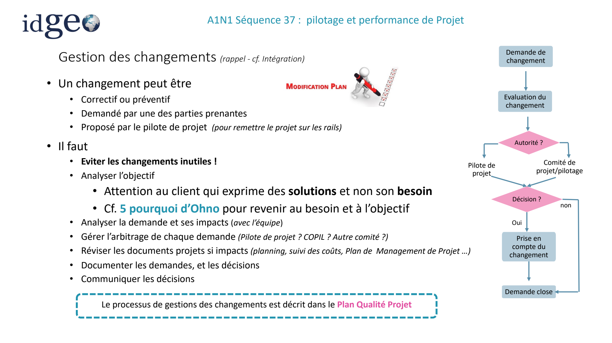

*Visuel original — `A1N1S37_Nov-2025.pdf`, page 68.*

## Amélioration continue

### Amélioration continue

*Source : page 69.*

PDCA

L’idée de la roue de Deming est de toujours analyser ce qui vient d’être réalisé pour s’améliorer.

<!-- FIGURE SOURCE : A1N1S37_Nov-2025.pdf, page 69. Emplacement : dans cette sous-partie, avant la page suivante. Reproduction de la page entière pour conserver les légendes et les relations du schéma. -->

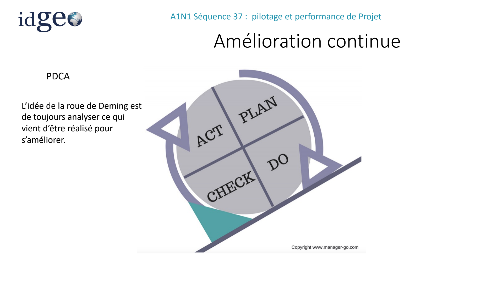

*Visuel original — `A1N1S37_Nov-2025.pdf`, page 69.*

### PDCA

*Source : page 70.*

| DÉMARCHE GÉNÉRALE | EXPÉRIMENTATION |
| --- | --- |
| PLAN |  |
| ANALYSER, PRÉPARER, PLANIFIER Analyse dela situation, le problème ou question en cause, recherche et sélection de solutions | ANALYSER, PRÉPARER, PLANIFIER Identification et définition du problème ou question. Recherche et choix de solution. |
| DO |  |
| FAIRE -METTRE EN PRODUCTION - DÉPLOYER Mise en oeuvre de la solution retenue. | TESTER - EXPÉRIMENTER Mise en oeuvre du test ou de la solution pilote, du prototype. |
| CHECK |  |
| VÉRIFIER - MESURER Evaluation des résultats par différentes mesures. | VÉRIFIER - MESURER Suivi de performance de la solution expérimentale |
| ACT |  |
| AMÉLIORER - CORRIGER Identifier les points d&#x27;amélioration de la solution en place. | AGIR - STANDARDISER - IMPLÉMENTER - AMÉLIORER - CORRIGER Déploiement de la solution après d&#x27;éventuels ajustements. Généralisation de la solution retenue à l&#x27;ensemble du périmètre concerné. Suivi de la performance et identification des améliorations |

<!-- FIGURE SOURCE : A1N1S37_Nov-2025.pdf, page 70. Emplacement : dans cette sous-partie, avant la page suivante. Reproduction de la page entière pour conserver les légendes et les relations du schéma. -->

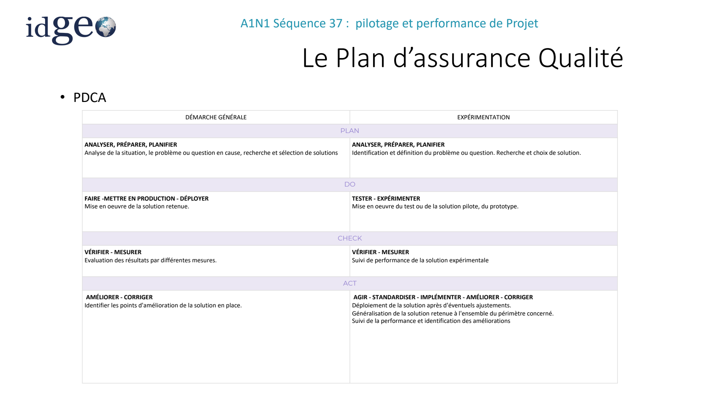

*Visuel original — `A1N1S37_Nov-2025.pdf`, page 70.*

### Amélioration continue

*Source : page 71.*

Méthodes d’analyse de causes

- Les 5 pourquoi
- Ishikawa
- Diagramme de Pareto

### Les 5 pourquoi d’Ohno

*Source : page 72.*

Objectif : trouver la cause fondamentale d’un problème à c’est la cause sur laquelle il faut agir pour résoudre le problème durablement

- Principe :
- Enoncer le problème en commençant par « Pourquoi »
- Prendre la réponse et en faire une question commençant par « Pourquoi »
- Recommencer tant que la cause fondamentale n’a pas été trouvée
- Exemple : « l’utilisateur n’est pas content »

1. Pourquoi l’utilisateur n’est pas content ? Il n’a pas pu travailler normalement

2. Pourquoi il n’a pas pu travailler normalement ? Les temps de réponses étaient trop longs

3. Pourquoi les temps de réponses étaient trop longs ? Le serveur était surchargé

4. Pourquoi le serveur était surchargé ? Des requêtes lancées ont monopolisé les ressources du serveur

5. Pourquoi des requêtes lancées ont monopolisé les ressources du serveur ? Un accès sans contrôle a été donné à des utilisateurs sur les données de l’établissement

<!-- FIGURE SOURCE : A1N1S37_Nov-2025.pdf, page 72. Emplacement : dans cette sous-partie, avant la page suivante. Reproduction de la page entière pour conserver les légendes et les relations du schéma. -->

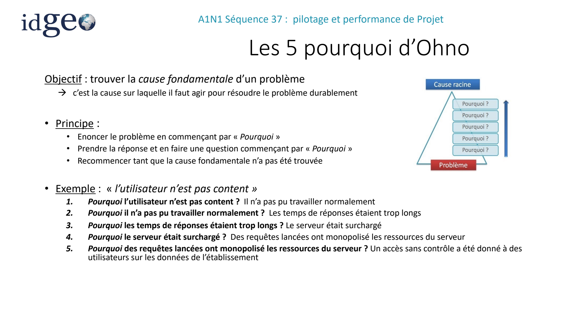

*Visuel original — `A1N1S37_Nov-2025.pdf`, page 72.*

### Diagramme d’Ishikawa (cause à effet)

*Source : page 73.*

**Diagnostic**

- Objectif : trouver toutes les causes qui conduisent à une situation Contrôler, Améliorer
- Description : Les causes sont catégorisées selon 7 domaines Milieu Méthodes Main d’œuvre contexte culturel social, matériel ..

Problème Management

Moyens Matériel Machine, financiers outils matière Causes Effet Ce sur quoi on agit dans la situation

- Comment construire un diagramme d’Ishikawa ?
- Enoncer précisément problème à analyser
- Lister toutes les causes possibles (à faire collectivement) et les classer dans les catégories
- Permet de cibler les actions pour corriger le problème

<!-- FIGURE SOURCE : A1N1S37_Nov-2025.pdf, page 73. Emplacement : dans cette sous-partie, avant la page suivante. Reproduction de la page entière pour conserver les légendes et les relations du schéma. -->

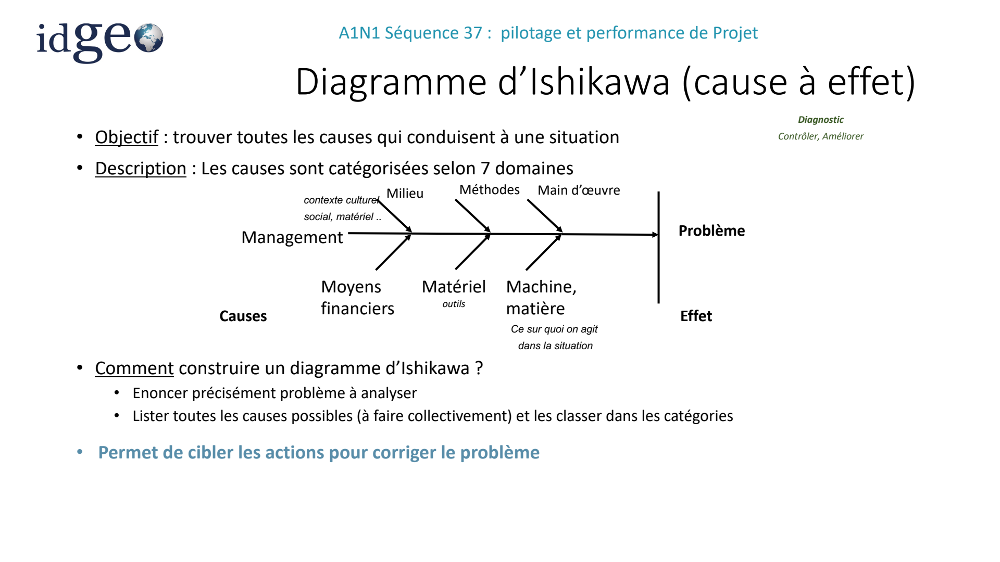

*Visuel original — `A1N1S37_Nov-2025.pdf`, page 73.*

### Diagramme de Pareto

*Source : page 74.*

**Diagnostic**

Contrôler, Améliorer

Objectif : hiérarchiser les causes d’un problème en fonction de leur nombre d’occurrences pour définir des priorités dans leur traitement Vilfredo PARETO (1848 – 1923) avait constaté que 80% des richesses étaient détenus par 20% des personnes, il en avait déduit une loi dite des «80 / 20».

Joseph JURAN (1904 – 2008) a généralisé cette loi à d’autres cas : 80% des effets d’un problème sont directement liés à 20% des causes de ce problème.

Le diagramme de Pareto permet d’identifier les 20% de causes, et de s’intéresser prioritairement à celles-ci.

- Construire un diagramme de Pareto
- Lister les causes possibles d’un problème récurrent
- Relever le nombre d’occurrences pour chaque cause
- Classer les causes par nombre d’occurrences décroissant
- Effectuer la somme totale des occurrences de toutes les causes et calculer le pourcentage d’occurrence de chaque cause
- Représenter le graphique des valeurs, et des valeurs '!!" cumulées &amp;!"
- Sur cet exemple %!"
- 6 types de causes $!"
- 80% des problèmes viennent de 3 causes #!"

!" ()*+,-' ()*+,-# ()*+,-. ()*+,-$ ()*+,-/ ()*+,-%

"-0)1-2)*+, "-2*3*45

<!-- FIGURE SOURCE : A1N1S37_Nov-2025.pdf, page 74. Emplacement : dans cette sous-partie, avant la page suivante. Reproduction de la page entière pour conserver les légendes et les relations du schéma. -->

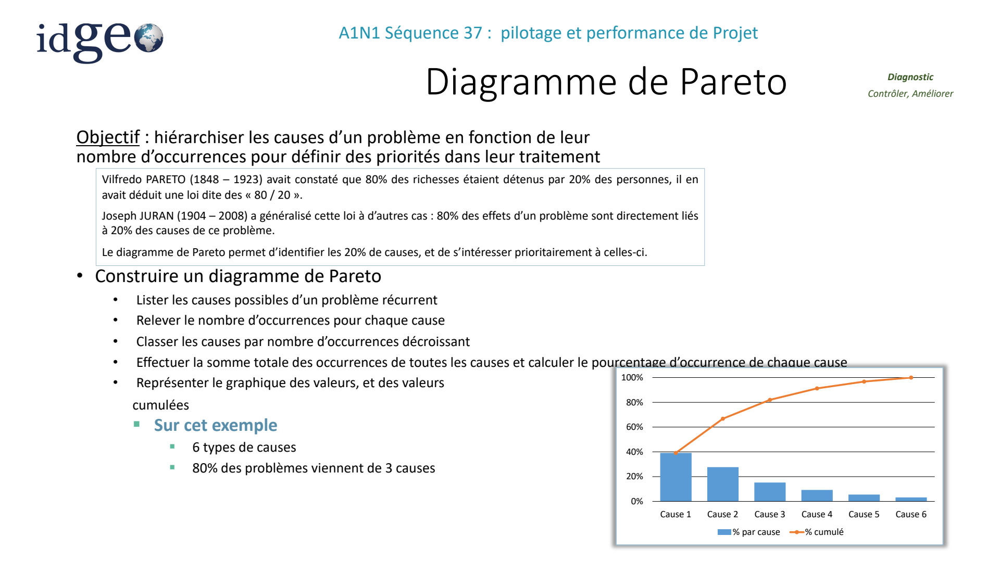

*Visuel original — `A1N1S37_Nov-2025.pdf`, page 74.*

### À retenir

*Source : page 75.*

- La gestion de la qualité permet de :
- Garantir que le résultat sera conforme aux besoins exprimés par le client
- Anticiper et prévenir les « défauts » plutôt que les corriger
- C’est un travail indispensable et continu tout le long du projet
- Définir qui va assurer le management de la qualité
- Souvent le pilote de projet (un autre membre de l’équipe projet peut aussi prendre ce rôle)
- La cellule qualité de votre structure, à la demande du pilote, peut réaliser des Audits sur le projet
- En cas de non-conformité, diagnostiquer les causes de façon collégiale
- Plus le niveau d’exigence est élevé, plus le coût sera important
- Attention au perfectionnisme

## Ressources humaines

### Ressources humaines

*Source : page 76.*

Objectif : gérer tous les collaborateurs qui contribuent au projet

- Constituer l’équipe projet à les RP et collaborateurs du projet sont souvent désignés par les managers
- Définir les rôles et responsabilités de chacun (WBS, RACI) à Point le plus important, pour éviter :
- De perdre du temps à chercher qui est responsable d’une activité
- Les situations floues et les divergences sur la responsabilité des tâches
- Non implication à tort de certaines personnes
- Conflits
- Plusieurs personnes pensent avoir la même chose à faire
- Développer et diriger l’équipe projet à Passer d’un groupe d’individus à une équipe collaborative …

… qui partage un objectif commun !

- Utiliser une communication ouverte et efficace
- Développer la confiance entre les membres de l’équipe
- Gérer les conflits de façon constructive (si l’équipe n’y arrive pas seule)
- Résoudre les problèmes et prendre les décisions de manière collaborative
- Améliorer les compétences de l’équipe projet …. et sa performance

### Eléments clés du pilotage

*Source : page 77.*

- Pour piloter un projet, il est nécessaire de mettre en place des outils de pilotage:
- La planification (planning, délais)
- Les couts/charges
- Les risques
- La qualité
- Les ressources (humaines et techniques)
- Les achats

### L’équipe projet dans la structure organisationnelle

*Source : page 78.*

- Organisation Matricielle
- Projet impliquant des collaborateurs de différentes équipes
- Coordination du projet transverse
- Forme moderne d’organisation à Organisation matricielle « Forte » : le DP appartient à une équipe dédiée au Pilotage de projet
- Avantages
- Fortes compétences métiers dans tous les domaines pour le projet
- Communication verticale et horizontale
- Points à surveiller
- Dualité de responsabilité : les membres de l’équipe sont sous 2 types de responsabilité :
- - Responsabilité Hiérarchique avec leur manager
- - Responsabilité Opérationnelle avec le DP dans le cadre du Projet
- Nécessite une maitrise de la communication
- Sentiment d’appartenance à l’équipe projet à créer à chaque projet

<!-- FIGURE SOURCE : A1N1S37_Nov-2025.pdf, page 78. Emplacement : dans cette sous-partie, avant la page suivante. Reproduction de la page entière pour conserver les légendes et les relations du schéma. -->

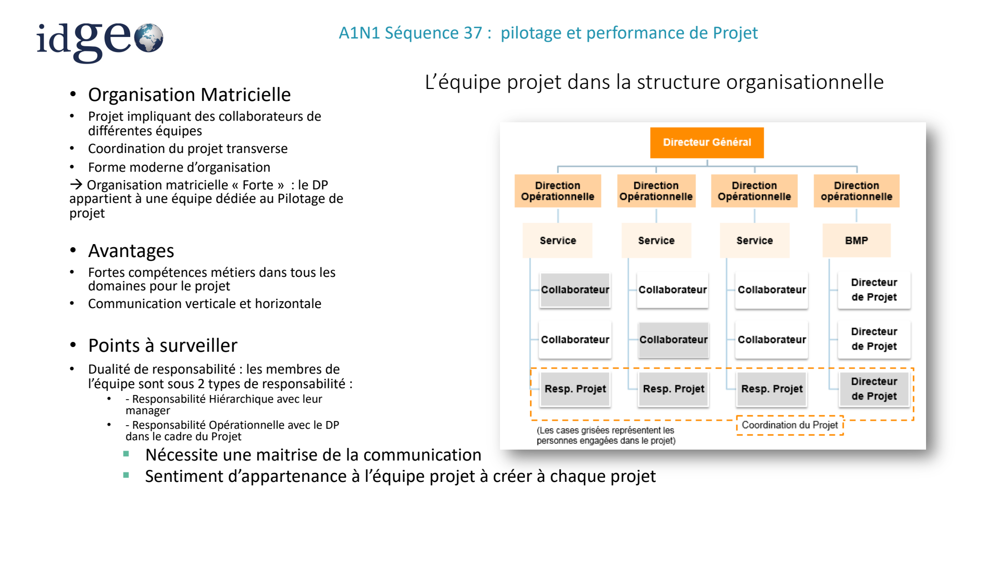

*Visuel original — `A1N1S37_Nov-2025.pdf`, page 78.*

### Gestion des compétences

*Source : page 79.*

- Dans une équipe il est important d’avoir toutes les compétences nécessaires à la réalisation du projet.
- Il faut cependant éviter d’avoir 1 personne qui détient la connaissance car en cas d’absence, il sera difficile d’avancer sur la réalisation de certaines taches.
- Il existe des moyens de limiter cet impact en mettant en place:
- Une matrice de compétences décrivant:
- Qui est en capacité de faire quoi
- Qui peut remplacer sur la réalisation d’une tache (peut être en dehors de l’équipe projet mais être sollicitée si nécessaire)
- Cela permet de vérifier si toutes les compétences sont couvertes, sinon un plan d’action est à mener

### Gestion des compétences

*Source : page 80.*

- Il existe des moyens de limiter cet impact en rédigeant:
- De la documentation:
- Décrivant les modes opératoires
- Expliquant les standards de développement
- Arborescence projet permettant de retrouver la documentation technique et de suivi du projet
- Cela permet de capitaliser les méthodes de réalisation et de les standardiser
- facilite le transfert de connaissance

### Rôle du client

*Source : page 81.*

**Points de vigilance:**

- Le client n’est pas une ressource du projet
- L’équipe projet lui doit:
- de la transparence et un reporting régulier
- L’escalade des points à risque / bloquant
- Le client est une partie prenante du projet mais il est préférable de maintenir une certaine réserve. Il faut savoir distinguer les informations internes au projet de celles communicables au client.

Quels sujets sont à conserver en interne d’après vous?

### À retenir

*Source : page 82.*

**La gestion des ressources humaines permet de :**

- Définir les rôles de chacun sur le projet
- Identifier les besoins tout au long du projet
- Vérifier l’adéquation des compétences
- Assurer la bonne exécution du projet L’équipe projet est … une équipe !
- Le pilote de projet doit l’animer et la fédérer… la faire vivre !

## Achats et sous-traitance

### Gérer les achats

*Source : page 83.*

Objectif : Gérer les prestations ou fournitures nécessaires au projet, provenant d’un partenaire ou d’une société extérieure

- Assurer la maîtrise du périmètre contractuel
- Différents types de prestations : Prestataire externe, Editeur (licence, support, assistance, …), Fournisseur de matériel spécifique, Fournisseur réseau, etc.
- Coordonner les interventions
- Suivre la prestation
- Temps passé (pour les prestations en «régie », engagement de moyens) è À suivre
- Réalisé (pour les prestations en « forfait », engagement de résultat) è À qualifier
- Livrables (fournitures de matériel, licences, etc.)
- Participer à la gestion des règlements
- Factures présentées par le fournisseur : à approuver par le pilote de projet avant règlement
- En cas de dysfonctionnement ou de problème grave
- Escalade auprès de la hiérarchie pour retour au niveau contractuel
- Clôturer la prestation
- Payer les dernières factures
- Libérer le fournisseur

### Eléments clés du pilotage

*Source : page 84.*

- Pour piloter un projet, il est nécessaire de mettre en place des outils de pilotage:
- La planification (planning, délais)
- Les couts/charges
- Les risques
- La qualité
- Les ressources (humaines et techniques)
- Les achats

### Comment sous-traiter ?

*Source : page 85.*

- Arbitrer au niveau du projet :
- Identifier des lots de travaux du WBS posant des problèmes : capacité interne, compétence, etc.
- Décider d’investir (embauches, formations…) ou d’externaliser
- Si c’est externalisé, préparer l’appel d’offre
- Contacter le service des Achats, et avec eux :
- Examiner l’expérience passée
- Préciser les rôles et responsabilités (RACI)
- Sélectionner le type de contrat (forfait, régie, etc.) Le fournisseur ne fera rien qui ne soit
- Rédiger le cahier des charges, en précisant bien les rôles et responsabilités du fournisseur demandé par le contrat
- Livrables attendus, y compris intermédiaires
- Contraintes de délais
- Niveau et preuves de tests
- Exigences de pilotage (participation aux réunions, rédaction de CR, rapports d’avancement)
- Identifier les critères de comparaison des réponses (tarif, qualité, complétude, références, etc.)
- Identifier les fournisseurs potentiels
- Lancer l’appel d’offre
- Publier l’offre Après la signature, gérer
- Récupérer les réponses l’approvisionnement et clôturer la
- Les comparer, en sélectionner une prestation comme vu page précédente
- Négocier le contrat et signer

### Comment sous-traiter : quelques clés

*Source : page 86.*

- Concurrence
- Besoin de mise en concurrence? (demande de prix)
- Délai de mise sur le marché (qu’est-ce qui est le plus rapide ?)
- Informations confidentielles (y a-t-il une quelconque information qui devrait être gardée secrète ?)
- Eléments sociaux
- De telles décisions ont-elles un impact sur les effectifs ?

Existe-t-il un problème de capacité ?

- Les employés peuvent-ils absorber le changement ou la charge de travail ?
- Manque de compétence ? Transfert de compétence ?
- Disponibilité des fournisseurs
- Le fournisseur a-t-il une licence ?
- Avons-nous plusieurs fournisseurs disponibles ?
- Eléments politiques/environnementaux
- Cet investissement est-il cohérent avec la stratégie à long terme de l’entreprise ?
- L’entreprise a-t-elle connaissance des obligations environnementales du produit ou du service à fabriquer ? (ex agrément HDS)
- Eléments économiques
- Réduction des coûts
- Coût des investissements

### À retenir

*Source : page 87.*

- La gestion des achats permet de :
- Suivre le cycle de l’approvisionnement, de l’achat à la facturation
- Piloter l’avancement des travaux sous-traités
- Anticiper les risques liés aux approvisionnements (qualité du livrable…)
- Vérifier que les livrables sont conformes aux attentes
- Contrôler les livrables et la facturation
- Anticiper les délais de livraison

## Performance, indicateurs et outils de suivi

### Suivre la performance

*Source : page 88.*

- Afin de s’assurer la bonne évolution du projet et la transparence avec le client, il est recommandé de mettre en place un/des tableaux de bord de pilotage du projet (à usage interne ou partagé avec le client) présentant des indicateurs clés pour mettre en avant:
- L’avancement du projet
- Le cout du projet
- Les risques et leur mitigation
- Les performances en termes de cout/qualité et délais

### Types de KPI

*Source : page 89.*

- On a différents types de KPI:
- OTD : on time delivery
- OQD: on quality delivery Ces 2 types d’indicateurs sont les principaux qui seront échangés avec le client. Ils sont généralement représentés graphiquement pour une meilleure visibilité.

En fonction du type de la mission on va pouvoir mettre en place des indicateurs.

### Fiche descriptive d’un indicateur

*Source : page 90.*

**Nom:**

**Mode de calcul:**

**Fréquence:**

**Données d’entrée:**

**Date de début:**

**Date de fin:**

**Objectif de performance:**

**Représentation graphique:**

### On Time Delivery – Livraison dans les temps

*Source : page 91.*

- Application: projet avec planning à respecter et des jalons de livraison. Pas de récurrence.
- Définition:
- Livraison dans les délais contractuels de lots, livrables
- Règle de calcul
- Par mois, il s’agit de comparer la date prévisionnelle de livraison convenue dans le planning établi avec le client, à la date de livraison effective de chaque livrable.
- Résultat: pourcentage de livrables livrés dans le délai
- En cumulé et en mensuel AVANCEMENT 80%
- Visuel attendu: 70% 60%

50%

40%

30%

20%

10%

0% LOT 1 LOT 2 LOT 3

<!-- FIGURE SOURCE : A1N1S37_Nov-2025.pdf, page 91. Emplacement : dans cette sous-partie, avant la page suivante. Reproduction de la page entière pour conserver les légendes et les relations du schéma. -->

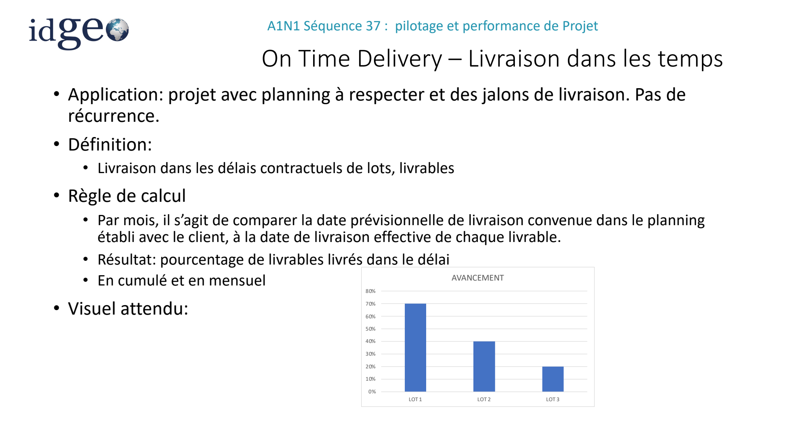

*Visuel original — `A1N1S37_Nov-2025.pdf`, page 91.*

### On Time Delivery – Volume traité dans les délais

*Source : page 92.*

- Application: achat en catalogue avec engagement de service /récurrence UO traitée dans la période donnée (exemple : ticket de SAV: pris en compte et traité dans les 48h)
- Définition:
- Ratio des activités traitées dans les délais contractuels
- Règle de calcul
- Par mois, il s’agit de comptabiliser les UO traitées dans les délais par rapport à la somme totale d’UO traitées sur la période.
- Résultat: pourcentage d’UO traités dans le délais – un seuil peut être défini
- En cumulé et en mensuel tickets traités 250
- Visuel attendu: 200

150

100

50

0 &lt;48h &lt;72h 72h+

<!-- FIGURE SOURCE : A1N1S37_Nov-2025.pdf, page 92. Emplacement : dans cette sous-partie, avant la page suivante. Reproduction de la page entière pour conserver les légendes et les relations du schéma. -->

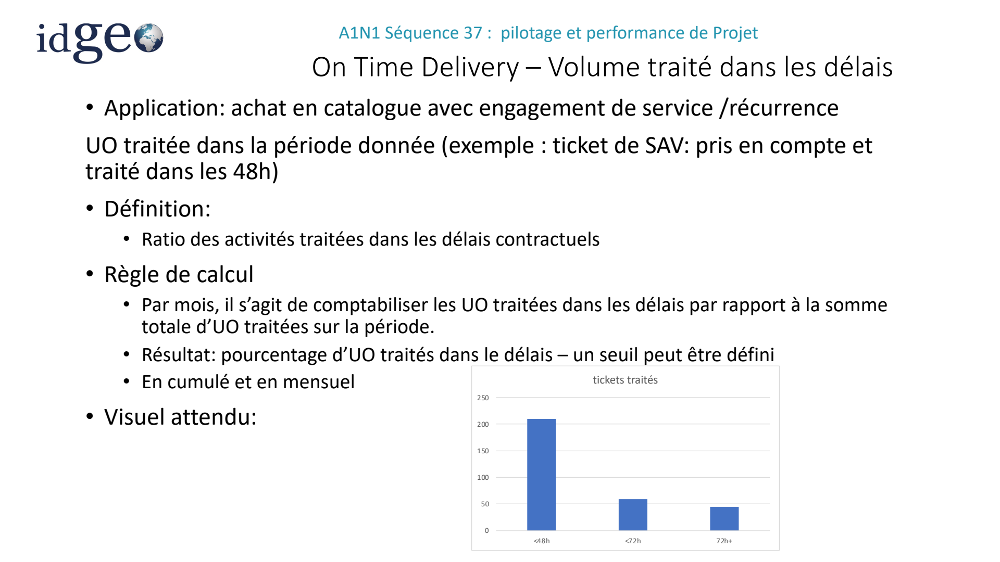

*Visuel original — `A1N1S37_Nov-2025.pdf`, page 92.*

### On Time Delivery – Engagement de volume

*Source : page 93.*

- Application: achat en catalogue avec engagement de volume /récurrence Quantité UO traitées sur la période donnée (exemple : Traitement de 200 tickets de SAV sur 190, production de 3 modèles 3D sur 4 attendus)
- Définition:
- Ratio des UO traitées dans les délais contractuels
- Règle de calcul
- Par mois, il s’agit de comptabiliser le volume des UO traitées durant la période par rapport à la somme totale d’UO attendues sur la période.
- Résultat: pourcentage du volume des UO traitées par rapport au volume attendu – un seuil peut être défini
- En cumulé et en mensuel tickets traités
- Visuel attendu: juin

mai

avril

mars

fevrier

Janv

0 50 100 150 200 250

<!-- FIGURE SOURCE : A1N1S37_Nov-2025.pdf, page 93. Emplacement : dans cette sous-partie, avant la page suivante. Reproduction de la page entière pour conserver les légendes et les relations du schéma. -->

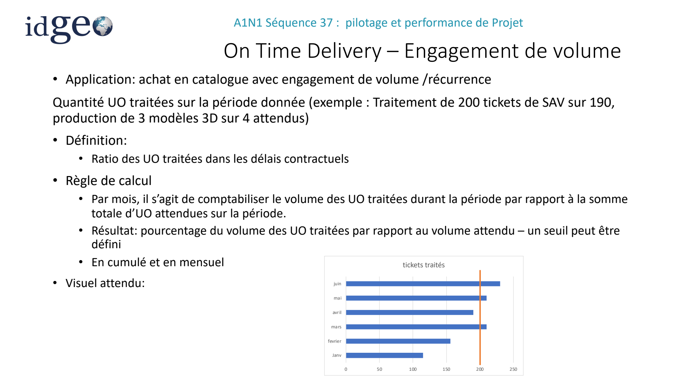

*Visuel original — `A1N1S37_Nov-2025.pdf`, page 93.*

### On Qualitity Delivery – non récurrent

*Source : page 94.*

- Application: réalisation d’un livrable: développement, logiciel, service, rapport,…
- Définition:
- Livrable livré sans erreur
- Une erreur peut être un dysfonctionnement, un oubli de fonctionnalité, une réclamation client, une erreur de calcul, un document non exhaustif (par rapport à l’exigence client contractuelle)…
- Règle de calcul
- On peut proposer différents moyens de calcul:
- Compter les non-conformités
- Proposer une check au moment de la validation client
- Considérer uniquement les réclamations client

### On Qualitity Delivery – récurrent

*Source : page 95.*

- Application:
- production répétée d’une même UO (prise en compte d’un ticket Sav, modèle 3D, migration de données…)
- Définition:
- Il s’agit ici de détecter le pourcentage d’UO qui ont été réalisées sans erreur ou sans réclamation client
- Règle de calcul
- On va compter ici le nombre total d‘activités réalisées sur la période à considérer et calculer le pourcentage de celles réalisées sans erreur.
- Il est possible de proposer un seuil (95% de conformité…) en fonction du type de contrat ou de mission

Titre du graphique

40

35

30

25

20

15

10

5

0 FEV MARS AVRIL MAI

UO OK UO NOK

<!-- FIGURE SOURCE : A1N1S37_Nov-2025.pdf, page 95. Emplacement : dans cette sous-partie, avant la page suivante. Reproduction de la page entière pour conserver les légendes et les relations du schéma. -->

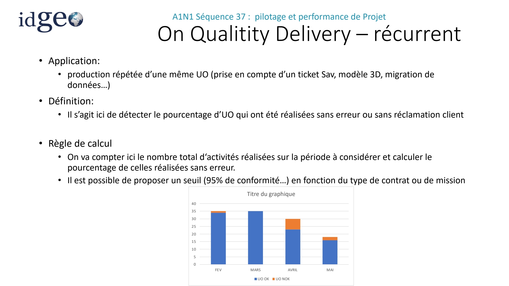

*Visuel original — `A1N1S37_Nov-2025.pdf`, page 95.*

### Outils de suivi d’un projet

*Source : page 96.*

- Planning
- Plan de charges
- Plan d’action
- Report hebdo /mensuel avec des KPI clés

### Exemple plan de charge

*Source : page 97.*

- EXEMPLE plan de charge Agenium

### Plan d’action

*Source : page 98.*

- Document permettant de suivre l’ensemble des actions prises tout au long du projet
- Il est généralement réalisé avec excel et suivi de manière hebdomadaire au sein du projet
- Il contient au moins:
- Identifiant (afin de la suivre plus facilement)
- Date de création
- Sa description
- Qui doit la réaliser
- Pour quand
- Statut de l’action

### Exemple de plan d’action

*Source : page 99.*

<!-- FIGURE SOURCE : A1N1S37_Nov-2025.pdf, page 99. Emplacement : dans cette sous-partie, avant la page suivante. Reproduction de la page entière pour conserver les légendes et les relations du schéma. -->

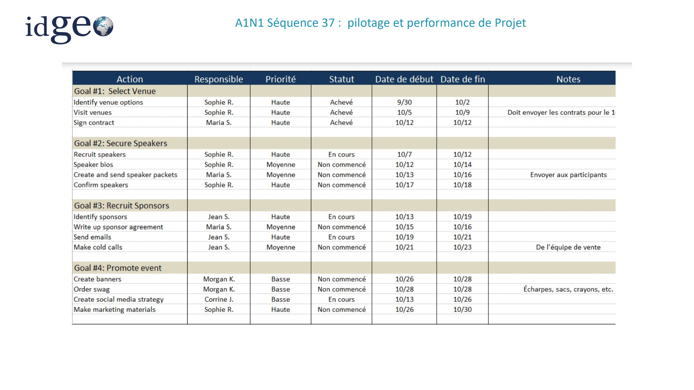

*Visuel original — `A1N1S37_Nov-2025.pdf`, page 99.*

### Exemple de Dashboard

*Source : page 100.*

<!-- FIGURE SOURCE : A1N1S37_Nov-2025.pdf, page 100. Emplacement : dans cette sous-partie, avant la page suivante. Reproduction de la page entière pour conserver les légendes et les relations du schéma. -->

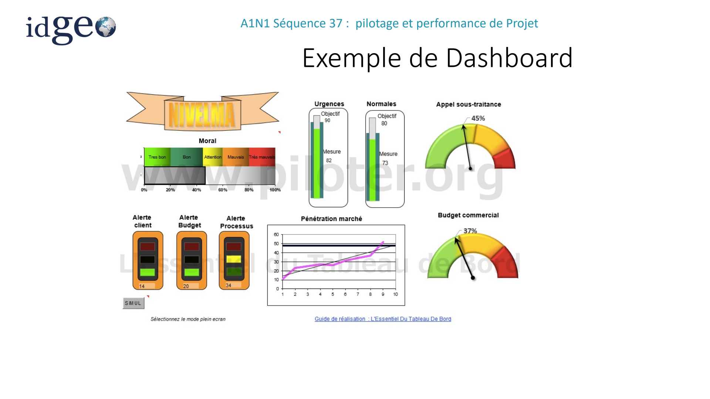

*Visuel original — `A1N1S37_Nov-2025.pdf`, page 100.*

### Exercice - KPI

*Source : page 101.*

- Proposez 3 à 5 indicateurs permettant de suivre le projet du TP Ville de Montauban.
- Attendu pour chaque indicateur:
- Sa description
- Sa règle de calcul
- Sa représentation graphique

### Application PAQ

*Source : page 102.*

- Réaliser la trame du PAQ du projet lié au TP Ville de Montauban.
- Il doit décrire
- les informations liées aux caractéristiques et aux exigences du projet
- Les méthodes de travail
- Le planning et les livrables
- Les éléments mis en place pour garantir la qualité du projet
- Les actions liées à l’amélioration continue
