# S38 — Méthodologies projets SI

> Source unique : `A1N1S38_Nov-2025.pdf` — 75 pages. Les repères de page suivent l’ordre du PDF.

## Objectifs et plan

### Objectifs de la séquence

*Source : page 1.*

- Les méthodologies projets appliquées aux SI
- Les rôles et les notions
- Les outils adaptés

### Plan de la séquence

*Source : page 2.*

- Les rôles dans un projet
- Le Cycle en V
- Les principes et applications
- Les rôles et notions spécifiques
- Les outils adaptés
- La méthode Agile / Scrum:
- Les principes et applications
- Les rôles et notions spécifiques
- Les méthodes complémentaires
- Le DevOps
- Les principes et applications
- Annexe - Les certifications Management de projet

## Les rôles dans un projet

### Les acteurs historiques

*Source : page 3.*

**Equipe projet**

Toute ressource affectée à des travaux sur les livrables du projet. Cela inclut les analystes, les concepteurs, les développeurs, etc.

Ils sont responsables de:

- La compréhension du travail à accomplir
- Le respect des délais des activités assignées
- L’achèvement du travail affecté dans les limites des délais et de la qualité des attentes
- d’informer le gestionnaire de projet des problèmes, des changements de contenu, des risques et de la qualité
- La communication proactive sur l’avancement et la gestion des attentes L'équipe de projet peut consister en ressources humaines dans une organisation fonctionnelle, ou elle peut être composée de membres appartenant à différents organismes techniques.

### Le chef de projet

*Source : page 4.*

Le rôle d’un chef de projet est de gérer un ou plusieurs projets de création ou de refonte pour le compte de clients interne ou externe.

- Le chef de projet peut aussi analyser les besoins du client afin de concevoir les interfaces et rédiger le cahier des charges fonctionnel - intégrant les spécifications fonctionnelles.
- Il gère le relationnel client lié au projet
- Il réalise le planning du projet pour déterminer/garantir la date de livraison
- Durant toute la vie du projet, le chef de projet assure la coordination entre l’ensemble des intervenants pour maintenir les échéances définies dans le planning, en respectant le budget.
- Les intervenants peuvent être des ressources internes et/ou externes.

### Directeur de Projet

*Source : page 5.*

Le rôle d’un directeur de projet peut différer selon les organisations, cependant, 2 profils sont répandus.

1- En charge des projets stratégiques: Il prend en charge un ou plusieurs projets clés / stratégiques / complexes. Il met à profit son expertise métier. Il peut analyser rapidement un sujet et définir les actions à mener.

2- En charge d’une équipe de chefs de projet: Il coordonne l’avancement de plusieurs projets en se positionnant comme leader et support pour les chefs de projet qui pilotent en direct les projets.

Le directeur de projet est souvent un pilier dans une organisation, il communique son savoir-faire auprès de l’équipe pour développer les compétences de chacun

### Direction de Production / Direction Opérationnelle

*Source : page 6.*

La direction opérationnelle est en charge de la coordination de l’ensemble des projets d’une organisation. Il est garant et responsable de la production.

Son rôle peut inclure une ou plusieurs des missions suivantes selon la société :

- Participer aux réponses aux appels d’offres pour la réponse technique
- Assurer la coordination des chefs de projet
- Négocier / Sélectionner les prestataires techniques
- Prendre en charge les projets les plus stratégiques / complexes
- Être support en cas de difficultés rencontrées par un chef de projet
- Développer les compétences de son équipe de chefs de projet

### Directeur Projet, Chef de Projet , Directeur de Production

*Source : page 7.*

Un rôle différent selon la société

Chacun de ces postes est fréquent dans une entreprise.

Cependant, le rôle peut différer en fonction de chaque organisation.

Parfois, un chef de projet dit “Senior” aura un rôle similaire au directeur de projet d’une autre société.

Un directeur de projet peut avoir également le même rôle qu’un directeur de production.

Dans une agence, on retrouvera souvent un directeur de production et un directeur commercial. Le premier est responsable de la production, le second du développement commercial.

### Rappel - Quelques qualités du pilote de projet

*Source : page 8.*

- Connaissance et performance en management de projet
- Leadership
- Développement de l’esprit d’équipe
- Motivation : « passion et foi » dans le projet
- Communication : écoute et sens aigu de la relation humaine
- Capacité à prendre des décisions
- Négociation
- Gestion des conflits
- Accompagnement des membres de l’équipe projet, du client
- Responsabilité, respect, équité, honnêteté

## Chronologie des méthodologies

### Les méthodologies projet

*Source : page 9.*

<!-- FIGURE SOURCE : A1N1S38_Nov-2025.pdf, page 9. Emplacement : dans cette sous-partie, avant la page suivante. Reproduction de la page entière pour conserver les légendes et les relations du schéma. -->

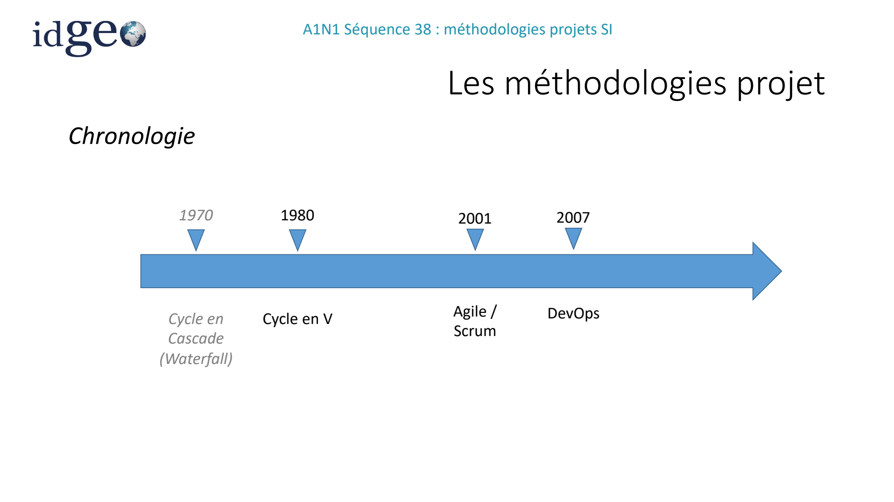

*Visuel original — `A1N1S38_Nov-2025.pdf`, page 9.*

## Cycle en V

### Cycle en V

*Source : page 10.*

- Les principes et applications
- Les rôles et notions
- Les outils adaptés

### Origine

*Source : page 11.*

- Le cycle en V en gestion de projet découle du modèle en cascade théorisé dans les années 1970, qui permet de représenter des processus de développement de manière linéaire et en phases successives.
- Ce mode de gestion de projet a été développé dans les années 1980 et appliqué au champ des projets industriels, puis étendu aux projets informatiques. Il a été remis en cause à partir du début des années 2000, sous l’effet de l’accélération des changements technologiques, favorisant davantage les méthodes dites « agiles ».
- La leare V fait référence à la vision schématique de ce cycle, qui prend la forme d’un V : une phase descendante suivie d’une phase ascendante. Le cycle en V associe à chaque phase de réalisation une phase de validation

### Principe

*Source : page 12.*

Le cycle en V, ou V-modèles en anglais, est une méthode de gestion de projet en deux phases.

Une pour chaque branche du V.

- une phase descendante: du besoin exprimé par le client à la réalisation du produit
- une phase ascendante: du produit fini à la vérification de sa qualité.

Mais les deux branches du V communiquent et interagissent également entre elles.

Chaque phase de production correspond donc à une phase de vérification et de validation.

Cette interaction garantit la qualité du produit fini pour une satisfaction garantie du client.

### Développement Cycle en V

*Source : page 13.*

<!-- FIGURE SOURCE : A1N1S38_Nov-2025.pdf, page 13. Emplacement : dans cette sous-partie, avant la page suivante. Reproduction de la page entière pour conserver les légendes et les relations du schéma. -->

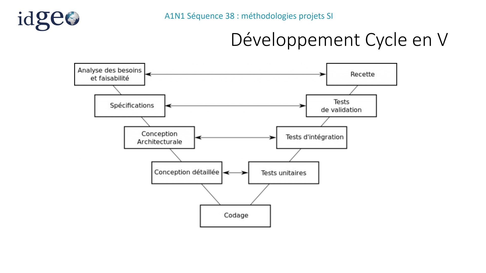

*Visuel original — `A1N1S38_Nov-2025.pdf`, page 13.*

### Déroulement du cycle en V

*Source : page 14.*

L’équipe réalise le projet en allant de la première étape « analyse des besoins et faisabilité » à la dernière étape « recette » de façon assez classique.

Le cycle en V propose de retravailler par exemple la conception détaillée si les tests unitaires ne se valident pas ou de retravailler les spécifications si les tests de validation ne passent pas.

- En plus des phases de développement respectives d’un projet, le cycle V définit en parallèle des procédures d’assurance qualité et décrit comment ces différentes phases peuvent interagir entre elles.
- Le modèle de développement doit son nom à sa structure, qui s’apparente à la leare « V ».

### Une phase cruciale

*Source : page 15.*

**la conception**

- Les besoins du client doivent être recueillis de manière exhaustive et rigoureuse.

Les spécifications fonctionnelles doivent faire l’objet d’un processus de validation suivi et définitif. Elles doivent synthétiser les demandes du client tout en couvrant l’ensemble du programme du projet.

- La description des moyens pour parvenir au produit final, quant à elle, ne doit intervenir qu’au stade des spécifications techniques (conception générale), de façon à éviter que les moyens ne définissent la fin !

### Analyse de la méthode

*Source : page 16.*

| AVANTAGES | INCONVENIENTS |
| --- | --- |
| Evite de revenir en arrière sans cesse pour redéfinir les spécifications principales | Effet tunnel : phase linéaire liées à une spécification très détaillée |
| facile à mettre en œuvre : très bien décrit au départ et bien jalonné. Ne demande pas de réunion journalière. | Moins de réactivité si évolution besoin client en cours de projet |
| Optimisation de la communication | Délai long entre besoin et livraison produit |
| Minimisation des risques et meilleure planification | Structure rigide ne permettant pas de réagir avec souplesse aux changements |
| Amélioration de la qualité par les mesures d’assurance qualité | Modèle parfois trop simple pour s’adapter à des projets complexes |

<!-- FIGURE SOURCE : A1N1S38_Nov-2025.pdf, page 16. Emplacement : dans cette sous-partie, avant la page suivante. Reproduction de la page entière pour conserver les légendes et les relations du schéma. -->

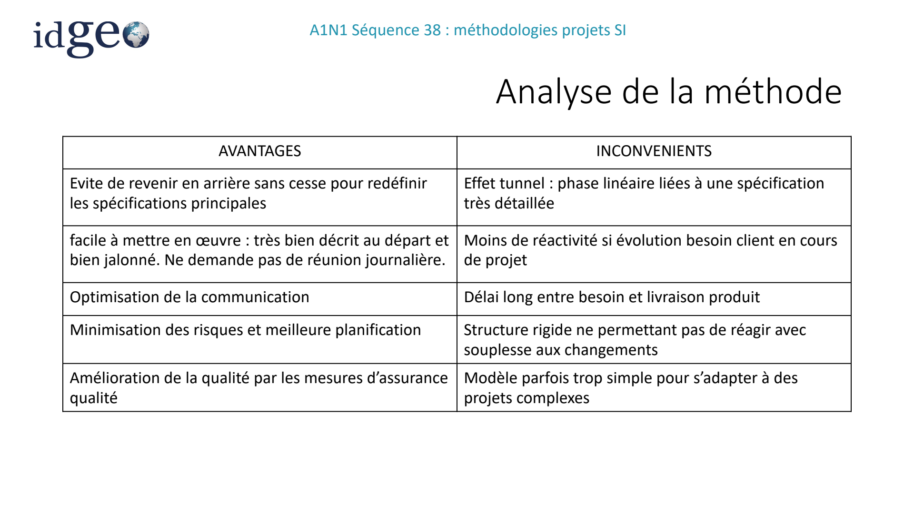

*Visuel original — `A1N1S38_Nov-2025.pdf`, page 16.*

### Exercice

*Source : page 17.*

- Trouver des types de projet à suivre en cycle en V.

### Adapté à quel projet?

*Source : page 18.*

**Les éléments suivants favorisent l’utilisation du cycle en V :**

- Des exigences très précises émises par le client, par exemple dans le cadre d’un appel d’offres.
- La présence d’un prestataire, qui maîtrise l'ensemble des étapes de réalisation et requiert ainsi moins de communication entre les différents acteurs.
- La possibilité de suivre un cahier des charges inchangé du début à la fin, de par la nature du produit ou du projet.
- Un projet où l’environnement technologique évolue très peu, limitant ainsi les risques de décalage dus à l’effet tunnel.

## Agile et Scrum

### Agile

*Source : page 19.*

- Les principes et applications
- Les rôles et notions
- Les outils adaptés

### Origine

*Source : page 20.*

- Découle du Manifeste Agile, des pratiques édictées par des experts en 2001 pour améliorer le développement de logiciels.
- Se base sur 4 valeurs :
- une collaboration permanente avec le client remplaçant une négociation contractuelle.
- la primauté des personnes et des interactions sur les processus et outils.
- une préférence pour un logiciel fonctionnel plutôt qu'une documentation complète.
- une adaptation continue au changement et non le suivi rigide d'un plan.

Alors que les méthodes traditionnelles visent à traiter les différentes phases d'un projet d'une manière séquentielle (cycle en V), le principe des méthodes Agiles est de le découper en sous-parties (ou sous-projets) autonomes (on parle également de développement itératif).

### 12 principes

*Source : page 21.*

1 - La priorité n°1 est d' obtenir la satisfaction client au plus tôt par la livraison rapide et régulière de fonctionnalités attendues.

2 - Accepter les demandes de changement en cours de projet 3 - Mettre en œuvre des livraisons rapides reposant sur des cycles courts (quelques semaines). Ces livrables doivent être opérationnels pour permettre des tests de validation des fonctionnalités attendues.

4 - Coopération forte et continue entre les utilisateurs et le développement.

5 - Donner de l'autonomie à des personnes impliquées et leur faire confiance.

6 - Privilégier le face à face comme canal de communication entre les parties.

### 12 principes

*Source : page 22.*

7 - L'important est d'avoir une application opérationnelle.

8 - Avancer avec un rythme constant compatible avec ce que peut produire l'ensemble des acteurs.

9 - Focus sur la qualité technique et la qualité de conception pour construire une base solide renforçant l'agilité.

10 - Rester simple dans les méthodes de travail : ne faire que ce qui est nécessaire.

11 - Une équipe qui s'organise elle même produit de meilleurs résultats.

12 - En revoyant régulièrement ses pratiques, l'équipe adapte son comportement et ses outils pour être plus efficace.

### Avantages

*Source : page 23.*

- plus de flexibilité en travaillant sur des sous-parties autonomes. Elles peuvent être conçues, testée, modifiées de nouveau sans que l'ensemble du projet ne soit impacté. La prise en compte de besoins non identifiés dans la phase d'analyse ou bien l'émergence de nouvelles fonctionnalités au cours du développement peuvent être implémentées. Par expérience, il est difficile de penser à tout dans la phase de définition de besoin pour une approche classique de gestion de projet.
- Plus de fiabilité et de qualité : en testant en continu, en favorisant les feedbacks, les échanges avec les clients.
- Des risques réduits : détection rapide grâce à des cycles courts.
- Une meilleure maîtrise des coûts : pas de coûteux retours en arrière - si nécessaire le projet peut être stoppé rapidement.

### Les limites

*Source : page 24.*

- La flexibilité poussée à l'extrême peut conduire à un enlisement du projet . De nombreuses itérations sans que des directions ou décisions ne soient figées représentent un réel danger. Un client modifiant sans cesse sa demande et son besoin.
- Dans ces situations, le chef de projet (quelle que soit sa dénomination dans la méthode choisie) doit être capable d'arbitrer pour le bien du projet, mais également celui... du client.

### Le POC vers le MVP

*Source : page 25.*

- Le Produit Minimum Viable (ou MVP de l'anglais : minimum viable product)à stratégie de développement de produit, utilisée pour des tests rapides et quantitatifs de mise sur le marché d'un produit ou d'une fonctionnalité.
- L’intérêt est de prouver que le concept fonctionne et de pouvoir valider la continuité des incrémentations.
- Le MVP remplace donc le POC (Proof Of Concept): prototype développé avec des fonctionnalités principales, permettant de démontrer à un client son savoir faire et que le projet est faisable.

### La méthode Scrum

*Source : page 26.*

Le Sprint, le cœur de Scrum

- Cette approche repose sur des itérations de 2 à 4 semaines. Ce sont les fameux "Sprints". Il s'agit des sous-parties d'un projet comme le définit le principe Agile.

Chaque Sprint a pour objectif de livrer au client une version potentiellement utilisable du produit.

- Les Sprints successifs ajoutent des fonctionnalités au produit ou améliorent celles déjà développées. On parle d'incrément de produit.
- Un Sprint démarre lorsque le précédent est terminé. Il s'agit d'un processus incrémental.

### Les trois piliers de Scrum

*Source : page 27.*

**Ce cadre repose sur 3 piliers que sont :**

- la transparence : élaboration d'un standard commun pour permettre une compréhension partagée.
- l'inspection : des vérifications sont effectuées régulièrement.
- l'adaptation : en cas de dérive constatée lors de l'inspection, des ajustements sont décidés.

### Structure des sprints

*Source : page 28.*

Les Sprints se structurent autour de plusieurs outils organisationnels (appelés événements) :

- Sprint planning (Planification du sprint) : réunion pour sélectionner et planifier les priorités de chaque Sprint en termes de liste des fonctionnalités produit (Sprint Backlog).
- Scrum (Mélée quotidienne) : réunion journalière de coordination entre les membres de l'équipe projet. Elle prend fréquemment la forme de "Stand-up meeting" (réunion de courte durée, 10-15mn, tenue debout).

### Structure des sprints

*Source : page 29.*

- Sprint Review (Revue de Sprint ) : réunion de synthèse à la fin de chaque Sprint afin de valider les fonctionnalités développées.
- Sprint Retrospective (Rétrospective de Sprint) : venant immédiatement après la revue de Sprint, il s'agit d'un bilan dont l'objectif est l'amélioration continue des pratiques. L'équipe échange sur les réussites, les difficultés, relève ce qui a fonctionné ou non. Avec toujours des leçons à Brer pour les prochains Sprints.

Sprint Sprint (2 à 4 semaines) Incrément Backlog

Sprint Planning Sprint review Sprint Retrospective Scrum (daily)

<!-- FIGURE SOURCE : A1N1S38_Nov-2025.pdf, page 29. Emplacement : dans cette sous-partie, avant la page suivante. Reproduction de la page entière pour conserver les légendes et les relations du schéma. -->

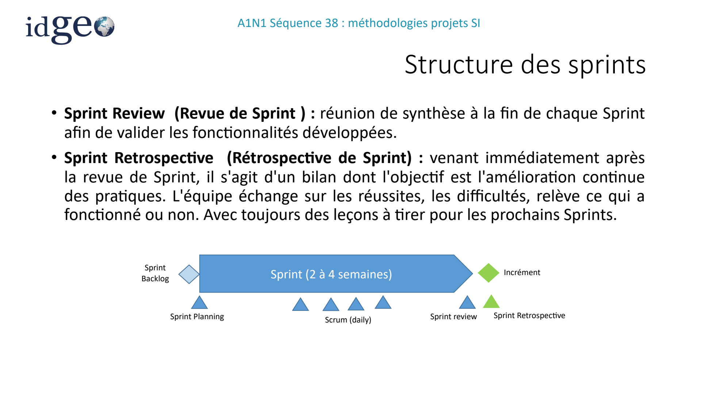

*Visuel original — `A1N1S38_Nov-2025.pdf`, page 29.*

### User Story

*Source : page 30.*

La User Story est une technique de spécification permettant de synthétiser le besoin lié à une fonctionnalité en quelques phrases courtes et simples utilisant exclusivement le vocabulaire métier (absence de connotation technique ou de description d’IHM). D’autre part, une User Story énumère les tests fonctionnels connus à date permettant de vérifier la couverture du besoin de la fonctionnalité associée.

- Les avantages sont nombreux :
- Une User Story est compréhensible rapidement aussi bien par un développeur que par un utilisateur,
- Elle favorise les interactions entre développeur et rédacteur, favorisant ainsi une bonne compréhension du besoin (communication face à face),
- Les tests énumérés renforcent la qualité des développements.

### User Story

*Source : page 31.*

- C’est une phrase simple décrivant une fonctionnalité logicielle, écrite du point de vue de l’utilisateur final. Rédigée dans un langage non technique, elle offre du contexte à l’équipe de développement.
- Elle s’appuie sur le format suivant : « En tant que [profil client], je souhaite [objectif du logiciel] afin de [résultat] ».

<!-- FIGURE SOURCE : A1N1S38_Nov-2025.pdf, page 31. Emplacement : dans cette sous-partie, avant la page suivante. Reproduction de la page entière pour conserver les légendes et les relations du schéma. -->

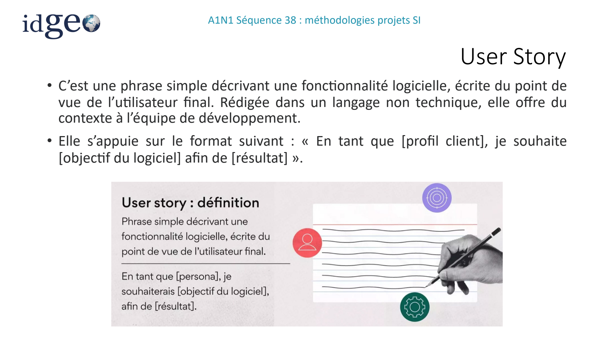

*Visuel original — `A1N1S38_Nov-2025.pdf`, page 31.*

### User Story

*Source : page 32.*

Qui rédige les user stories ?

- Le plus souvent, le responsable de produit (Product Owner) rédige les user stories en se basant sur des recherches menées auprès des utilisateurs. Il les répertorie ensuite dans une liste (backlog produit) à destination de l’équipe de développement. Techniquement, n’importe qui peut rédiger ce type de récits, mais c’est au chef de produit de veiller à ce qu’ils contiennent toutes les informations dont l’équipe de développement a besoin pour mener à bien ses initiatives.
- Ensuite, l’équipe de développement hiérarchise les demandes et décide quelles user stories gérer pendant la réunion de planification de sprint.

### User Story

*Source : page 33.*

Rédigé en trois étapes, la user story représente le point de vue de l’utilisateur final.

<!-- FIGURE SOURCE : A1N1S38_Nov-2025.pdf, page 33. Emplacement : dans cette sous-partie, avant la page suivante. Reproduction de la page entière pour conserver les légendes et les relations du schéma. -->

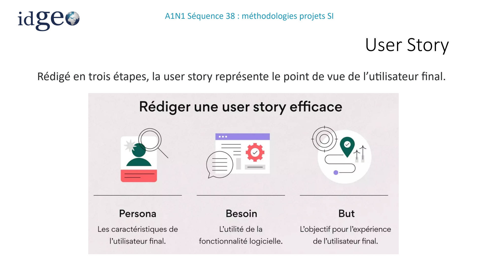

*Visuel original — `A1N1S38_Nov-2025.pdf`, page 33.*

### Rôles Scrum

*Source : page 34.*

**Product Owner - PO (propriétaire du produit) :**

l'expert métier, le maître d'ouvrage, représente le client et intervient sur le coté fonctionnel.

**Scrum Master (maître de mêlée) :**

le coordinateur du projet et le garant du respect de la méthode Scrum.

Team (équipe) : les autres intervenants sur le projet (notamment les développeurs).

<!-- FIGURE SOURCE : A1N1S38_Nov-2025.pdf, page 34. Emplacement : dans cette sous-partie, avant la page suivante. Reproduction de la page entière pour conserver les légendes et les relations du schéma. -->

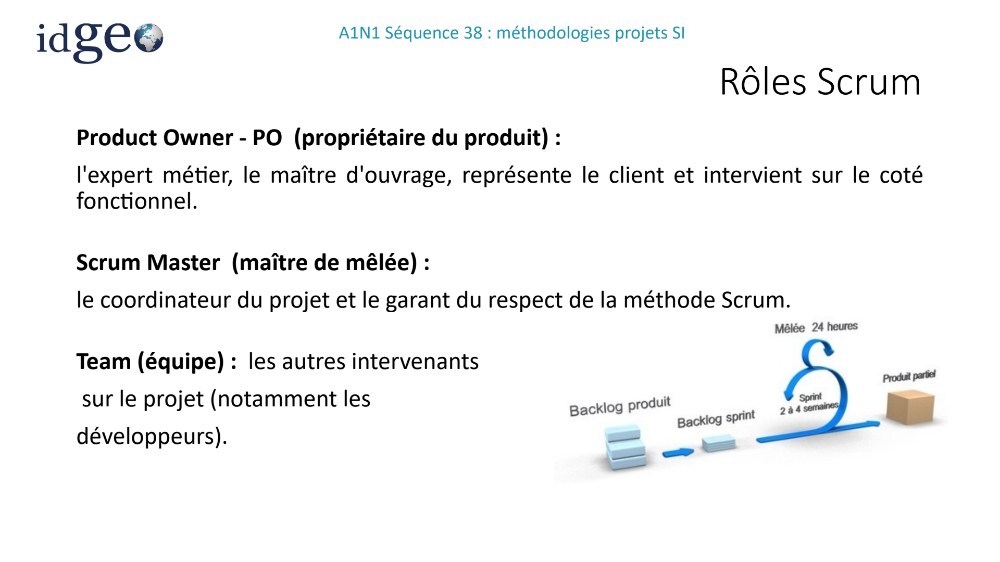

*Visuel original — `A1N1S38_Nov-2025.pdf`, page 34.*

### Méthode Scrum

*Source : page 35.*

<!-- FIGURE SOURCE : A1N1S38_Nov-2025.pdf, page 35. Emplacement : dans cette sous-partie, avant la page suivante. Reproduction de la page entière pour conserver les légendes et les relations du schéma. -->

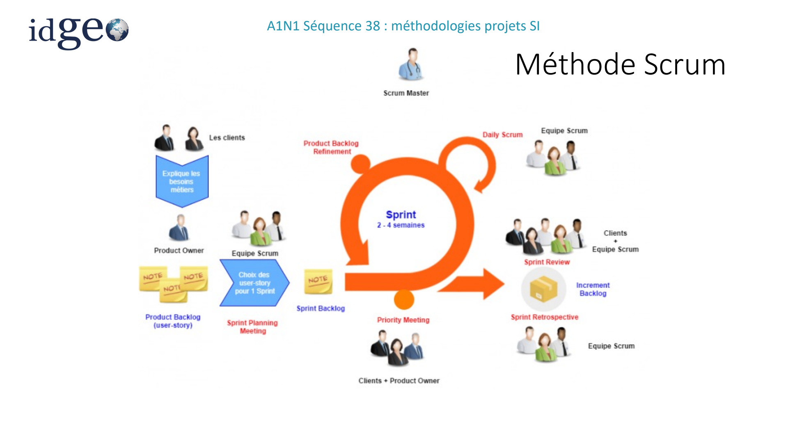

*Visuel original — `A1N1S38_Nov-2025.pdf`, page 35.*

### Scrum : Mesure avancement

*Source : page 36.*

Grâce aux estimations individuelles des exigences du «Product Backlog» ainsi qu'à la segmentation en sprints, on peut aisément produire un graphique de suivi d'avancement représentant l'évolution du travail accompli en fonction du temps (voir illustration ci contre : total de "points" d'estimation des exigences terminées en bleu et charge totale de "points" de la release (version) en rouge).

<!-- FIGURE SOURCE : A1N1S38_Nov-2025.pdf, page 36. Emplacement : dans cette sous-partie, avant la page suivante. Reproduction de la page entière pour conserver les légendes et les relations du schéma. -->

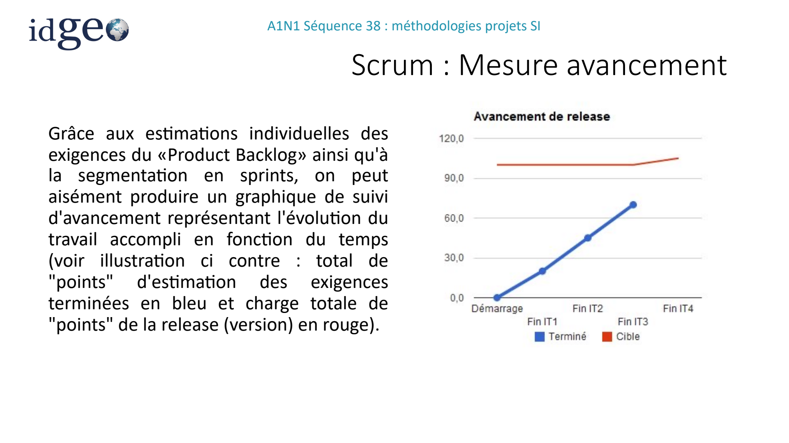

*Visuel original — `A1N1S38_Nov-2025.pdf`, page 36.*

### Modèle Scrum et pratiques agiles

*Source : page 37.*

<!-- FIGURE SOURCE : A1N1S38_Nov-2025.pdf, page 37. Emplacement : dans cette sous-partie, avant la page suivante. Reproduction de la page entière pour conserver les légendes et les relations du schéma. -->

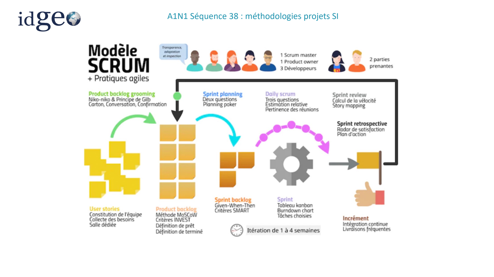

*Visuel original — `A1N1S38_Nov-2025.pdf`, page 37.*

## Contractualisation et comparaison des méthodes

### Contractualisation projet agile

*Source : page 38.*

La contractualisation n'est pas la partie la plus facile car le périmètre est par définition variable.

Il difficile de rassurer le client avec un contrat en régie (compter les jours).

Aujourd’hui, le contrat au forfait domine.

**Méthodes:**

- La forfaitisation de chaque itération avec la possibilité pour le client d'arrêter le contrat à la fin de chaque itération.
- le principe de troc d'exigence : réalisation d'une exigence imprévue en échange du retrait d'une autre moins importante, de priorité faible et de même coût.

### Cycle en V vs Scrum

*Source : page 39.*

Cycle en V est une méthode de gestion de projet alors que le Scrum est une méthode de gestion de produit.

- En fin d’itération (2 semaines pour 80% des équipes en Scrum), l’équipe Scrum va inviter les utilisateurs clés et les parties prenantes à venir voir le travail réalisé afin qu’ils lui fassent des feedbacks intéressants. L’équipe prendra en compte ceux-ci pour améliorer le produit lors des prochaines itérations.
- Sachant qu’il est quasiment impossible d’avoir pensé au produit parfait dès le départ, le produit ne sera pas totalement celui qu’on avait imaginé en début de projet.
- Dans le Cycle en V, l’aspect un peu « cascade » persistant amène souvent à attendre la recette finale pour envisager des modifications du produit ; un nouveau cycle sera nécessaire pour revoir un grand nombre d’améliorations.

### Cycle en V vs Scrum

*Source : page 40.*

**Vitesse de développement en théorie identique (scrum = cycle en v)**

- Certaines entreprises vendent l’agilité comme une façon de développer un produit 4 fois plus vite… C’est évidement une erreur à ne pas commettre.
- seul phénomène constaté à certains moments mais qui n’est que temporaire : la motivation des développeurs sur certains projets Scrum est des fois bien augmentée du fait d’utiliser voire de tester une méthode de travail à la mode ; cela va augmenter temporairement la productivité de l’équipe…
- Le phénomène serait identique si une autre méthodologie de gestion de projet devenait à la mode dans quelques années.

### Cycle en V vs Scrum

*Source : page 41.*

**Scrum parfois trop évasif (cycle en v plus stricte ?)**

- Scrum a le défaut aujourd’hui d’être un peu trop évasif sur certains points comme la documentation et la qualité technique
- C’est une très grosse erreur, l’agilité n’a pas pour but de livrer tout au plus vite ; l’agilité veut qu’on livre régulièrement des produits de très grande qualité ce qui est bien différent.
- Tenter de livrer au plus vite en omettant une documentation de qualité (écrite au fur et à mesure) et une qualité technique irréprochable est totalement anti-agile

### Cycle en V vs Scrum

*Source : page 42.*

**Le Scrum aime la communication (plus qu’en cycle en V ?)**

- On le voit régulièrement, le rôle des développeurs en Scrum a changé. On ne parle d’ailleurs pas d’un développeur mais d’une équipe de développeurs. Le Scrum pousse à l’intelligence collective ce qui n’est pas du tout le cas du cycle en V.
- En cycle en V, on a des rôles bien définis pour la spécification , l’architecture, le développement, les tests… Aujourd’hui les développeurs acceptent de moins en moins cette façon de faire ; elle n’est plus dans les tendances actuelles.

### Cycle en V vs Agile

*Source : page 43.*

**Le droit à l’erreur (compliqué en cycle en V)**

- La notion de l’erreur est très importante en Scrum. Les équipes apprennent de leurs erreurs et peuvent rectifier la trajectoire dès l’itération suivante.
- Le fait de pouvoir faire des rectifications rapides en Scrum permet d’accepter plus facilement l’erreur qui aura un coût peu significatif. Une même erreur en cycle en V peut coûter extrêmement cher.

Par exemple en cycle en V, on ne verra l’erreur fonctionnelle qu’au moment de la recette ; on pouvait même se retrouver à s’apercevoir que le projet était obsolète ou qu’il ne répondait pas du tout au besoin initial.

En Scrum une telle erreur se serait vue rapidement et aurait été rectifiée dans les plus brefs délais.

### Conclusion Scrum vs cycle en V

*Source : page 44.*

Si les projets en cycle en V étaient dans les années 80/90, une véritable évolution pour répondre aux problématiques rencontrées, le Scrum est une méthode plus adaptée au contexte actuel.

Le Scrum vivra probablement le même type de comparaison avec des méthodes de gestion de projet futures. Ces méthodes seront plus adaptées au contexte dans lequel seront nos entreprises dans le futur.

## Kanban

### Méthode Kanban

*Source : page 45.*

KANBAN est une méthode de travail qui s’inspire de l’approche Lean centrée sur l'amélioration continue des processus de production. Elle se fonde sur un système à "flux tirés", tenant compte des demandes des consommateurs, et non à flux poussés.

**Objectif :**

Limiter le risque de surproduction et de gaspillage, mais aussi réduire les délais et les coûts. Qualifiée de méthode agile au même titre que Scrum, Kanban prône la visualisation des flux de travail par le biais d'un tableau (dit tableau Kanban), permettant de prioriser et suivre l'état d'avancement des tâches à accomplir.

### La méthode Kanban

*Source : page 46.*

- La méthode Kanban fonctionne à partir d’un système de cartes. Elle a d'ailleurs été baptisée en référence à ce procédé. Kanban signifie étiquettes en langue japonaise. Les cartes ou étiquettes vont représenter les tâches à accomplir en vue de répondre à la commande d'un client.
- Ces objets graphiques constituent un outil simple à comprendre et rapide à déchiffrer. Pour visualiser l'état d'avancement d'une commande ou d'un projet, elles seront réparties dans un tableau Kanban généralement divisé en trois parties : "A faire", "En cours" et "Réalisé". Chacun sait ainsi ce qu’il doit faire, quand et comment.

### Kanban + Daily Meeting

*Source : page 47.*

- Les méthodes agiles ont révolutionné la tenue des traditionnelles réunions autour d’une table. Place désormais aux daily meetings. Il s’agit de réunions de courte durée (pas plus de 15 minutes) qui se tiennent tous les matins et généralement débout. Chaque membre de l’équipe doit alors répondre à trois questions : Qu’ai-je fait hier ? Que vais-je faire aujourd’hui ? Quels sont les obstacles que je risque de rencontrer ?
- Les daily meetings permettent de tenir l’ensemble de l’équipe au courant des tâches des uns et des autres et d’apporter des solutions à certains problèmes. Du coup, ils sont souvent considérés comme un outil complémentaire à l'approche Kanban.

### Point notoire

*Source : page 48.*

La méthode Kanban permet une synthèse visuelle permettant de vérifier les encours et de rythmer le projet, mais ne permet pas d’évaluer les restes à faire sur les tâches restant à accomplir.

**Exemple de Kanban du support** :

| | TO DO | DOING | DONE |
| --- | --- | --- | --- |
| Développeur | Sprint 2 | Sprint 1 | Scénario test |
| Designer | | IHM | Maquette |

<!-- FIGURE SOURCE : A1N1S38_Nov-2025.pdf, page 48. Emplacement : dans cette sous-partie, avant la page suivante. Reproduction de la page entière pour conserver les légendes et les relations du schéma. -->

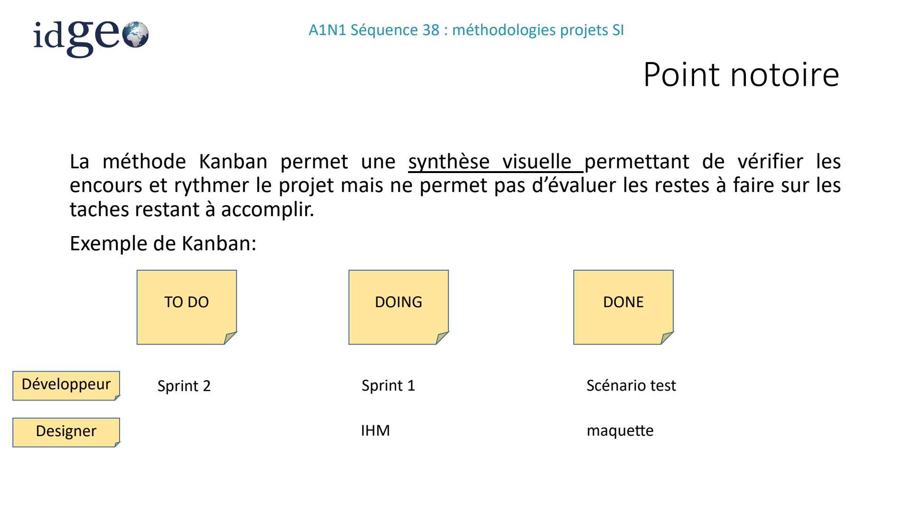

*Visuel original — `A1N1S38_Nov-2025.pdf`, page 48.*

### Kanban avec Trello

*Source : page 49.*

<!-- FIGURE SOURCE : A1N1S38_Nov-2025.pdf, page 49. Emplacement : dans cette sous-partie, avant la page suivante. Reproduction de la page entière pour conserver les légendes et les relations du schéma. -->

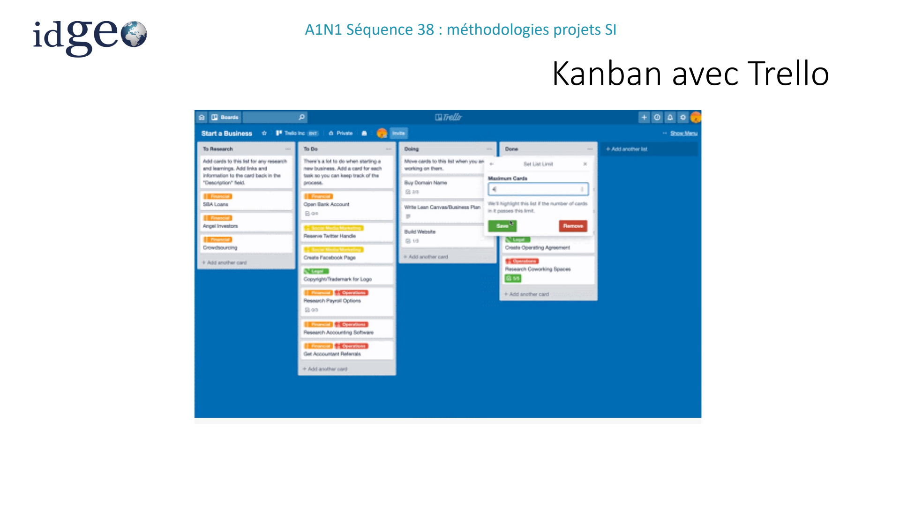

*Visuel original — `A1N1S38_Nov-2025.pdf`, page 49.*

### Kanban vs Scrum

*Source : page 50.*

- Scrum prône des cycles de développement courts (ou sprint), de deux à quatre semaines, au terme desquels une nouvelle version du projet est livrée. Comme on l'a vu, Kanban met l'accent sur l'amélioration continue, avec des évolutions possibles en permanence.
- Les deux approches semblent donc s'opposer. Elles n'en restent pas moins complémentaires, et d'ailleurs souvent utilisées de concert. Un tableau kanban peut en effet permettre de gérer l'état d'avancement des tâches à accomplir au sein d'un sprint Scrum.

## DevOps

### L’Agilité optimisée - DevOps

*Source : page 51.*

Après le développement en cycle en V dans les années 90, l’apparition de l’Agile dans les années 2000, la déclinaison de cette dernière méthodologie est poussée à son extrême avec l’apparition du DevOps à partir de 2007.

### Qu'est-ce que DevOps

*Source : page 52.*

DevOps offre un cadre conçu pour dynamiser et améliorer le développement d'applications et accélérer la mise à disposition de nouvelles fonctionnalités, de mises à jour logicielles ou de produits.

Il favorise la communication, la collaboration, l'intégration, la visibilité et la transparence continues entre les équipes chargées du développement d'applications (Dev) et celles responsables des opérations IT (Ops).

Cette relation plus étroite entre Dev et Ops se reflète dans chaque phase du cycle de vie DevOps : planification logicielle initiale, codage, développement, test, publication, déploiement, opérations et surveillance continue.

### Les quatre axes du DevOps

*Source : page 53.*

**Les objectifs du DevOps s'articulent autour de 4 axes :**

culture, automatisation, mesure et partage.

Dans chacun de ces domaines, les outils DevOps améliorent la rationalisation et la collaboration des workflows de développement et d'opérations en automatisant les tâches chronophages, manuelles ou statiques des phases d'intégration, de développement, de test, de déploiement ou de surveillance.

### Pourquoi le DevOps est-il important ?

*Source : page 54.*

- En favorisant la communication et la collaboration entre les équipes chargées du développement et des opérations IT, le DevOps vise à optimiser la satisfaction client et à proposer des solutions à valeur ajoutée plus rapidement. Le DevOps est aussi conçu pour stimuler l'innovation dans une optique d'amélioration continue des processus.
- Les pratiques DevOps accélèrent, optimisent et sécurisent la valeur commerciale des entreprises, par exemple via la publication plus fréquente ou la mise à disposition plus rapide de versions, de fonctionnalités ou de mises à jour des produits, le tout en assurant les niveaux de qualité et de sécurité appropriés.

Autre objectif : améliorer les délais de détection, de résolution de bug ou d'autres problèmes.

- L'infrastructure sous-jacente apporte également au DevOps la fluidité des performances, la disponibilité et la fiabilité requises lors des étapes de développement, de test et de mise en production des logiciels.

### Principes DevOps

*Source : page 55.*

Repose sur l’approche CI/CD : Continuous Integration / Continuous Development Qui garantit une automatisation et une surveillance continues tout au long du cycle de vie des applications, des phases d'intégration et de test jusqu'à la distribution et au déploiement.

- Développement continu: couvre les phases de planification et de codage dans le cycle de vie DevOps et peut inclure des mécanismes de contrôle des versions.
- Intégration continue: rassemble des outils de gestion de la configuration, de test et de développement pour assurer le suivi de la mise en production des différentes portions du code. Elle implique une collaboration étroite entre les équipes responsables des tests et du développement pour identifier et résoudre rapidement les problèmes de code.

### Livraison continue et tests continus

*Source : page 56.*

**Selon la même logique, il y a donc:**

- Livraison continue. automatise la publication des modifications du code après la phase de test, dans un environnement intermédiaire ou de préproduction
- Tests continus. Mise en place de tests automatisés, planifiés et continus lors de l'écriture ou de la mise à jour du code de l'application qui accélèrent la livraison du code en production.

### Synthèse

*Source : page 57.*

<!-- FIGURE SOURCE : A1N1S38_Nov-2025.pdf, page 57. Emplacement : dans cette sous-partie, avant la page suivante. Reproduction de la page entière pour conserver les légendes et les relations du schéma. -->

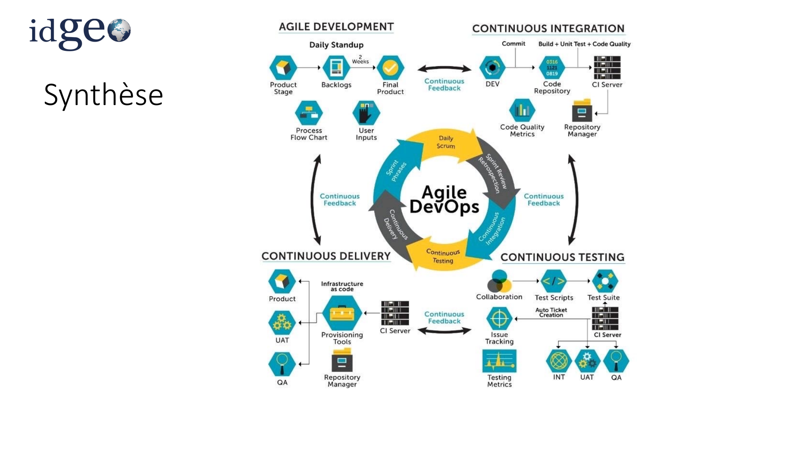

*Visuel original — `A1N1S38_Nov-2025.pdf`, page 57.*

### Avantages du DevOps

*Source : page 58.*

Les avantages commerciaux et techniques sont évidents et la plupart contribuent à améliorer la satisfaction des clients :

- Accélération et amélioration de la fourniture des produits
- Résolution plus rapide des problèmes et complexité réduite
- Plus grande évolutivité
- Stabilité accrue des environnements d'exploitation
- Automatisation accrue
- Meilleure visibilité sur les résultats du système
- Innovation renforcée

### Quels sont les avantages de DevOps ?

*Source : page 59.*

**Vitesse**

- Les équipes qui adoptent la livraison DevOps livrent plus souvent, de façon plus qualitative et plus stable.

**Collaboration améliorée**

- DevOps repose sur une culture de la collaboration entre développeurs et équipes opérationnelles, qui partagent les responsabilités et combinent le travail. Il améliore l'efficacité des équipes et permet d'accélérer les transferts de tâches et la création de code conçu pour un environnement d'exécution spécifique.

### Déploiement rapide, qualité et fiabilité

*Source : page 60.*

**Déploiement rapide**

- En augmentant la fréquence et la vélocité des livraisons, les équipes DevOps améliorent rapidement les produits. La rapidité de livraison de nouvelles fonctionnalités et de correction des bugs permet d'obtenir un avantage concurrentiel.

Qualité et fiabilité

- Des pratiques telles que l'intégration et la livraison continues garantissent que les changements sont fonctionnels et sûrs, ce qui améliore la qualité d'un produit logiciel. La surveillance permet aux équipes de suivre les performances en temps réel.

### Sécurité

*Source : page 61.*

- En intégrant la sécurité dans un pipeline d'intégration, de livraison et de déploiement continus, DevSecOps est une partie active et intégrée du processus de développement. La sécurité fait partie intégrante du produit grâce à l'intégration des audits actifs et des tests de sécurité dans le développement Agile et les workflows DevOps.

### Micro service / monolithique

*Source : page 62.*

<!-- FIGURE SOURCE : A1N1S38_Nov-2025.pdf, page 62. Emplacement : dans cette sous-partie, avant la page suivante. Reproduction de la page entière pour conserver les légendes et les relations du schéma. -->

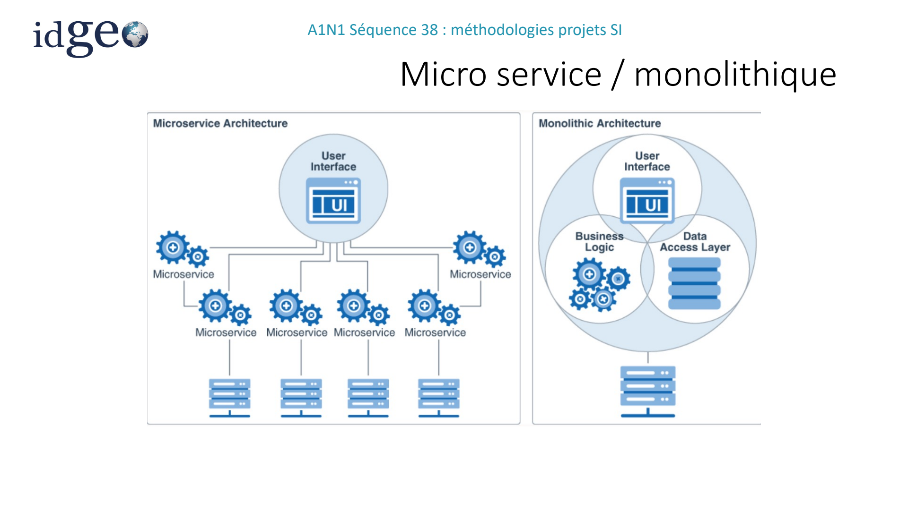

*Visuel original — `A1N1S38_Nov-2025.pdf`, page 62.*

### Impact sur Architecture

*Source : page 63.*

1) Architecture monolithique : Les applications monolithiques ont généralement un code source assez volumineux. Lorsque des nouveaux développeurs rejoignent l’équipe de projet, il faut passer beaucoup de temps pour se familiariser avec le code source de l’application et comprendre les dépendances entre les modules.

Avec une architecture monolithique, il est difficile d’apporter des améliorations à l’application sans prendre le risque d’affecter les autres fonctionnalités. Toute modification de l’application entraîne plusieurs révisions et approbations qui augmentent le temps du cycle de déploiement.

### Impact sur Architecture

*Source : page 64.*

**Problème n°1 :**

Comment assurer la haute disponibilité des applications ?

Problème n°2 : Comment répondre rapidement aux nouvelles fonctionnalités métiers et faire évoluer les applications d’une façon très fréquente.

Problème n°3 : Comment être indépendant des technologies utilisées tout en sachant que ces technologies évoluent très vite

### Impact sur Architecture

*Source : page 65.*

L’architecture Microservices est implémentée pour des applications logicielles complexes et volumineuses.

Composés d’un ou plusieurs services, les Microservices peuvent être déployés indépendamment les uns des autres en restant faiblement dépendants.

Chacun de ces Microservices se concentre sur l’achèvement d’une fonctionnalité ou bien d’un module bien déterminé.

Chaque micro-service peut être: Développé indépendamment Avoir une base de données indépendante testé indépendamment déployé indépendamment (Technologie différente des autres)

### Impact sur Architecture

*Source : page 66.*

Les applications de microservice permettent aux développeurs de décomposer plus facilement leur travail en petites équipes indépendantes et d’intégrer ce travail au fur et à mesure.

<!-- FIGURE SOURCE : A1N1S38_Nov-2025.pdf, page 66. Emplacement : dans cette sous-partie, avant la page suivante. Reproduction de la page entière pour conserver les légendes et les relations du schéma. -->

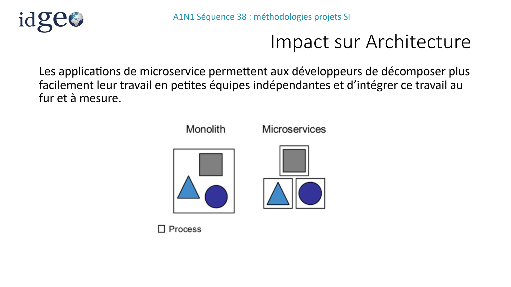

*Visuel original — `A1N1S38_Nov-2025.pdf`, page 66.*

### Exemples illustrés dans le support

*Source : page 67.*

<!-- FIGURE SOURCE : A1N1S38_Nov-2025.pdf, page 67. Emplacement : dans cette sous-partie, avant la page suivante. Reproduction de la page entière pour conserver les légendes et les relations du schéma. -->

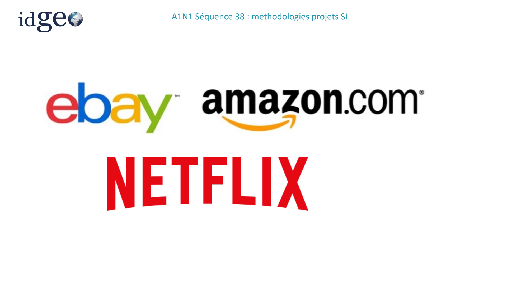

*Visuel original — `A1N1S38_Nov-2025.pdf`, page 67.*

### DevOps - Synthèse

*Source : page 68.*

**DevOps est une démarche continue de collaboration entre les équipes :**

- Développement
- Opérations Elle est basée sur l’agile et le lean et couvre toutes les phases du projet de la création du produit, sa conception jusqu’à son suivi en production.

DevOps permet à une entreprise d’optimiser la rapidité de livraison d’un produit ou d’un service, en toute sérénité et en toute confiance quant à sa qualité.

DevOps est donc l’extension des principes agiles à toute la chaine de valeur produit.

### DevOps et Agile — Illustration

*Source : page 69.*

<!-- FIGURE SOURCE : A1N1S38_Nov-2025.pdf, page 69. Emplacement : dans cette sous-partie, avant la page suivante. Reproduction de la page entière pour conserver les légendes et les relations du schéma. -->

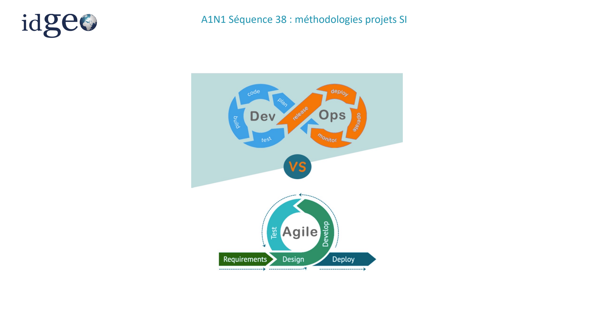

*Visuel original — `A1N1S38_Nov-2025.pdf`, page 69.*

### DevOps avec la suite Atlassian

*Source : page 70.*

<!-- FIGURE SOURCE : A1N1S38_Nov-2025.pdf, page 70. Emplacement : dans cette sous-partie, avant la page suivante. Reproduction de la page entière pour conserver les légendes et les relations du schéma. -->

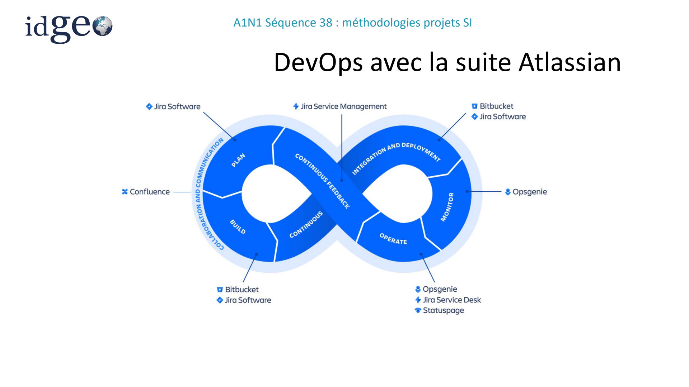

*Visuel original — `A1N1S38_Nov-2025.pdf`, page 70.*

## Annexe — Certifications en management de projet

### Annexe

*Source : page 71.*

- Annexe

### Les certifications management projet

*Source : page 72.*

**PMP® du PMI**

Le PMI (Project Management Institute) est à l’origine de nombreux standards en management de projet, dont le fameux PMBOK® (Project Management Body of Knowledge), la « bible » du management de projet, imprimée à plus de 6 millions d’exemplaires, et traduite dans de nombreuses langues. Le PMBOK® dont la sixième édition a été publiée en 2017, établit les « Standards » clés qui fournissent lignes directrices, les règles et les caractéristiques du Management de Projet selon le PMI.

Les certifications PMI sont au nombre de 5, nous ne citerons ici que les trois principales :

CAPM®, niveau d’entrée, ne requiert pas de pré-requis. Examen QCM de trois heures.

PMP®, niveau chefs de projets confirmés. Examen QCM comportant 200 questions à compléter en quatre heures.

PgMP®, pour les responsables de programmes. Examen assez complexe, comprenant notamment une évaluation du candidat par ses pairs, selon la méthode 360°.

### PMP

*Source : page 73.*

Le PMP® est la plus reconnue.

Véritable certification internationale de référence, le PMP® permet de valoriser un niveau d’expérience et d’expertise dans la gestion de projets.

Cette certification s’adresse à des personnes ayant un minimum d’expérience sur des postes de chefs de projets ou sur des postes de responsables fonctionnels/opérationnels liés à des projets.

**Pour pouvoir passer cette certification, il faut justifier :**

- niveau Bac+4 avec 4500 h d’expérience de chef de projet au cours des 6 dernières années ainsi que 35 h de formation en management de projet
- ou d’un niveau Bac (ou équivalent) avec 7500 h de chef de projet au cours des 8 dernières années ainsi que 35 h de formation en management de projet Aujourd’hui, près de 850 000 personnes sont certifiées PMP® dans le monde.

### Prince2

*Source : page 74.*

Accessible et ne nécessitant aucun pré-requis, elle comprend 2 niveaux

**:**

Prince2® Foundation (Prince2 Fondation pour la version française), la certification de premier niveau, qui s’obtient par un QCM à la suite d’une formation de 3 jours. Le taux de réussite de l’examen au niveau mondial est proche de 94%.

Prince2® Practioner, la certification de deuxième niveau, s’obtient également par un QCM après une formation complémentaire de 2 jours. Pré-requis : avoir obtenu la certification Prince2® Foundation. Le taux de réussite de l’examen au niveau mondial est de l’ordre de 70%

Aujourd’hui, près de 1 500 000 personnes sont certifiées Prince2 Foundation dans plus de 150 pays à travers le monde.

### AgilePM

*Source : page 75.*

**AgilePM®**

Cette formation permet de comprendre comment un projet peut être conduit en mode agile.

Elle définit le cycle de vie d'un projet agile et l'organisation du projet, incluant la gouvernance du projet et le rôle des différents acteurs de l'équipe projet.

Cette certification est très complémentaire des certifications Prince2® et PMP®.

En effet, grâce à son focus sur l’Agilité, elle complète à merveille la certification Prince2® (voire PMP® qui possède tout de même une partie sur l’agilité).

Aujourd’hui, plus de 100 000 personnes sont certifiées AgilePM® dans le monde.
