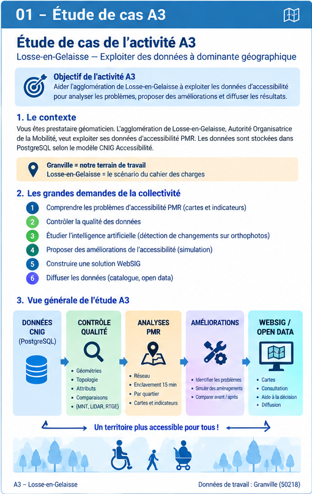

# 01 — Comprendre l'étude de cas A3

## Objectif de cette page

Cette page explique en **français simple** ce que demande l'activité A3.

> **À retenir :** l'étude de cas officielle se déroule dans l'agglomération fictive de **Losse-en-Gelaisse**. **Granville** correspond aux données utilisées pour réaliser concrètement nos traitements.

---

## Vue générale de l’étude A3



---

## 1. Le contexte

Nous nous plaçons dans la situation d'un **prestataire géomaticien** travaillant pour l'agglomération de Losse-en-Gelaisse.

La collectivité est Autorité Organisatrice de la Mobilité et travaille sur l'accessibilité pour les **personnes à mobilité réduite (PMR)**.

Elle dispose déjà de données concernant l'accessibilité de la voirie et de certains ERP, notamment autour des arrêts prioritaires. Les données sont organisées dans PostgreSQL selon un MCD conforme au modèle CNIG Accessibilité.

La collectivité ne nous demande donc pas seulement de créer une base de données : elle veut maintenant **exploiter les données**.

```text
A2 = construire et organiser la base
                ↓
A3 = exploiter la base pour produire des analyses utiles
```

---

## 2. Comprendre les problèmes d'accessibilité PMR

La collectivité souhaite obtenir des **cartes et des indicateurs** permettant de comprendre où se trouvent les difficultés de déplacement.

Deux analyses importantes sont demandées :

- l'enclavement piéton à **15 minutes** pour une personne en fauteuil roulant électrique ;
- l'accessibilité en fauteuil roulant électrique **par quartier**.

### Exemple simple : les 15 minutes

On choisit un point de départ et on cherche à savoir jusqu'où une personne en fauteuil roulant électrique peut aller en 15 minutes, en tenant compte du réseau et des informations d'accessibilité disponibles.

```text
              Zone accessible
            en moins de 15 min
                   🟢
               🟢 🟢 🟢
             🟢 🟢 ⭐ 🟢 🟢
               🟢 🟢 🟢
                   ↑
                départ
```

Certaines zones pourront alors apparaître comme faciles d'accès, tandis que d'autres pourront être plus difficiles à atteindre.

### Comparer les quartiers

L'objectif est également de pouvoir comparer plusieurs secteurs :

- un quartier avec beaucoup de cheminements accessibles ;
- un quartier avec de nombreux obstacles ;
- un quartier avec une mauvaise continuité du réseau ;
- un secteur difficile à atteindre.

Le résultat doit aider la collectivité à comprendre **où intervenir en priorité**.

---

## 3. Contrôler la qualité des données reçues

La collectivité reçoit des données provenant de différents prestataires. Elle doit donc pouvoir répondre à la question :

> **Les données livrées sont-elles suffisamment fiables pour être utilisées ?**

Les contrôles concernent notamment :

- la conformité au modèle de données ;
- la complétude ;
- les géométries ;
- les relations entre les objets ;
- la cohérence des informations utiles à l'accessibilité.

La collectivité souhaite également comparer les données avec d'autres sources indépendantes, notamment le **MNT 1 m**, le **LiDAR HD** et des données topographiques sur le mobilier urbain.

Dans notre réalisation pratique, nous disposons notamment de :

```text
MNT-1m.zip
MNT-50cm.zip
```

Ces données pourront par exemple être utilisées pour travailler sur l'altitude et la pente et comparer certains résultats avec les informations présentes dans le réseau.

---

## 4. Étudier l'utilisation de l'intelligence artificielle

Le cahier des charges demande également une **étude de faisabilité** autour de l'intelligence artificielle.

La collectivité produit régulièrement des orthophotographies à très haute résolution et souhaite savoir si une méthode automatique pourrait aider à détecter des changements, par exemple :

- apparition d'un passage piéton ;
- suppression d'un passage piéton ;
- changement concernant le mobilier urbain.

L'objectif n'est pas seulement de citer une IA. Il faut réfléchir à une méthode, à ses limites et à la manière d'évaluer la fiabilité et la complétude des résultats.

---

## 5. Proposer et simuler des améliorations

Une fois les problèmes identifiés, il faut aller plus loin et réfléchir aux aménagements pouvant améliorer l'accessibilité.

La logique est la suivante :

```text
Problème détecté
       ↓
Aménagement proposé
       ↓
Simulation
       ↓
Nouveau calcul d'accessibilité
       ↓
Comparaison avant / après
```

Cette partie transforme l'analyse SIG en **outil d'aide à la décision**.

---

## 6. Construire une solution WebSIG

Les résultats ne doivent pas rester uniquement dans PostgreSQL ou QGIS.

La collectivité souhaite disposer d'une solution Web permettant notamment de consulter les cartes et les résultats d'accessibilité et de visualiser des zones de travaux selon une période.

La solution envisagée doit notamment être :

- open source ;
- utilisable sur ordinateur et mobile ;
- adaptée aux besoins d'accessibilité numérique ;
- utilisable pour la consultation et la présentation des résultats.

---

## 7. Diffuser les données

L'A3 comprend également la diffusion et la mise à disposition des données.

Il faudra donc réfléchir à :

- la publication des données ;
- leur catalogage ;
- les métadonnées ;
- les standards et formats d'échange ;
- l'interopérabilité ;
- le WebSIG et l'Open Data.

---

## 8. La chaîne générale de l'étude

```text
        DONNÉES ACCESSIBILITÉ
        MCD CNIG / PostgreSQL
                 │
                 ▼
        CONTRÔLER LA QUALITÉ
                 │
                 ▼
        EXPLOITER LES DONNÉES
                 │
        ┌────────┴────────┐
        ▼                 ▼
 Accessibilité       Enclavement
 par quartier          15 min
        │                 │
        └────────┬────────┘
                 ▼
         CARTES + INDICATEURS
                 │
                 ▼
       IDENTIFIER LES PROBLÈMES
                 │
                 ▼
       SIMULER DES AMÉLIORATIONS
                 │
                 ▼
       AIDE À LA DÉCISION
                 │
                 ▼
        WEBSIG / OPEN DATA
```

En parallèle :

```text
MNT / LiDAR / données topographiques
              ↓
       contrôle des données
```

et :

```text
Orthophotographies + IA
              ↓
 aide aux futures mises à jour
```

---

## 9. Ce que nous devons montrer dans notre travail

Le travail ne doit pas être seulement une succession de requêtes SQL.

Nous devons montrer une démarche complète :

```text
Données
  ↓
Traitement
  ↓
Contrôle
  ↓
Croisement / analyse
  ↓
Résultat
  ↓
Interprétation
  ↓
Carte
  ↓
Aide à la décision
  ↓
Diffusion Web
```

Les compétences A3 concernent notamment la chaîne de traitement, les traitements géographiques, le croisement et l'analyse, la qualité des données et leur diffusion.

---

## 10. Losse-en-Gelaisse et Granville : ne pas les confondre

| Élément | Rôle |
|---|---|
| **Losse-en-Gelaisse** | territoire fictif du scénario officiel A3 |
| **Granville** | territoire des données utilisées pour notre réalisation pratique |

Nous utilisons donc **Granville comme terrain de mise en pratique**, tout en répondant aux objectifs définis dans l'étude de cas A3.
