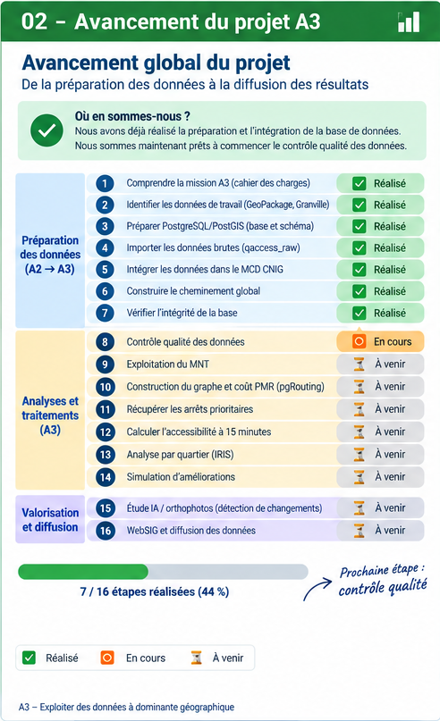

# 02 — Avancement du projet A3

## Vue d’ensemble de l’avancement




## Objectif de cette page

Cette page sépare clairement :

1. ce que l'étude A3 demande ;
2. ce que nous avons **réellement réalisé** avec les données de Granville ;
3. ce qui reste à faire.

---

## Vue d'ensemble

| Étape | Travail | Statut |
|---:|---|:---:|
| 1 | Comprendre la mission A3 | ✅ |
| 2 | Identifier les données de travail | ✅ |
| 3 | Préparer PostgreSQL/PostGIS | ✅ |
| 4 | Importer les données brutes | ✅ |
| 5 | Intégrer les données dans le MCD CNIG | ✅ |
| 6 | Construire le cheminement global | ✅ |
| 7 | Contrôles techniques initiaux | ✅ |
| 8 | Audit détaillé de la structure réelle | ✅ |
| 9 | Contrôle qualité A3 | 🔄 |
| 10 | Exploitation du MNT | ⏳ |
| 11 | Graphe et coût PMR | ⏳ |
| 12 | Arrêts prioritaires | ⏳ |
| 13 | Accessibilité à 15 minutes | ⏳ |
| 14 | Analyse par quartier | ⏳ |
| 15 | Simulation d'améliorations | ⏳ |
| 16 | Étude IA | ⏳ |
| 17 | WebSIG et diffusion | ⏳ |

---

## Étape 1 — Comprendre la mission A3 ✅

Nous avons identifié les grands objectifs : contrôle qualité, analyse d'accessibilité PMR, enclavement à 15 minutes, analyse territoriale, contrôle avec d'autres sources, étude IA, simulation d'améliorations et diffusion WebSIG.

**Statut : réalisé.**

---

## Étape 2 — Identifier les données de travail ✅

Le GeoPackage de travail identifié est :

```text
qaccess (1).gpkg
```

Nous avons vérifié qu'il contient réellement des données liées au cheminement et à l'accessibilité : nœuds, circulations, traversées, obstacles, quais, entrées, escaliers, stationnements PMR, rampes, etc.

Les données utilisées pour la réalisation pratique se situent à **Granville**, code INSEE **50218**.

**Statut : réalisé.**

---

## Étape 3 — Préparer PostgreSQL/PostGIS ✅

Nous utilisons :

```text
Base : qaccess_cnig
SGBD : PostgreSQL
Extension spatiale : PostGIS
Schéma principal : geostandard
```

Le schéma `geostandard` contient les tables du modèle utilisé pour structurer les données d'accessibilité.

**Statut : réalisé.**

---

## Étape 4 — Importer les données brutes ✅

Le GeoPackage a été importé dans le schéma temporaire :

```text
qaccess_raw
```

La logique retenue est :

```text
qaccess (1).gpkg
       ↓
   qaccess_raw
 données importées
       ↓
 transformation
       ↓
   geostandard
 données structurées
```

`qaccess_raw` sert donc de **zone intermédiaire**. Les analyses finales doivent s'appuyer sur les données structurées dans `geostandard`.

**Statut : réalisé.**

---

## Étape 5 — Intégrer les données dans le MCD CNIG ✅

Les données ont été transformées et transférées vers `geostandard`.

Une transformation de système de coordonnées a notamment été réalisée :

```text
EPSG:2154
    ↓
EPSG:4326
```

Les principales tables alimentées sont actuellement :

| Table | Nombre |
|---|---:|
| `Noeud` | 741 |
| `Troncon_Cheminement` | 713 |
| `Obstacle` | 708 |
| `Circulation` | 412 |
| `Traversee` | 236 |
| `Entree` | 44 |
| `Quai` | 39 |
| `Stationnement_PMR` | 14 |
| `Escalier` | 13 |
| `Rampe` | 4 |
| `Passage_Selectif` | 1 |

**Statut : réalisé.**

---

## Étape 6 — Construire le cheminement global ✅

Un cheminement logique global a été créé :

```text
CHM_GRANVILLE_RESEAU_PMR
```

Les **713 tronçons** sont associés à ce cheminement par la table `Cheminement_Troncon_Cheminement`.

Cela permet de représenter l'ensemble du réseau PMR de travail comme un ensemble logique.

**Statut : réalisé.**

---

## Étape 7 — Premiers contrôles techniques ✅

Un premier niveau de vérification a déjà été réalisé sur l'intégration.

Les contrôles effectués n'ont pas détecté :

```text
relation cassée                 : 0
tronçon sans nœud               : 0
circulation sans tronçon        : 0
traversée sans tronçon          : 0
géométrie invalide détectée     : 0
```

> Cela ne signifie pas que la qualité est parfaite. Cela signifie seulement que ces premiers contrôles techniques n'ont pas détecté ces anomalies.

**Statut : premier contrôle réalisé.**

---

## Étape 8 — Audit détaillé de la structure réelle ✅

Avant d'exécuter les contrôles qualité A3, nous avons réalisé un audit plus précis de la base.

Nous avons vérifié :

- les 20 tables du schéma `geostandard` ;
- les colonnes et leurs types ;
- les clés primaires ;
- les clés étrangères ;
- les colonnes géométriques ;
- les SRID ;
- le nombre réel d'enregistrements ;
- les extensions PostgreSQL ;
- les index existants.

Cet audit est détaillé dans la page :

[03 — Audit de la structure de la base](03-audit-structure-base.md)

**Statut : réalisé.**

---

## Étape 9 — Contrôle qualité A3 🔄

C'est la prochaine grande étape.

Nous allons mettre en place une table permettant de centraliser les anomalies détectées, puis contrôler progressivement :

- les géométries ;
- la topologie du réseau ;
- les doublons ;
- les micro-tronçons ;
- les longueurs ;
- les informations PMR ;
- les obstacles ;
- la complétude.

La table prévue est :

```text
anomalies_controle
```

avec différents niveaux de criticité, par exemple :

```text
BLOQUANT
CRITIQUE
WARNING
```

**Statut : prochaine étape / exécution et validation à réaliser.**

---

## Étape 10 — Exploiter le MNT ⏳

Nous disposons de :

```text
MNT-1m.zip
MNT-50cm.zip
```

Ces données pourront notamment aider à travailler sur les informations altimétriques et les pentes et à comparer certains résultats avec les données du réseau.

**Statut : données disponibles, traitement à réaliser.**

---

## Étape 11 — Préparer le graphe et le coût PMR ⏳

Après le contrôle qualité, le réseau devra être préparé pour les calculs de déplacement.

```text
Tronçons
   ↓
Nœuds
   ↓
Graphe
   ↓
Coût de déplacement PMR
```

Les critères retenus pour le coût PMR devront être expliqués et justifiés.

L'audit a montré que **pgRouting n'est pas installé actuellement**. Son utilisation et son installation seront donc étudiées au moment approprié.

**Statut : à réaliser.**

---

## Étape 12 — Intégrer les arrêts prioritaires ⏳

Les arrêts prioritaires nécessaires à certaines analyses doivent encore être récupérés et intégrés à notre environnement de travail.

Ils pourront servir de points de référence ou de départ pour les analyses d'accessibilité.

**Statut : à récupérer et intégrer.**

---

## Étape 13 — Calculer l'accessibilité à 15 minutes ⏳

Lorsque le graphe sera prêt :

```text
Point de départ
      ↓
Réseau PMR
      ↓
Coût de déplacement
      ↓
15 minutes
      ↓
Zone accessible
```

Cette analyse permettra d'identifier les secteurs accessibles et les secteurs plus difficiles à atteindre.

**Statut : à réaliser.**

---

## Étape 14 — Analyser l'accessibilité par quartier ⏳

Il faudra disposer d'un découpage territorial adapté puis croiser celui-ci avec les résultats d'accessibilité.

Des indicateurs pourront ensuite être construits, par exemple autour de :

- la couverture accessible ;
- la voirie accessible ;
- la présence d'obstacles ;
- les secteurs enclavés.

Les indicateurs exacts devront être définis et justifiés avant leur calcul.

**Statut : à réaliser.**

---

## Étape 15 — Simuler des améliorations ⏳

L'objectif sera de comparer une situation actuelle avec une situation améliorée.

```text
Situation actuelle
       ↓
Problème identifié
       ↓
Aménagement simulé
       ↓
Nouveau calcul
       ↓
Comparaison avant / après
```

**Statut : à réaliser.**

---

## Étape 16 — Étudier l'IA et les orthophotographies ⏳

Une étude de faisabilité doit être menée sur la détection de changements à partir d'orthophotographies, notamment concernant les passages piétons et certains éléments de mobilier urbain.

Les performances éventuelles devront être **mesurées ou correctement sourcées** et ne devront pas être présentées comme acquises avant expérimentation.

**Statut : étude à poursuivre.**

---

## Étape 17 — WebSIG et diffusion ⏳

À terme, la chaîne pourra prendre la forme suivante :

```text
PostgreSQL / PostGIS
        ↓
Services / API
        ↓
WebSIG
        ↓
Cartes + indicateurs + analyses
```

La partie diffusion devra également traiter les métadonnées, le catalogage, l'interopérabilité et la mise à disposition des données.

**Statut : conception à poursuivre et réalisation à venir.**

---

## Où sommes-nous maintenant ?

```text
1. Compréhension de la mission         ✅
2. Identification des données          ✅
3. PostgreSQL / PostGIS                ✅
4. Import qaccess_raw                  ✅
5. Intégration dans geostandard        ✅
6. Cheminement global Granville        ✅
7. Contrôles techniques initiaux       ✅
8. Audit détaillé de la base           ✅

──────────────────────────────────────────
              NOUS SOMMES ICI
──────────────────────────────────────────

9. Contrôle qualité A3                🔄
10. Exploitation MNT                  ⏳
11. Graphe + coût PMR                 ⏳
12. Arrêts prioritaires               ⏳
13. Accessibilité 15 min              ⏳
14. Analyse par quartier              ⏳
15. Simulation d'améliorations        ⏳
16. Étude IA                          ⏳
17. WebSIG / diffusion                ⏳
```

---

## Règle de documentation pour la suite

Pour chaque nouvelle étape, nous conserverons toujours la même logique :

```text
Objectif
   ↓
Données utilisées
   ↓
Méthode
   ↓
Traitement réellement exécuté
   ↓
Résultat
   ↓
Capture / carte / preuve
   ↓
Interprétation
   ↓
Limites
   ↓
Compétence A3 concernée
```

Cette méthode permet de transformer le travail technique en **preuves claires pour l'évaluation A3**.
