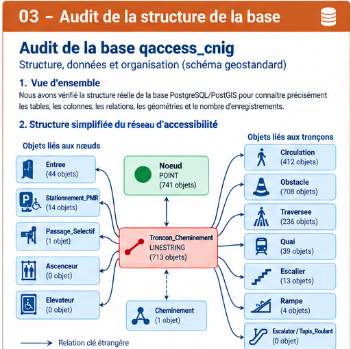
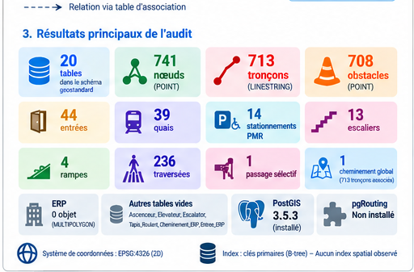

# 03 — Audit de la structure de la base de données

## Objectif de cette page

Avant de commencer les contrôles qualité de l'activité A3, nous avons vérifié la **structure réelle** de notre base PostgreSQL/PostGIS.

Notre environnement de travail est :

| Élément | Valeur |
|---|---|
| Base de données | `qaccess_cnig` |
| Schéma principal | `geostandard` |
| Territoire des données | Granville |
| Extension spatiale | PostGIS 3.5.3 |

L'objectif n'était pas encore de chercher toutes les erreurs dans les données. Nous voulions d'abord répondre à une question simple :

> **Comment notre base est-elle réellement construite ?**

---

## Vue générale de l'audit

| Contrôle | Résultat |
|---|:---:|
| Tables | ✅ |
| Colonnes et types | ✅ |
| Clés primaires | ✅ |
| Clés étrangères | ✅ |
| Géométries et SRID | ✅ |
| Nombre d'enregistrements | ✅ |
| Extensions PostgreSQL | ✅ |
| Index | ✅ |

---

## 1. Vérification des tables

Nous avons trouvé **20 tables ordinaires** dans `geostandard` :

```text
Ascenceur
Cheminement
Cheminement_ERP
Cheminement_Troncon_Cheminement
Circulation
ERP
Elevateur
Entree
Entree_ERP
Escalator
Escalier
Noeud
Obstacle
Passage_Selectif
Quai
Rampe
Stationnement_PMR
Tapis_Roulant
Traversee
Troncon_Cheminement
```

### Point important : respecter les majuscules

Les noms ont été créés avec des majuscules. Il faut donc utiliser les guillemets doubles dans les requêtes SQL :

```sql
SELECT * FROM geostandard."Noeud";
SELECT * FROM geostandard."Obstacle";
SELECT * FROM geostandard."Troncon_Cheminement";
```

Écrire `geostandard.noeud` n'est pas équivalent à `geostandard."Noeud"` dans ce contexte.

---

## 2. Vérification des colonnes et des types

Cette vérification permet de connaître les **vrais champs** avant d'écrire les futurs contrôles qualité.

### `Troncon_Cheminement`

Champs importants observés :

```text
idTroncon
from
to
longueur
typeTroncon
statutVoie
pente
devers
accessibiliteGlobale
geom
```

À retenir :

- `from` : référence vers le nœud de départ ;
- `to` : référence vers le nœud d'arrivée ;
- `longueur` : longueur renseignée ;
- `pente` : information de pente ;
- `devers` : information de dévers ;
- `accessibiliteGlobale` : information d'accessibilité ;
- `geom` : géométrie LINESTRING.

Les champs `pente` et `devers` sont réellement de type **integer** dans la base actuelle.

### `Circulation`

Champs utiles observés :

```text
typeSol
largeurPassageUtile
etatRevetement
eclairage
idTroncon
```

### `Obstacle`

Champs utiles observés :

```text
typeObstacle
largeurUtile
positionObstacle
longueurObstacle
largeurObstacle
hauteurObsPoseSol
hauteurSousObs
geom
idTroncon
```

### `Traversee`

Champs utiles observés :

```text
etatRevetement
marquageSol
eclairage
feuPietons
aideSonore
presenceIlot
chausseeBombee
idTroncon
```

Ces champs pourront être mobilisés plus tard pour les contrôles et analyses PMR.

---

## 3. Vérification des clés primaires

Une **clé primaire** identifie de manière unique un enregistrement.

Exemple :

```text
Noeud
└── idNoeud

Troncon_Cheminement
└── idTroncon

Obstacle
└── idObstacle
```

Sur les **20 tables**, nous avons observé une clé primaire sur **18 tables**.

| Table | Clé primaire |
|---|---|
| `Noeud` | `idNoeud` |
| `Troncon_Cheminement` | `idTroncon` |
| `Obstacle` | `idObstacle` |
| `Circulation` | `idCirculation` |
| `Traversee` | `idTraversee` |
| `Quai` | `idQuai` |
| `Entree` | `idEntree` |

Aucune clé primaire n'a été observée sur :

```text
Cheminement_Troncon_Cheminement
Entree_ERP
```

À ce stade, nous conservons cela comme **constat de structure**. Nous ne le classons pas automatiquement comme erreur ou non-conformité.

---

## 4. Vérification des clés étrangères

Une **clé étrangère** permet de relier plusieurs tables.

### Réseau principal

```text
            Noeud
              ▲
              │ from
              │
       Troncon_Cheminement
              │
              │ to
              ▼
            Noeud
```

Les relations observées sont notamment :

```text
Troncon_Cheminement.from  → Noeud.idNoeud
Troncon_Cheminement.to    → Noeud.idNoeud
Circulation.idTroncon     → Troncon_Cheminement.idTroncon
Traversee.idTroncon       → Troncon_Cheminement.idTroncon
Obstacle.idTroncon        → Troncon_Cheminement.idTroncon
Quai.idTroncon            → Troncon_Cheminement.idTroncon
Entree.idNoeud            → Noeud.idNoeud
```

Les contraintes observées sont indiquées comme **validées par PostgreSQL**.

> **Attention :** cela confirme la cohérence des identifiants. Cela ne prouve pas encore qu'une extrémité géométrique du tronçon tombe exactement sur le point du nœud correspondant. Ce sera un contrôle topologique de l'étape qualité.

---

## Vue simplifiée du réseau



---

## 5. Vérification des données spatiales

Quatre tables possèdent directement une colonne géométrique déclarée :

| Table | Type géométrique | Dimension | SRID |
|---|---|:---:|---:|
| `ERP` | MULTIPOLYGON | 2D | 4326 |
| `Noeud` | POINT | 2D | 4326 |
| `Obstacle` | POINT | 2D | 4326 |
| `Troncon_Cheminement` | LINESTRING | 2D | 4326 |

Représentation simple :

```text
       Noeud ●
             │
             │ Troncon_Cheminement
             │
       Noeud ●

       Obstacle ●
```

Toutes ces géométries sont déclarées en **EPSG:4326**.

Pour les futurs contrôles exprimés en mètres, il faudra donc utiliser une méthode de calcul métrique adaptée plutôt que de traiter directement les degrés comme des mètres.

---

## 6. Vérification du nombre d'enregistrements

### Tables contenant des données

| Table | Nombre |
|---|---:|
| `Noeud` | **741** |
| `Troncon_Cheminement` | **713** |
| `Obstacle` | **708** |
| `Cheminement_Troncon_Cheminement` | **713** |
| `Circulation` | **412** |
| `Traversee` | **236** |
| `Entree` | **44** |
| `Quai` | **39** |
| `Stationnement_PMR` | **14** |
| `Escalier` | **13** |
| `Rampe` | **4** |
| `Passage_Selectif` | **1** |
| `Cheminement` | **1** |

Le cheminement global contient **1 enregistrement** et ses **713 tronçons** sont associés dans `Cheminement_Troncon_Cheminement`.

### Tables actuellement vides

```text
Ascenceur                  0
Cheminement_ERP            0
Elevateur                  0
Entree_ERP                 0
ERP                        0
Escalator                  0
Tapis_Roulant              0
```

Une table vide n'est pas automatiquement une anomalie. Elle indique ici qu'aucune donnée correspondante n'a été intégrée dans ces tables.

---

## 7. Vérification des extensions PostgreSQL

### PostGIS

```text
Installé : oui
Version : 3.5.3
Schéma : public
```

PostGIS fournit les types et fonctions spatiales nécessaires aux traitements géographiques, par exemple :

```text
ST_IsValid()
ST_Length()
ST_Distance()
ST_DWithin()
```

### pgRouting

```text
Installé : non
```

Cela ne bloque pas l'audit actuel. Son installation sera étudiée plus tard si pgRouting est retenu pour le graphe et le routage PMR.

---

## 8. Vérification des index

Les **18 tables possédant une clé primaire** disposent d'un index **B-tree unique** associé.

Exemples :

```text
Noeud
└── pk_noeud
    └── idNoeud

Troncon_Cheminement
└── pk_troncon
    └── idTroncon

Obstacle
└── pk_obstacle
    └── idObstacle
```

Les index observés sont indiqués comme :

```text
valides                  : oui
prêts pour les écritures : oui
```

Aucun index spatial **GiST** n'est apparu dans le résultat de cet audit. Cela sera étudié ultérieurement comme question d'optimisation des requêtes spatiales.

---

## 9. Points techniques à surveiller

L'audit a fait apparaître plusieurs points à garder dans notre liste de vérification :

1. la valeur par défaut de `Troncon_Cheminement.idTroncon` utilise une séquence appelée `noeud_seq` ;
2. `Cheminement_Troncon_Cheminement` et `Entree_ERP` n'ont pas de clé primaire observée ;
3. une contrainte de `Cheminement_ERP` porte le nom `troncon_fk` alors qu'elle référence `ERP` ;
4. `pente` et `devers` sont de type `integer` ;
5. aucun index spatial GiST n'a été observé ;
6. pgRouting n'est pas installé.

> Ces éléments sont des **constats techniques**. Ils ne sont pas considérés automatiquement comme des non-conformités CNIG.

---

## 10. Ce que cet audit prouve — et ce qu'il ne prouve pas

### Nous pouvons maintenant dire

- la structure réelle de `geostandard` est connue ;
- les principales relations SQL sont en place ;
- les volumes de données sont connus ;
- les géométries principales sont déclarées en EPSG:4326 ;
- PostGIS 3.5.3 est disponible ;
- pgRouting n'est pas encore installé ;
- les index de clés primaires sont présents.

### Nous ne pouvons pas encore dire

- que toutes les données sont correctes ;
- que la topologie spatiale du réseau est parfaite ;
- que les attributs PMR sont complets ;
- que les pentes, longueurs et obstacles sont cohérents ;
- que le réseau est déjà prêt pour le routage.

Ces questions appartiennent à l'étape suivante.

---

## Bilan visuel de l’audit



---

## 11. Conclusion

```text
qaccess_cnig
      │
      ▼
geostandard
      │
      ├── 20 tables
      ├── 741 nœuds
      ├── 713 tronçons
      ├── 708 obstacles
      ├── relations SQL vérifiées
      ├── géométries EPSG:4326
      ├── PostGIS 3.5.3
      └── pgRouting non installé
```

L'étape 1 nous a donc permis de **connaître et documenter la base réelle avant de lancer les contrôles qualité**.

## Prochaine étape

> **Étape 2 — Contrôle de la qualité des données**

Nous contrôlerons progressivement :

- les géométries ;
- la cohérence spatiale entre tronçons et nœuds ;
- les attributs utiles à l'accessibilité PMR ;
- les obstacles ;
- la complétude ;
- les anomalies détectées.
